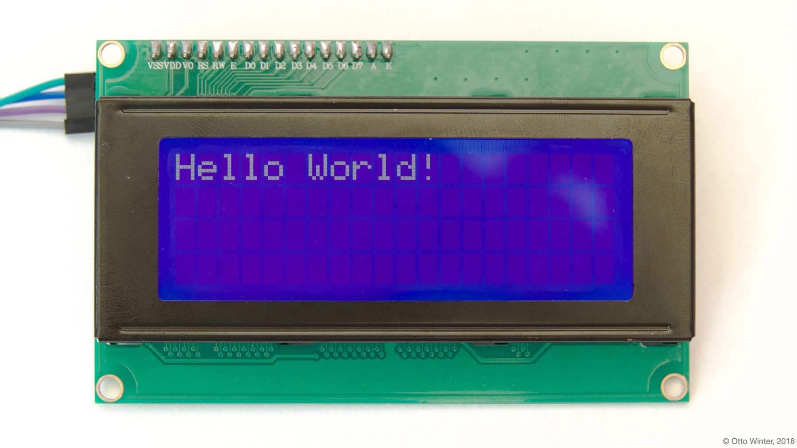
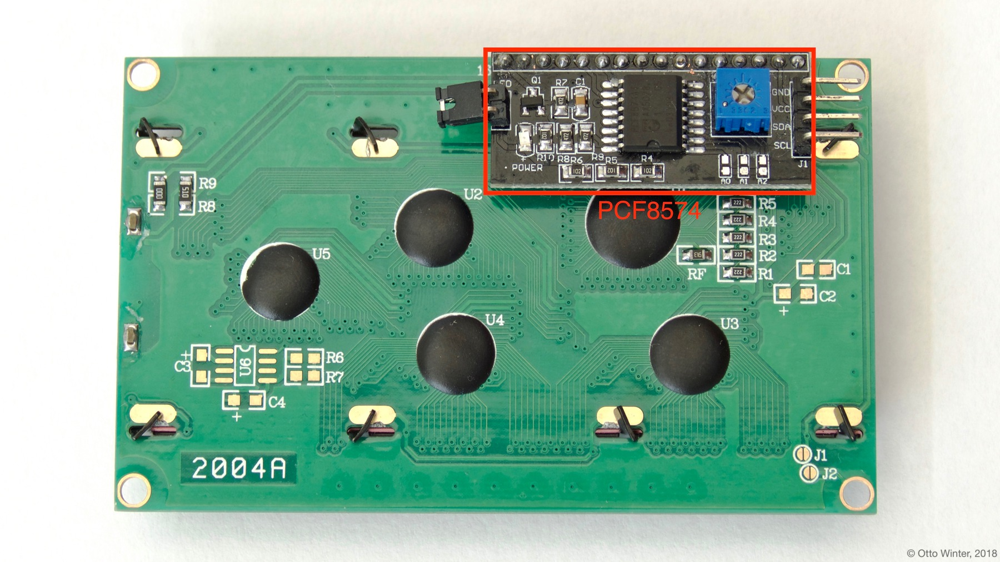
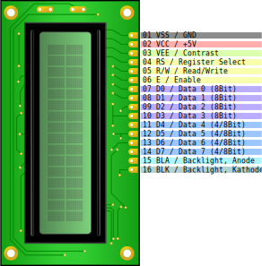

Character-Based LCD Display
===========================

.. seo::
    :description: Instructions for setting up character-based HD44780 LCDs.
    :image: lcd.jpg

The ``lcd_pcf8574`` and ``lcd_gpio`` display components allow you to use HD44780-compatible, character-based LCDs
with ESPHome. This component is only for LCDs that display individual characters on a screen
(usually 8-40 columns and 2-4 rows), and not for LCDs that can control each pixel individually.

.. note::

    Multiple versions of the display exist, supporting different character sets:

    - HD44780UA00 English-Japanese which includes katakana characters, some Greek letters and mathematical symbols
    - HD44780UA02 English-European which includes Greek, Cyrillic and Western European characters (with some diacritics)
    - HD44780UBxx custom, manufacturer-specific character sets

    It is also possible to add eight user-defined characters.

.. _lcd-pcf8574:

lcd_pcf8574 Component
---------------------

``lcd_pcf8574`` is for LCD displays with a PCF8574 GPIO expander module connected to all the data pins. This has the
benefit that you only need to connect two data wires to the ESP instead of the six or ten as with the :ref:`lcd-gpio`.
The communication happens via :ref:`I²C Bus <i2c>`, you need to have an ``i2c:`` section in your configuration.

    LCD Display with a PCF8574 board attached on the back

.. code-block:: yaml

    # Example configuration entry
    i2c:
      sda: D0
      scl: D1

    display:
      - platform: lcd_pcf8574
        dimensions: 20x4
        address: 0x27
        lambda: |-
          it.print("Hello World!");

Configuration variables:
************************

- **dimensions** (**Required**, string): The dimensions of the display with ``COLUMNSxROWS``. If you're not
  sure, power the display up and just count them.
- **address** (*Optional*, int): The :ref:`I²C <i2c>` address of the PCF8574 chip, defaults to ``0x3F``.
- **lambda** (*Optional*, :ref:`lambda <config-lambda>`): The lambda to use for rendering the content on the display.
  See :ref:`display-lcd_lambda` for more information.
- **update_interval** (*Optional*, :ref:`config-time`): The interval to re-draw the screen. Defaults to ``1s``.
- **id** (*Optional*, :ref:`config-id`): Manually specify the ID used for code generation.

.. note::

    If you're not seeing anything on the display, try turning the contrast potentiometer around on the
    PCF8574 board.

.. _lcd-gpio:

lcd_gpio Component
------------------

The ``lcd_gpio`` version of this component addresses the screen directly and does not employ a GPIO expander module.
Each of the data pins of the LCD needs a dedicated GPIO pin on the ESP. Connecting the screen this way offers
faster refresh, especially in conjunction with an :ref:`LCD Menu <lcd_menu>`.

    LCD Display GPIO pinout

.. code-block:: yaml

    # Example configuration entry
    display:
      - platform: lcd_gpio
        dimensions: 20x4
        data_pins:
          - GPIOXX
          - GPIOXX
          - GPIOXX
          - GPIOXX
        enable_pin: GPIOXX
        rs_pin: GPIOXX
        lambda: |-
          it.print("Hello World!");

Configuration variables:
************************

- **dimensions** (**Required**, string): The dimensions of the display with ``COLUMNSxROWS``. If you're not
  sure, power the display on, turn contrast high up and just count them.
- **data_pins** (**Required**, list of :ref:`pins <config-pin_schema>`): A list of the data pins you
  have hooked up to the LCD. The list can either be 4 items long (operating in 4-bit mode with
  either the first 4 data pins connected or the last 4 data pins connected), or 8 items long (when you have
  connected all 8 data pins).
- **enable_pin** (**Required**, :ref:`pin <config-pin_schema>`): The pin you have ``E`` (``06``) hooked up to.
- **rs_pin** (**Required**, :ref:`pin <config-pin_schema>`): The pin you have ``RS`` (``04``) hooked up to.
- **rw_pin** (*Optional*, :ref:`pin <config-pin_schema>`): Optionally set the pin you have ``R/W`` (``05``) hooked up to. You can also just permanently connect that pin to ``GND``.
- **lambda** (*Optional*, :ref:`lambda <config-lambda>`): The lambda to use for rendering the content on the display.
  See :ref:`display-lcd_lambda` for more information.
- **update_interval** (*Optional*, :ref:`config-time`): The interval to re-draw the screen. Defaults to ``1s``.
- **id** (*Optional*, :ref:`config-id`): Manually specify the ID used for code generation.

.. note::

    If you're not seeing anything on the display, make sure you apply ``3.3V`` to the ``VEE`` (``03``) contrast control
    pin of the board. You can use a potentiometer to make it adjustable.

.. _display-lcd_lambda:

Rendering Lambda
----------------

The LCD displays has a similar API to the fully fledged :ref:`display-engine`, but it's only a subset as LCD displays
don't have a concept of individual pixels. In the lambda you're passed a variable called ``it``
as with all other displays. In this case however, ``it`` is an instance of either ``GPIOLCDDisplay`` or ``PCF8574LCDDisplay``.

The most basic operation with LCD Displays is writing static text to the screen as in the configuration example
at the top of this page.

Each of the three methods (``print``, ``printf`` and ``strftime``) all optionally take a column and row arguments at the
beginning which can be used to print the text at a specific position. These arguments are set to ``0`` (column) and ``0`` (row)
by default which means the character at the top left.

.. code-block:: yaml

    display:
      - platform: lcd_gpio # or lcd_pcf8574
        # ...
        lambda: |-
          // Print 0 at the top left
          it.print("0");

          // Print 1 at the second row and second column.
          it.print(1, 1, "1");

          // Let's write a sensor value (let's assume it's 42.1)
          it.printf("%.1f", id(my_sensor).state);
          // Result: "42.1" (the dot will appear on the segment showing "2")

          // Print a right-padded sensor value with 0 digits after the decimal
          it.printf("Sensor value: %8.0f", id(my_sensor).state);
          // Result: "Sensor value:       42"

          // Print the current time
          it.strftime("It is %H:%M on %d.%m.%Y", id(my_time).now());
          // Result for 10:06 on august 21st 2018 -> "It is 10:06 on 21.08.2018"

    # (Optional) For displaying time:
    time:
    - platform: homeassistant
      id: my_time

Please see :ref:`display-printf` for a quick introduction into the ``printf`` formatting rules and
:ref:`display-strftime` for an introduction into the ``strftime`` time formatting.

User Defined Characters
-----------------------

The LCD display has the possibility to define up to eight user defined characters occupying the characters
``0`` to ``7`` and mirrored at ``8`` to ``15`` (i.e. ``\x08`` can be used instead of the ``\0`` that can
be problematic in strings). Each character has eight lines of five bits, with the first line on the top
and the most significant bit on the left, meaning that ``0b10000`` followed by six zeros and a ``0b00001``
defines a dot at the upper left and lower right of the character.

.. code-block:: yaml

    display:
      - platform: lcd_pcf8574
        id: mydisplay
        # ...
        user_characters:
          - position: 0
            data:
              - 0b00000
              - 0b01010
              - 0b00000
              - 0b00100
              - 0b00100
              - 0b10001
              - 0b01110
              - 0b00000
          - position: 7
            data:
              - 0b00000
              - 0b01010
              - 0b00000
              - 0b00100
              - 0b00100
              - 0b00000
              - 0b01110
              - 0b10001
        lambda: |-
          it.print("Hello, world \x08 \x07!");

Try this `custom character generator <https://omerk.github.io/lcdchargen/>`__ to design your own sybmols.

Backlight Control
-----------------

With the ``lcd_pcf8574`` the backlight can be turned on by ``it.backlight()`` and off by ``it.no_backlight()`` in the
display lambda definition. The jumper on the PCF8574 board needs to be closed for the backlight control to work.
Keep in mind that the display lambda runs for every ``update_interval``, so if the backlight is turned on/off there,
it cannot be overridden from other parts.

With the ``lcd_gpio``, the backlight is lit by applying ``Vcc`` to the ``BLA`` (``15``) pin and connect ``BLK`` (``16``)
pin to ``GND``. The backlight can draw more power than the microcontroller output pins can supply, so it is advisable
to use a transistor as a switch to control the power for the backlight pins.

Below an example for a typical use-case where the backlight is turned on when a motion sensor activates and
turns off ``90`` seconds after the last activation of the sensor.

.. code-block:: yaml

    display:
      - platform: lcd_pcf8574
        id: mydisplay
        # ...

    binary_sensor:
      - platform: gpio
        # ...
        on_press:
          then:
            - binary_sensor.template.publish:
                id: backlight
                state: ON
            - binary_sensor.template.publish:
                id: backlight
                state: OFF
      - platform: template
        id: backlight
        filters:
          - delayed_off: 90s
        on_press:
          then:
            - lambda: |-
                id(mydisplay).backlight();
        on_release:
          then:
            - lambda: |-
                id(mydisplay).no_backlight();

See Also
--------

- :doc:`index`
- :doc:`/components/switch/gpio`
- :doc:`/components/binary_sensor/gpio`
- :ref:`LCD Menu <lcd_menu>`
- :ref:`Add pages to LCD display <lambda_magic_pages>`
- :doc:`/components/pcf8574`
- `HD44780U (LCD-II) datasheet <https://www.sparkfun.com/datasheets/LCD/HD44780.pdf>`__
- `Charset cheatsheet <https://user-images.githubusercontent.com/1550668/173113487-9c98e866-8ee4-4a3c-a83f-61fe62057c5f.png>`__
- `Custom Character Generator <https://omerk.github.io/lcdchargen/>`__
- `Arduino LiquidCrystal Library <https://www.arduino.cc/en/Reference/LiquidCrystal>`__
- :apiref:`lcd_base/lcd_display.h`
- :ghedit:`Edit`
