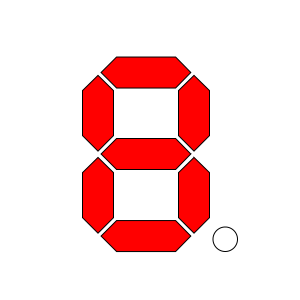
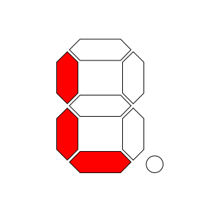

MAX6921 vacuum-fluorescent display (VFD) tube driver
====================================================

.. seo::
    :description: Instructions for setting up MAX6921 vacuum-fluorescent display (VFD) tube driver.

The ``max6921`` display platform allows you to use MAX6921 VFD display drivers (
`datasheet <https://www.analog.com/media/en/technical-documentation/data-sheets/MAX6921-MAX6931.pdf>`__)
with ESPHome. Please note that this component is *only* for 7-segment display, not matrix configurations. An example use case would be to drive an IV18 display tube (
`Thingiverse IV18 project <https://www.thingiverse.com/thing:3417955>`__).

As the communication with the MAX6921 is done using SPI for this component, you need
to have an :ref:`SPI bus <spi>` in your configuration with **clk_pin** and **mosi_pin** set (miso_pin is not required).

As the chip refresh is very time-critical, the ESP8266 is not supported (the refresh routine uses a 2nd CPU core)!

.. figure:: images/max6921/7-segment-display.svg
    :align: center
    :width: 100.0%

    7-Segment Display Example.

.. code-block:: yaml

    # Example configuration entry for IV18 VFD tube
    spi:
      clk_pin: GPIO18
      mosi_pin: GPIO23
    
    display:
      - platform: max6921
        id: iv18
        load_pin: GPIO5
        blank_pin: GPIO17
        out_pin_mapping:
            seg_to_out_map:
                seg_a_pin: 0
                seg_b_pin: 2
                seg_c_pin: 5
                seg_d_pin: 6
                seg_e_pin: 4
                seg_f_pin: 1
                seg_g_pin: 3
                seg_p_pin: 7
            pos_to_out_map:
                # IV18 positions starts at the right side!
                pos_0_pin: 15
                pos_1_pin: 14
                pos_2_pin: 13
                pos_3_pin: 16
                pos_4_pin: 12
                pos_5_pin: 17
                pos_6_pin: 11
                pos_7_pin: 18
        lambda: |-
          it.print("01234567");

Configuration variables:
------------------------

- **load_pin** (**Required**, :ref:`Pin Schema <config-pin_schema>`): The pin is used to update the output latch with data from shift register (see MAX6921 datasheet).
- **blank_pin** (**Required**, :ref:`Pin Schema <config-pin_schema>`): The pin is used to control the display brightness by PWM (see MAX6921 datasheet).
- **out_pin_mapping** (**Required**): The mapping of MAX6921 output pins to the appropriate display pins.

  - **seg_to_out_map** (**Required**): The mapping of MAX6921 output pins to the appropriate 7-segment pins of any display character.

    - **seg_a_pin** (**Required**, int): MAX6921 OUTx pin to control segment ``a``. Range is ``0`` to ``19``.
    - **seg_b_pin** (**Required**, int): MAX6921 OUTx pin to control segment ``b``. Range is ``0`` to ``19``.
    - **seg_c_pin** (**Required**, int): MAX6921 OUTx pin to control segment ``c``. Range is ``0`` to ``19``.
    - **seg_d_pin** (**Required**, int): MAX6921 OUTx pin to control segment ``d``. Range is ``0`` to ``19``.
    - **seg_e_pin** (**Required**, int): MAX6921 OUTx pin to control segment ``e``. Range is ``0`` to ``19``.
    - **seg_f_pin** (**Required**, int): MAX6921 OUTx pin to control segment ``f``. Range is ``0`` to ``19``.
    - **seg_g_pin** (**Required**, int): MAX6921 OUTx pin to control segment ``g``. Range is ``0`` to ``19``.
    - **seg_p_pin** (*Optional*, int): MAX6921 OUTx pin to control segment ``point``. Range is ``0`` to ``19``.
  - **pos_to_out_map** (**Required**): The mapping of MAX6921 output pins to the appropriate character position pins of the display.

    - **pos_0_pin** (**Required**, int): MAX6921 OUTx pin to select position ``0``. Range is ``0`` to ``19``.
    - **pos_1_pin** (*Optional*, int): MAX6921 OUTx pin to select position ``1``. Range is ``0`` to ``19``.
    - **pos_2_pin** (*Optional*, int): MAX6921 OUTx pin to select position ``2``. Range is ``0`` to ``19``.
    - **pos_3_pin** (*Optional*, int): MAX6921 OUTx pin to select position ``3``. Range is ``0`` to ``19``.
    - **pos_4_pin** (*Optional*, int): MAX6921 OUTx pin to select position ``4``. Range is ``0`` to ``19``.
    - **pos_5_pin** (*Optional*, int): MAX6921 OUTx pin to select position ``5``. Range is ``0`` to ``19``.
    - **pos_6_pin** (*Optional*, int): MAX6921 OUTx pin to select position ``6``. Range is ``0`` to ``19``.
    - **pos_7_pin** (*Optional*, int): MAX6921 OUTx pin to select position ``7``. Range is ``0`` to ``19``.
    - **pos_8_pin** (*Optional*, int): MAX6921 OUTx pin to select position ``8``. Range is ``0`` to ``19``.
    - **pos_9_pin** (*Optional*, int): MAX6921 OUTx pin to select position ``9``. Range is ``0`` to ``19``.
    - **pos_10_pin** (*Optional*, int): MAX6921 OUTx pin to select position ``10``. Range is ``0`` to ``19``.
    - **pos_11_pin** (*Optional*, int): MAX6921 OUTx pin to select position ``11``. Range is ``0`` to ``19``.
    - **pos_12_pin** (*Optional*, int): MAX6921 OUTx pin to select position ``12``. Range is ``0`` to ``19``.
- **brightness** (*Optional*, percentage, :ref:`templatable <config-templatable>`): The brightness with which the MAX6921 should drive the outputs. Defaults to ``100%``.
- **update_interval** (*Optional*, :ref:`config-time`): The interval to re-draw the screen. Defaults to ``500ms``.
- **lambda** (*Optional*, :ref:`lambda <config-lambda>`): The lambda to use for rendering the content on the display.
  See :ref:`display-max6921_lambda` for more information.
- **id** (*Optional*, :ref:`config-id`): Manually specify the ID used for code generation.


.. _display-max6921_lambda:

Rendering Lambda
----------------

The MAX6921 has a similar API to the fully fledged :ref:`display-engine`, but it's only a subset as the MAX6921
7-segment displays don't have a concept of individual pixels. In the lambda you're passed a variable called ``it``
as with all other displays. In this case however, ``it`` is an MAX6921 instance (see API Reference).

The most basic operation with the MAX6921 is wiring a simple number to the screen as in the configuration example
at the top of this page. But even though you're passing in a string (here ``"01234567"``), ESPHome converts it
into a representation that the MAX6921 can understand: The exact pixels that should be turned on. And of course,
not all characters can be represented. You can see a full list of characters :ref:`below <display-max6921_characters>`.

Each of the three methods (``print``, ``printf`` and ``strftime``) all optionally take a position argument at the
beginning which can be used to print the text at a specific position. This argument is ``0`` by default which
means the first character of the display. For example to start the first character of your text at
the end (right side) of a 8 position display, you would write ``it.print(7, "0");``.

Also note that the ``.`` (dot) character is special because when ESPHome encounters it in the string the dot
segment of the previous position will be enabled.

.. code-block:: yaml

    time:
      - platform: homeassistant
        id: esptime

    display:
      - platform: max6921
        # configure 8-position display...
        lambda: |-
          // Print 0 at position 0 (left)
          it.print("0");
          // Result: "0       "

          // Print 1 at position 1 (second character)
          it.print(1, "1");
          // Result: "01      "

          // Let's write a sensor value (let's assume it's 42.1)
          it.printf(3, "%.1f", id(my_sensor).state);
          // Result: "01 42.1  " (the dot will appear on the "2" segment)

          // Overwrite the previous content with blank
          it.print("        ");
          // Print a right-padded sensor value with 0 digits after the decimal
          it.printf("SENS%4.0f", id(my_sensor).state);
          // Result: "SENS  42"

          // Print the current time
          it.print("        ");
          it.strftime("%H.%M.%S", id(esptime).now());
          // Result for 10:06:42 -> "10.06.42  "

Please see :ref:`display-printf` for a quick introduction into the ``printf`` formatting rules and
:ref:`display-strftime` for an introduction into the ``strftime`` time formatting.

.. _display-max6921_characters:

All 7-Segment Characters
------------------------

.. raw:: html

    <style>
        /* dark theme */
        @media (prefers-color-scheme: dark) {
            #all-7-segment-characters img {
                background-color: #6b6b6b;
            }
        }
    </style>

============================== ==============================
**MAX6921 Representation**     **Character**
------------------------------ ------------------------------
|max692100|                    *(space)*
------------------------------ ------------------------------
|max692180|                    ``.``, ``,``
------------------------------ ------------------------------
|max6921B0|                    ``!``
------------------------------ ------------------------------
|max69217E|                    ``0``, ``O``
------------------------------ ------------------------------
|max692130|                    ``1``, ``I``
------------------------------ ------------------------------
|max69216D|                    ``2``, ``Z``
------------------------------ ------------------------------
|max692179|                    ``3``
------------------------------ ------------------------------
|max692133|                    ``4``
------------------------------ ------------------------------
|max69215B|                    ``5``, ``S``, ``s``
------------------------------ ------------------------------
|max69215F|                    ``6``
------------------------------ ------------------------------
|max692170|                    ``7``
------------------------------ ------------------------------
|max69217F|                    ``8``
------------------------------ ------------------------------
|max692173|                    ``9``
------------------------------ ------------------------------
|max692137|                    ``H``
------------------------------ ------------------------------
|max69214E|                    ``(``, ``[``, ``C``
------------------------------ ------------------------------
|max692131|                    ``{``
------------------------------ ------------------------------
|max692178|                    ``)``, ``]``
------------------------------ ------------------------------
|max692107|                    ``}``, ``T``, ``t``
------------------------------ ------------------------------
|max692120|                    ``\```
------------------------------ ------------------------------
|max692102|                    ``'``
------------------------------ ------------------------------
|max692122|                    ``"``
------------------------------ ------------------------------
|max69216F|                    ``@``
------------------------------ ------------------------------
|max692165|                    ``?``
------------------------------ ------------------------------
|max692110|                    ``i``
------------------------------ ------------------------------
|max692177|                    ``A``, ``a``
------------------------------ ------------------------------
|max69211F|                    ``B``, ``b``
------------------------------ ------------------------------
|max69213D|                    ``D``, ``d``
------------------------------ ------------------------------
|max69214F|                    ``E``, ``e``
------------------------------ ------------------------------
|max692147|                    ``F``, ``f``
------------------------------ ------------------------------
|max69215E|                    ``G``, ``g``
------------------------------ ------------------------------
|max69213C|                    ``J``, ``j``
------------------------------ ------------------------------
|max69210E|                    ``L``, ``l``
------------------------------ ------------------------------
|max692115|                    ``N``, ``n``
------------------------------ ------------------------------
|max692167|                    ``P``, ``p``
------------------------------ ------------------------------
|max692105|                    ``R``, ``r``
------------------------------ ------------------------------
|max69213E|                    ``U``
------------------------------ ------------------------------
|max692127|                    ``Y``, ``y``
------------------------------ ------------------------------
|max692101|                    ``-``
------------------------------ ------------------------------
|max692108|                    ``_``
------------------------------ ------------------------------
|max692109|                    ``=``
------------------------------ ------------------------------
|max69210D|                    ``c``
------------------------------ ------------------------------
|max692117|                    ``h``
------------------------------ ------------------------------
|max69211D|                    ``o``
------------------------------ ------------------------------
|max69211C|                    ``u``
============================== ==============================


.. |max692180| image:: images/max6921/seg80.svg
    :class: component-image segment
.. |max6921B0| image:: images/max6921/segB0.svg
    :class: component-image segment
.. |max69217E| image:: images/max6921/seg7E.svg
    :class: component-image segment
.. |max692130| image:: images/max6921/seg30.svg
    :class: component-image segment
.. |max69216D| image:: images/max6921/seg6D.svg
    :class: component-image segment
.. |max692179| image:: images/max6921/seg79.svg
    :class: component-image segment
.. |max692133| image:: images/max6921/seg33.svg
    :class: component-image segment
.. |max69215B| image:: images/max6921/seg5B.svg
    :class: component-image segment
.. |max69215F| image:: images/max6921/seg5F.svg
    :class: component-image segment
.. |max692170| image:: images/max6921/seg70.svg
    :class: component-image segment


.. |max692137| image:: images/max6921/seg37.svg
    :class: component-image segment

.. |max692131| image:: images/max6921/seg31.svg
    :class: component-image segment


.. |max692120| image:: images/max6921/seg20.svg
    :class: component-image segment
.. |max692102| image:: images/max6921/seg02.svg
    :class: component-image segment
.. |max692122| image:: images/max6921/seg22.svg
    :class: component-image segment
.. |max69216F| image:: images/max6921/seg6F.svg
    :class: component-image segment
.. |max692165| image:: images/max6921/seg65.svg
    :class: component-image segment

.. |max692177| image:: images/max6921/seg77.svg
    :class: component-image segment
.. |max69211F| image:: images/max6921/seg1F.svg
    :class: component-image segment

.. |max69214F| image:: images/max6921/seg4F.svg
    :class: component-image segment
.. |max692147| image:: images/max6921/seg47.svg
    :class: component-image segment
.. |max69215E| image:: images/max6921/seg5E.svg
    :class: component-image segment
.. |max69213C| image:: images/max6921/seg3C.svg
    :class: component-image segment

.. |max692115| image:: images/max6921/seg15.svg
    :class: component-image segment

.. |max692105| image:: images/max6921/seg05.svg
    :class: component-image segment
.. |max69213E| image:: images/max6921/seg3E.svg
    :class: component-image segment
.. |max692127| image:: images/max6921/seg27.svg
    :class: component-image segment
.. |max692101| image:: images/max6921/seg01.svg
    :class: component-image segment
.. |max692108| image:: images/max6921/seg08.svg
    :class: component-image segment
.. |max692109| image:: images/max6921/seg09.svg
    :class: component-image segment
.. |max69210D| image:: images/max6921/seg0D.svg
    :class: component-image segment

.. |max69211D| image:: images/max6921/seg1D.svg
    :class: component-image segment


.. note::

    Original 7-segment display base image taken from Wikipedia at https://de.wikipedia.org/wiki/Datei:7_Segment_Display.svg
    by user `h2g2bob <https://commons.wikimedia.org/wiki/User:H2g2bob>`__ under
    `Creative Commons BY-SA 3.0 <https://creativecommons.org/licenses/by-sa/3.0/deed.de>`__ and modified
    for this documentation.


.. _max6921-set_brightness_action:

``max9621.set_brightness`` Action
*********************************

This action sets the display brightness.

.. code-block:: yaml

    on_...:
      then:
        - max9621.set_brightness:
            id: iv18
            brightness: 80%

Configuration variables:

- **id** (**Required**, :ref:`config-id`): The ID of the MAX6921.
- **brightness** (**Required**, percentage, :ref:`templatable <config-templatable>`): The brightness with which the MAX6921 should drive the outputs.


.. _max6921-set_text_action:

``max9621.set_text`` Action
***************************

This action shows a text on the display with the given ID when executed.
One use case would be, for example, to display the current time by default (fixed configuration via ``it``) and to interrupt it briefly using ``set_text`` action. 

Configuration variables:

- **id** (**Required**, :ref:`config-id`): The ID of the MAX6921.
- **position** (*Optional*, int, :ref:`templatable <config-templatable>`): The display position. Range is ``0`` to ``13``.
- **align** (*Optional*, string, :ref:`templatable <config-templatable>`): The text alignment. Defaults to ``center``.

  - ``left``: align text to the left
  - ``center``: align text to the center
  - ``right``: align text to the right

- **duration** (*Optional*, :ref:`config-time`, :ref:`templatable <config-templatable>`): The time duration of showing text. Defaults to ``0ms`` (endless).
  If ``effect_cycle_num`` is given too, the first occurrence ends the effect.
- **effect** (*Optional*, string, :ref:`templatable <config-templatable>`): The text effect. Defaults to ``none``.

  - ``none``: Show text (cut if too long)
  - ``blink``: Blink text (cut if too long)
  - ``scroll_left``: Scroll text left (start with 1st character at right position)
- **effect_cycle_num** (*Optional*, int, :ref:`templatable <config-templatable>`): The number of text effect cycles (applicable to effects: ``blink``). Range is ``0`` to ``255``. Defaults to ``0`` (endless). If ``duration`` is given too, the first occurrence ends the effect.
- **repeat_interval** (*Optional*, :ref:`config-time`, :ref:`templatable <config-templatable>`): The action repeat interval. Defaults to ``0ms`` (no repeats). A non-zero value requires a non-zero ``duration`` or ``effect_cycle_num`` as well.
- **repeat_num** (*Optional*, int, :ref:`templatable <config-templatable>`): The number of action repeats. Range is ``0`` to ``255``. Defaults to ``0`` (endless). A non-zero value requires a non-zero ``repeat_interval`` as well.
- **update_interval** (*Optional*, :ref:`config-time`, :ref:`templatable <config-templatable>`): The effect update interval. Defaults to ``150ms``.

Examples
^^^^^^^^

*Display text ``0123`` for 3 seconds*

.. code-block:: yaml

  on_...:
    then:
      - max9621.set_text:
          id: iv18
          text: "0123"
          duration: 3s

*Display content of a :doc:`homeassistant text sensor </components/text_sensor/homeassistant>` for 1 second, repeat every 5 seconds. The text sensor can be updated with a temperature sensor value via automation, for instance.*

.. code-block:: yaml

  number:
    # repeat interval frontend
    - platform: template
      name: "IV18 Repeat Interval"
      id: iv18_repeat_interval
      min_value: 0
      max_value: 60
      restore_value: True
      step: 1
      unit_of_measurement: "s"
      mode: slider
      optimistic: True

  text_sensor:
    # text input frontend
    - platform: homeassistant
      id: iv18_text
      entity_id: input_text.iv18
      on_value:
        then:
          - max6921.set_text:
              id: iv18
              text: !lambda "return x.c_str();"
              align: center
              duration: 1s
              repeat_num: 0
              repeat_interval: !lambda return id(iv18_repeat_interval).state * 1000;


.. _max6921-set_demo_mode_action:

``max9621.set_demo_mode`` Action
********************************

This action starts a demo mode on the display with the given ID when executed.

.. code-block:: yaml

    on_...:
      then:
        - max9621.set_demo_mode:
            id: iv18
            mode: "scroll_font"

Configuration variables:

- **id** (**Required**, :ref:`config-id`): The ID of the MAX6921.
- **mode** (**Required**, string, :ref:`templatable <config-templatable>`): The demo mode.

  - ``off``: Switch off any running demo mode
  - ``scroll_font``: Scroll left the entire font
- **cycle_num** (*Optional*, int, :ref:`templatable <config-templatable>`): The number of demo mode cycles. Range is ``0`` to ``255``. Defaults to ``0`` (endless).
- **update_interval** (*Optional*, :ref:`config-time`, :ref:`templatable <config-templatable>`): The demo mode update interval. Defaults to ``150ms``.

