MAX7219 7-Segment Display
=========================

.. seo::
    :description: Instructions for setting up MAX7219 7-segment displays.
    :image: max7219.jpg

The ``max7219`` display platform allows you to use MAX7219 7-segment display drivers (
`datasheet <https://datasheets.maximintegrated.com/en/ds/MAX7219-MAX7221.pdf>`__,
`hobbycomponents <https://hobbycomponents.com/displays/597-max7219-8-digit-seven-segment-display-module>`__)
with ESPHome. Please note that this component is *only* for 7-segment display, not matrix configurations.

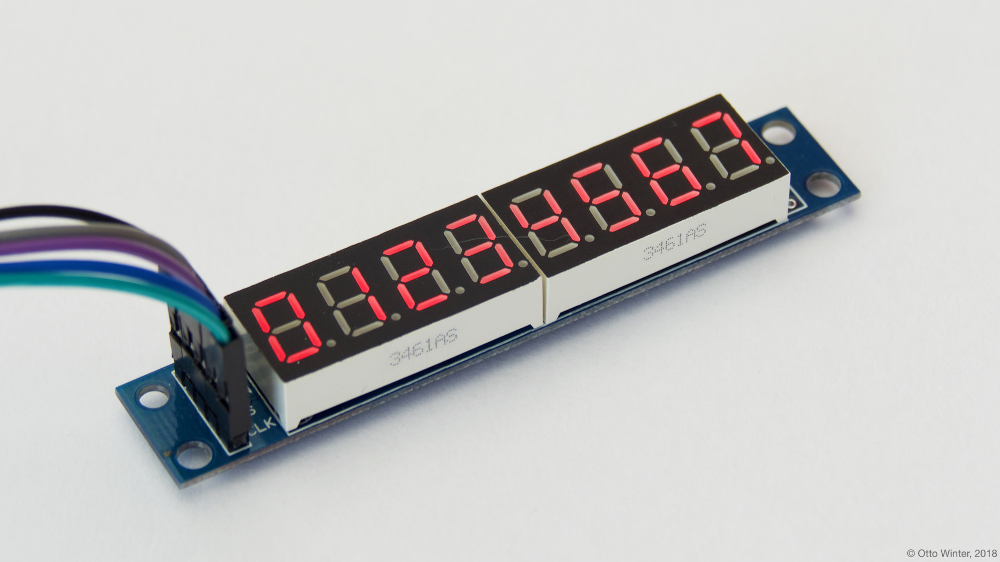

    MAX7219 7-Segment Display.

As the communication with the MAX7219 is done using SPI for this component, you need
to have an :ref:`SPI bus <spi>` in your configuration with both the **mosi_pin** set (miso_pin is not required).
Connect VCC to 3.3V (the manufacturer recommends 4+ V, but 3.3V seems to work fine), DIN to your ``mosi_pin`` and
CS to your set ``cs_pin`` and finally GND to GND.

You can even daisy-chain multiple MAX7219s by connecting the DOUT of the previous chip in the chain to the
next DIN. With more than ~3 chips the 3.3V will probably not be enough, so then you will have to potentially
use a logic level converted.

.. code-block:: yaml

    # Example configuration entry
    spi:
      clk_pin: D0
      mosi_pin: D1

    display:
      - platform: max7219
        cs_pin: D2
        num_chips: 1
        lambda: |-
          it.print("01234567");

Configuration variables:
------------------------

- **cs_pin** (**Required**, :ref:`Pin Schema <config-pin_schema>`): The pin you have the CS line hooked up to.
- **num_chips** (*Optional*, int): The number of chips you wish to use for daisy chaining. Defaults to
  ``1``.
- **intensity** (*Optional*, int): The intensity with which the MAX7219 should drive the outputs. Range is from
  0 (least intense) to 15 (the default).
- **lambda** (*Optional*, :ref:`lambda <config-lambda>`): The lambda to use for rendering the content on the MAX7219.
  See :ref:`display-max7219_lambda` for more information.
- **update_interval** (*Optional*, :ref:`config-time`): The interval to re-draw the screen. Defaults to ``1s``.
- **spi_id** (*Optional*, :ref:`config-id`): Manually specify the ID of the :ref:`SPI Component <spi>` if you want
  to use multiple SPI buses.
- **id** (*Optional*, :ref:`config-id`): Manually specify the ID used for code generation.
- **reverse_enable** (*Optional*, boolean): For some displays the order of the chips is reversed so you'll see "56781234" instead of "12345678". This option will adjust the output to compensate. Defaults to ``false``.


.. _display-max7219_lambda:

Rendering Lambda
----------------

The MAX7219 has a similar API to the fully fledged :ref:`display-engine`, but it's only a subset as the MAX7219
7-segment displays don't have a concept of individual pixels. In the lambda you're passed a variable called ``it``
as with all other displays. In this case however, ``it`` is an MAX7219 instance (see API Reference).

The most basic operation with the MAX7219 is wiring a simple number to the screen as in the configuration example
at the top of this page. But even though you're passing in a string (here ``"01234567"``), ESPHome converts it
into a representation that the MAX7219 can understand: The exact pixels that should be turned on. And of course,
not all characters can be represented. You can see a full list of characters :ref:`below <display-max7219_characters>`.

Each of the three methods (``print``, ``printf`` and ``strftime``) all optionally take a position argument at the
beginning which can be used to print the text at a specific position. This argument is ``0`` by default which
means the first character of the first MAX7219. For example to start the first character of your text at
the end of the first MAX7219, you would write ``it.print(7, "0");``.

Also note that the ``.`` (dot) character is special because when ESPHome encounters it in the string the dot
segment of the previous position will be enabled.

.. code-block:: yaml

    display:
      - platform: max7219
        # ...
        lambda: |-
          // Print 0 at position 0 (left)
          it.print("0");
          // Result: "0       "

          // Print 1 at position 1 (second character)
          it.print(1, "1");
          // Result: "01      "

          // Let's write a sensor value (let's assume it's 42.1)
          it.printf(3, "%.1f", id(my_sensor).state);
          // Result: "01 42.1  " (the dot will appear on the "2" segment)

          // Overwrite the previous content with blank
          it.print("        ");
          // Print a right-padded sensor value with 0 digits after the decimal
          it.printf("SENS%4.0f", id(my_sensor).state);
          // Result: "SENS  42"

          // Print the current time
          it.print("        ");
          it.strftime("%H.%M.%S", id(esptime).now());
          // Result for 10:06:42 -> "10.06.42  "

          // Change the display intnsity based on another id.
          // Value should be from 0-15.
          it.set_intensity(id(my_brightness));

Please see :ref:`display-printf` for a quick introduction into the ``printf`` formatting rules and
:ref:`display-strftime` for an introduction into the ``strftime`` time formatting.

.. _display-max7219_characters:

All 7-Segment Characters
------------------------

.. raw:: html

    <style>
        /* dark theme */
        @media (prefers-color-scheme: dark) {
            #all-7-segment-characters img {
                background-color: #6b6b6b;
            }
        }
    </style>

============================== ==============================
**MAX7219 Representation**     **Character**
------------------------------ ------------------------------
|max721900|                    *(space)*
------------------------------ ------------------------------
|max721980|                    ``.``
------------------------------ ------------------------------
|max7219B0|                    ``!``
------------------------------ ------------------------------
|max72197E|                    ``0``, ``O``
------------------------------ ------------------------------
|max721930|                    ``1``, ``I``
------------------------------ ------------------------------
|max72196D|                    ``2``, ``Z``
------------------------------ ------------------------------
|max721979|                    ``3``
------------------------------ ------------------------------
|max721933|                    ``4``
------------------------------ ------------------------------
|max72195B|                    ``5``, ``S``, ``s``
------------------------------ ------------------------------
|max72195F|                    ``6``
------------------------------ ------------------------------
|max721970|                    ``7``
------------------------------ ------------------------------
|max72197F|                    ``8``
------------------------------ ------------------------------
|max721973|                    ``9``
------------------------------ ------------------------------
|max721937|                    ``H``
------------------------------ ------------------------------
|max72194E|                    ``(``, ``[``, ``C``
------------------------------ ------------------------------
|max721931|                    ``{``
------------------------------ ------------------------------
|max721978|                    ``)``, ``]``
------------------------------ ------------------------------
|max721907|                    ``}``, ``T``, ``t``
------------------------------ ------------------------------
|max721920|                    ``\```
------------------------------ ------------------------------
|max721902|                    ``'``
------------------------------ ------------------------------
|max721922|                    ``"``
------------------------------ ------------------------------
|max72196F|                    ``@``
------------------------------ ------------------------------
|max721965|                    ``?``
------------------------------ ------------------------------
|max721910|                    ``,``, ``i``
------------------------------ ------------------------------
|max721949|                    ``%``
------------------------------ ------------------------------
|max721940|                    ``*``
------------------------------ ------------------------------
|max721948|                    ``:``
------------------------------ ------------------------------
|max721958|                    ``;``
------------------------------ ------------------------------
|max721977|                    ``A``, ``a``
------------------------------ ------------------------------
|max72191F|                    ``B``, ``b``
------------------------------ ------------------------------
|max72193D|                    ``D``, ``d``
------------------------------ ------------------------------
|max72194F|                    ``E``, ``e``
------------------------------ ------------------------------
|max721947|                    ``F``, ``f``
------------------------------ ------------------------------
|max72195E|                    ``G``, ``g``
------------------------------ ------------------------------
|max72193C|                    ``J``, ``j``
------------------------------ ------------------------------
|max72190E|                    ``L``, ``l``
------------------------------ ------------------------------
|max721915|                    ``N``, ``n``
------------------------------ ------------------------------
|max721967|                    ``P``, ``p``
------------------------------ ------------------------------
|max7219FE|                    ``Q``
------------------------------ ------------------------------
|max721905|                    ``R``, ``r``
------------------------------ ------------------------------
|max72193E|                    ``U``, ``V``
------------------------------ ------------------------------
|max72193F|                    ``W``
------------------------------ ------------------------------
|max721927|                    ``Y``, ``y``
------------------------------ ------------------------------
|max721901|                    ``-``
------------------------------ ------------------------------
|max721908|                    ``_``
------------------------------ ------------------------------
|max721909|                    ``=``
------------------------------ ------------------------------
|max721906|                    ``|``
------------------------------ ------------------------------
|max72190D|                    ``c``
------------------------------ ------------------------------
|max721917|                    ``h``
------------------------------ ------------------------------
|max72191D|                    ``o``
------------------------------ ------------------------------
|max72191C|                    ``u``, ``v``
------------------------------ ------------------------------
|max72198E|                    ``~``
============================== ==============================


.. |max721980| image:: images/max7219/seg80.svg
    :class: component-image segment
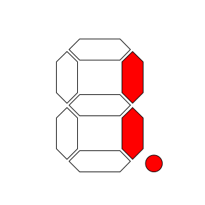
.. |max72197E| image:: images/max7219/seg7E.svg
    :class: component-image segment
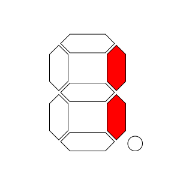
.. |max72196D| image:: images/max7219/seg6D.svg
    :class: component-image segment
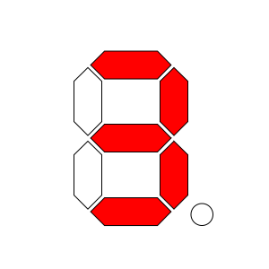
.. |max721933| image:: images/max7219/seg33.svg
    :class: component-image segment
.. |max72195B| image:: images/max7219/seg5B.svg
    :class: component-image segment
.. |max72195F| image:: images/max7219/seg5F.svg
    :class: component-image segment
.. |max721970| image:: images/max7219/seg70.svg
    :class: component-image segment
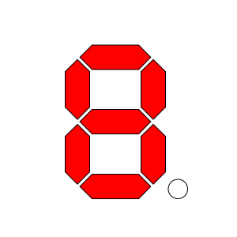
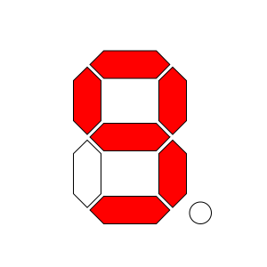
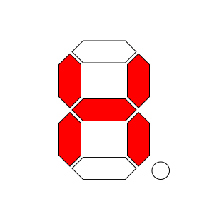
.. |max72194E| image:: images/max7219/seg4E.svg
    :class: component-image segment
.. |max721931| image:: images/max7219/seg31.svg
    :class: component-image segment
.. |max721978| image:: images/max7219/seg78.svg
    :class: component-image segment
.. |max721907| image:: images/max7219/seg07.svg
    :class: component-image segment
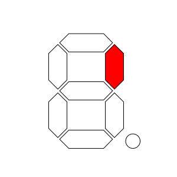
.. |max721902| image:: images/max7219/seg02.svg
    :class: component-image segment
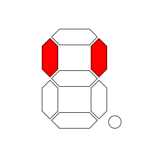
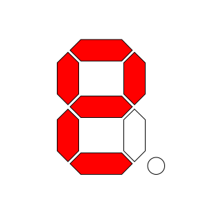
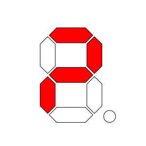
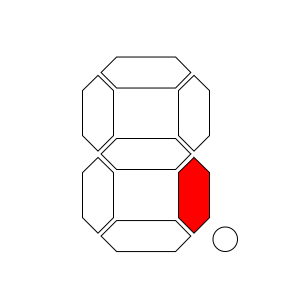
.. |max721949| image:: images/max7219/seg49.svg
    :class: component-image segment
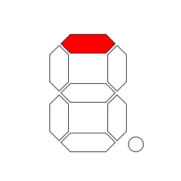
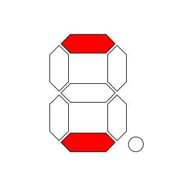
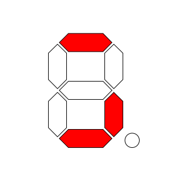
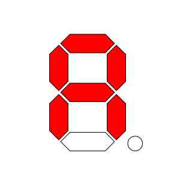
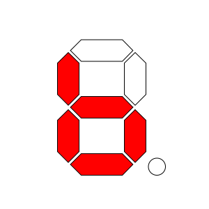
.. |max72193D| image:: images/max7219/seg3D.svg
    :class: component-image segment
.. |max72194F| image:: images/max7219/seg4F.svg
    :class: component-image segment
.. |max721947| image:: images/max7219/seg47.svg
    :class: component-image segment
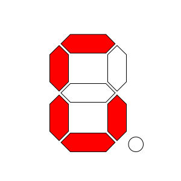
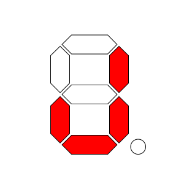
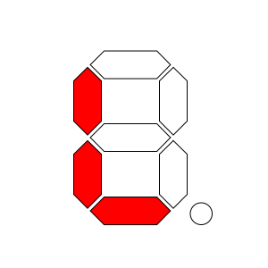
.. |max721915| image:: images/max7219/seg15.svg
    :class: component-image segment
.. |max721967| image:: images/max7219/seg67.svg
    :class: component-image segment
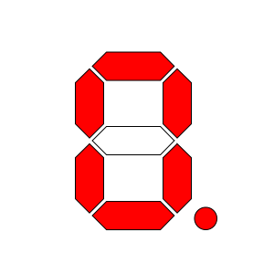
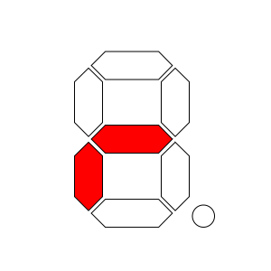
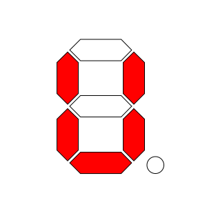
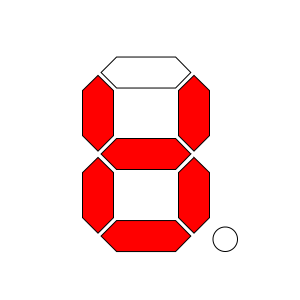
.. |max721927| image:: images/max7219/seg27.svg
    :class: component-image segment
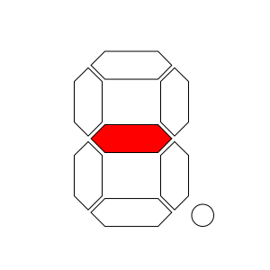
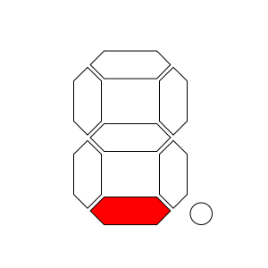
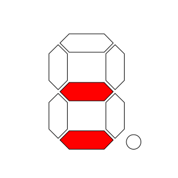
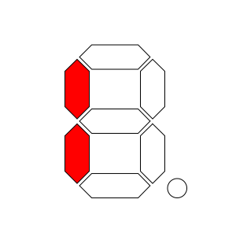
.. |max72190D| image:: images/max7219/seg0D.svg
    :class: component-image segment
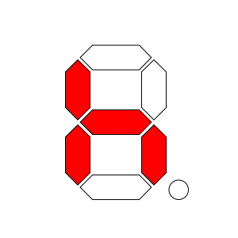
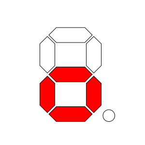
.. |max72191C| image:: images/max7219/seg1C.svg
    :class: component-image segment
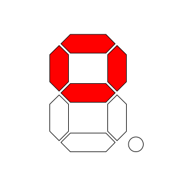

.. note::

    Original 7-segment display base image taken from Wikipedia at https://de.wikipedia.org/wiki/Datei:7_Segment_Display.svg
    by user `h2g2bob <https://commons.wikimedia.org/wiki/User:H2g2bob>`__ under
    `Creative Commons BY-SA 3.0 <https://creativecommons.org/licenses/by-sa/3.0/deed.de>`__ and modified
    for this documentation.

See Also
--------

- :doc:`index`
- :apiref:`max7219/max7219.h`
- `MAX7219 Library <https://github.com/nickgammon/MAX7219>`__ by `Nick Gammon <https://github.com/nickgammon>`__
- :ghedit:`Edit`
