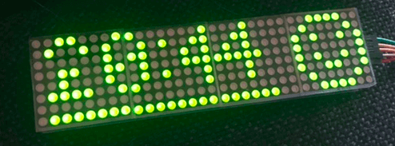

MAX7219 Digit Display
=====================

.. seo::
    :description: Instructions for setting up MAX7219 Digit displays.
    :image: max7219digit.jpg

The ``max7219`` display platform allows you to use MAX7219 digit with ESPHome. Please note that this component
is *only* for the digit "matrix" display, for the 7 segment display see :doc:`max7219`.

    MAX7219 Digit Display.

As the communication with the MAX7219 Digit is done using SPI for this component, you need
to have an :ref:`SPI bus <spi>` in your configuration with both the **mosi_pin** set (miso_pin is not required).
Connect VCC to 3.3V (the manufacturer recommends 4+ V, but 3.3V seems to work fine), DIN to your ``mosi_pin`` and
CS to your set ``cs_pin`` and finally GND to GND.

You can even daisy-chain multiple MAX7219s by connecting the DOUT of the previous chip in the chain to the
next DIN. With more than ~3 chips the 3.3V will probably not be enough, so then you will have to potentially
use a logic level converter.

.. code-block:: yaml

    # Example configuration entry
    spi:
      clk_pin: D0
      mosi_pin: D1

    display:
      - platform: max7219digit
        cs_pin: D2
        num_chips: 4
        intensity: 15
        lambda: |-
          it.print(0, 0, id(digit_font), "HELLO!");

Configuration variables:
------------------------

- **cs_pin** (**Required**, :ref:`Pin Schema <config-pin_schema>`): The pin you have the CS line hooked up to.
- **num_chips** (*Optional*, int): The number of chips you wish to use for daisy chaining. Defaults to
  ``4``.
- **rotate_chip** (*Optional*): Rotates every 8x8 chip. Valid values are ``0``, ``90``, ``180`` and ``270``.
  Defaults to ``0``.
- **scroll_enable** (*Optional*, boolean): Turn scroll mode on when content does not fit. Defaults to ``true``.
- **scroll_mode** (*Optional*): Set the scroll mode. One of ``CONTINUOUS`` or ``STOP``. Defaults to ``CONTINUOUS``

    - ``CONTINUOUS``: Always scrolls and the text repeats continuously, you might need to add some
      separation at the end.
    - ``STOP``: When text is over it waits the ``scroll_dwell`` time and scroll is set back to the start.

- **scroll_speed** (*Optional*, :ref:`config-time`): Set scroll speed. Defaults to ``250ms``
- **scroll_delay** (*Optional*, :ref:`config-time`): Set delay time before scroll starts. Defaults to ``1s``.
- **scroll_dwell** (*Optional*, :ref:`config-time`): Sets the wait time at the end of the scroll before starting
  over. This is only used in mode ``STOP``. Defaults to ``1s``.
- **reverse_enable** (*Optional*, boolean): For some displays the order of the displays is reversed ("DCBA"). This option will reverse the display to ("ABCD") again. Defaults to  ``false``.
- **intensity** (*Optional*, int): The intensity with which the MAX7219 should drive the outputs. Range is
  from ``0``, least intense to ``15`` the brightest. Defaults to ``15``.
- **lambda** (*Optional*, :ref:`lambda <config-lambda>`): The lambda to use for rendering the content on the
  MAX7219. See :ref:`display-max7219digit_lambda` for more information.
- **update_interval** (*Optional*, :ref:`config-time`): The interval to re-draw the screen. Defaults to ``1s``.
- **spi_id** (*Optional*, :ref:`config-id`): Manually specify the ID of the :ref:`SPI Component <spi>` if you want
  to use multiple SPI buses.
- **id** (*Optional*, :ref:`config-id`): Manually specify the ID used for code generation.
- **num_chip_lines** (*Optional*, int): Number of lines if you want to use the displays in Multiline Mode. Defaults to ``1`` Example: https://github.com/esphome/esphome/pull/1622#issue-836179156
- **chip_lines_style** (*Optional*): How are the lines in Multiline Mode connected? Possible values are ``zigzag`` and ``snake``. Defaults to ``snake``
- **flip_x** (*Optional*, boolean): Flip the horizontal axis on the screen. Defaults to ``false``.

.. _display-max7219digit_lambda:

Rendering Lambda
----------------

The MAX7219 digit is based on the fully fledged :ref:`display-engine`, as it has a concept of individual pixels 8 X 8
per max7219 chip. In the lambda you're passed a variable called ``it`` as with all other displays. Some "Special"
commands have been added to the basic display set.

.. code-block:: yaml

    display:
      - platform: max7219digit
        cs_pin: D8
        num_chips: 4
        lambda: |-
          it.strftime(0, 0, id(digit_font), "%H:%M", id(hass_time).now());
          it.image(24, 0, id(my_image));
          it.line(1, 7, 21, 7);
    font:
      - file: "pixelmix.ttf"
        id: digit_font
        size: 6

    time:
      - platform: homeassistant
        id: hass_time

    image:
      - file: "smile.png"
        id: my_image

This is roughly the code used to display the MAX7219 pictured in the image.

Scrolling
*********

By default the MAX7219Digit display has scroll enabled. The parameters can be set in the YAML file.
They can also be changed in the Lambda by adding the following command:

.. code-block:: cpp

    it.scroll(<on/off>, <mode>, <speed>, <delay>, <dwell>);

- **on/off** -> switch scrolling on or off, use true or false
- **mode** -> max7219digit::CONTINUOUS for continuous scrolling, max7219digit::STOP = Stop at end and reset
- **speed** -> Set speed of scrolling (ms for every step of one dot)
- **delay** -> pause time at start of scrolling
- **dwell** -> pause at end of scrolling (only in mode 1)

.. code-block:: yaml

    display:
      - platform: max7219digit
        # ...
        lambda: |-
          # ...
          it.scroll(true, max7219digit::CONTINUOUS, 100, 5000, 1500);
          // OR
          it.scroll(true, max7219digit::CONTINUOUS);
          // OR
          it.scroll(true);

- The screen does not scroll if the text fits within the screen.
- ``printdigit("...")`` and ``printdigitf("...")`` the alternative way of displaying text does not scroll

Screen inversion
****************

.. code-block:: yaml

    display:
      - platform: max7219digit
        # ...
        lambda: |-
          it.invert_on_off(true);
          // Print Hello at position 0 (left)
          it.print(0,0, id(digit_font), "Hello!");

The function ``it.invert_on_off(true);`` will invert the display. So background pixels are on and texts pixels are
off. ``it.invert_on_off(false);`` sets the display back to normal. In case no argument is used: ``it.invert_on_off();``
the inversion will toggle from on to off or visa versa. This will happen every time the display is updated.
So a blinking effect is created. The background pixels are only set at the next update, the pixels drawn in
the various function like print, line, etc. are directly influenced by the invert command.

.. code-block:: yaml

    display:
      - platform: max7219digit
        # ...
        lambda: |-
          it.invert_on_off(true);
          // Print Hello at position 0 (left)
          it.print(0,0, id(digit_font), "Hello!");
          it.line(0, 0, 31, 7, COLOR_OFF);

This code will only affect the line drawn on the screen. The line will wipe the pixels from top left to right bottom.
The background is not affected.

Screen intensity
****************

The intensity of the screen can be set "dynamically" within the lambda code with the following command: it.intensity(``0`` .. ``15``).

.. code-block:: yaml

    display:
      - platform: max7219digit
        # ...
        lambda: |-
          it.intensity(10);

Screen ON/OFF
*************

The display can be switched on and off "dynamically" within the lambda code with the following command: it.turn_on_off(true or false).

.. code-block:: yaml

    display:
      - platform: max7219digit
        # ...
        lambda: |-
          it.turn_on_off(true);

For a quick display some additional commands are embedded in the code with a related 8 pixel font. Three methods
(``printdigit``, ``printdigitf`` and ``strftimedigit``) can be used for displaying characters. Each 8 X 8 grid is used to
display a single character. So not very space efficient. The format of the command is: ``it.printdigit("1234");`` or
``it.printdigitf("%s","1234")``;

Please see :ref:`display-printf` for a quick introduction into the ``printf`` formatting rules and
:ref:`display-strftime` for an introduction into the ``strftime`` time formatting.

See Also
--------

- :doc:`index`
- :apiref:`max7219/max7219.h`
- `MAX7219 Library <https://github.com/nickgammon/MAX7219>`__ by `Nick Gammon <https://github.com/nickgammon>`__
- :ghedit:`Edit`
