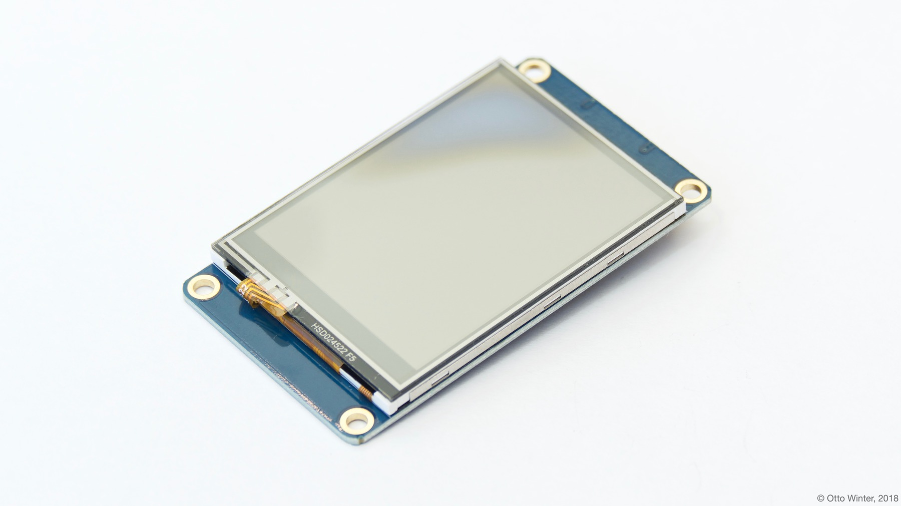

Nextion TFT LCD Display
=======================

.. seo::
    :description: Instructions for setting up Nextion TFT LCD displays
    :image: nextion.jpg

The ``nextion`` display platform allows you to use Nextion LCD displays (`datasheet <https://nextion.itead.cc/resources/datasheets/>`__,
`iTead <https://www.itead.cc/display/nextion.html>`__)
with ESPHome.

    Nextion LCD Display.

As the communication with the Nextion LCD display is done using UART, you need to have an :ref:`UART bus <uart>`
in your configuration with ``rx_pin`` both the ``tx_pin`` set to the respective pins on the display.
Additionally, you need to set the baud rate to 9600.

.. code-block:: yaml

    # Example configuration entry
    uart:
      rx_pin: D0
      tx_pin: D1
      baud_rate: 9600

    display:
      - platform: nextion
        lambda: |-
          it.set_component_value("gauge", 50);
          it.set_component_text("textview", "Hello World!");

Configuration variables:
------------------------

- **uart_id** (*Optional*, :ref:`config-id`): The ID of the :ref:`UART bus <uart>` you wish to use for this display.
  Use this if you want to use multiple UART buses at once.
- **brightness** (*Optional*, percentage): Set display brightness in %. Defaults to ``100%``
- **lambda** (*Optional*, :ref:`lambda <config-lambda>`): The lambda to use for rendering the content on the nextion display.
  See :ref:`display-nextion_lambda` for more information.
- **update_interval** (*Optional*, :ref:`config-time`): The interval to call the lambda to update the display.
  Defaults to ``5s``.
- **id** (*Optional*, :ref:`config-id`): Manually specify the ID used for code generation.

.. _display-nextion_lambda:

Rendering Lambda
----------------

With Nextion displays, a dedicated chip on the display itself does the whole rendering. ESPHome can only
send *instructions* to the display to tell it *how* to render something and *what* to render.

First, you need to use the `Nextion Editor <https://nextion.tech/nextion-editor/>`__ to
create a display file and insert it using the SD card slot. Then, in the rendering ``lambda``, you have 3 main methods
you can call to populate data on the display:

.. code-block:: yaml

    display:
      - platform: nextion
        # ...
        lambda: |-
          // set the "value" of a component - value is always an integer
          // for example gauges represent their status using integers from 0 to 100
          it.set_component_value("gauge", 50);

          // set the text of a component
          it.set_component_text("textview", "Hello World!");

          // set the text of a component with formatting
          it.set_component_text_printf("textview", "The uptime is: %.1f", id(uptime_sensor).state);

Please see :ref:`display-printf` for a quick introduction into the ``printf`` formatting rules and
:ref:`display-strftime` for an introduction into the ``strftime`` time formatting.

See Also
--------

- :doc:`index`
- :doc:`/components/binary_sensor/nextion`
- :apiref:`nextion/nextion.h`
- `Simple Nextion Library <https://github.com/bborncr/nextion>`__ by `Bentley Born <https://github.com/bborncr>`__
- `Official Nextion Library <https://github.com/itead/ITEADLIB_Arduino_Nextion>`__ by `iTead <https://www.itead.cc/>`__
- :ghedit:`Edit`
