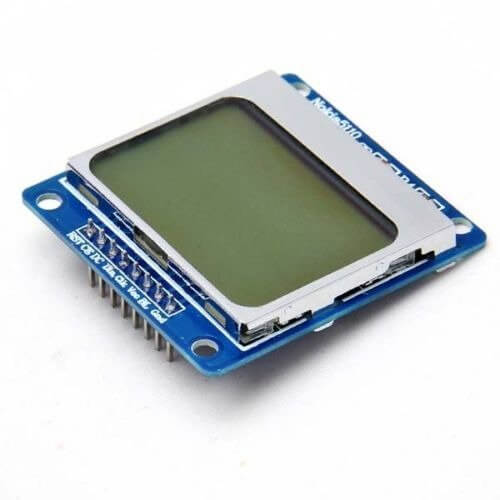

PCD 8544 Display (Nokia 5110/3310)
==================================

.. seo::
    :description: Instructions for setting up PCD8544 display drivers.
    :image: pcd8544.jpg

.. _pcd8544:

Usage
-----

The ``pcd8544`` display platform allows you to use
PCD8544 (`Adafruit <https://www.adafruit.com/product/338>`__)
displays with ESPHome. Connection to this display is made using the 4-Wire :ref:`SPI bus <spi>`.

It's a monochrome LCD display was used in old Nokia 5110/3310 cell phones.

The resolution of the display is 84x48 pixels.

    PCD8544 Display

Connect CLK, DIN, CS (CE), DC, and RST to pins on your ESP. For power, connect
VCC to 3.3V and GND to GND.

.. code-block:: yaml

    # Example configuration entry
    spi:
      clk_pin: D5
      mosi_pin: D7

    display:
      - platform: pcd8544
        reset_pin: D0
        cs_pin: D8
        dc_pin: D1
        contrast: 0x7f
        lambda: |-
          it.print(0, 0, id(font), "Hello World!");

Backlight
*********

To use a backlight LIGHT pin needs to be connected to ground. If connected to GPIO pin it can be controlled from ESPHome. See :doc:`/components/light/monochromatic`.

Configuration variables:
************************

- **reset_pin** (**Required**, :ref:`Pin Schema <config-pin_schema>`): The RESET pin.
- **cs_pin** (**Required**, :ref:`Pin Schema <config-pin_schema>`): The CS pin.
- **dc_pin** (**Required**, :ref:`Pin Schema <config-pin_schema>`): The DC pin.
- **lambda** (*Optional*, :ref:`lambda <config-lambda>`): The lambda to use for rendering the content on the display.
  See :ref:`display-engine` for more information.
- **update_interval** (*Optional*, :ref:`config-time`): The interval to re-draw the screen. Defaults to ``5s``.
- **pages** (*Optional*, list): Show pages instead of a single lambda. See :ref:`display-pages`.
- **id** (*Optional*, :ref:`config-id`): Manually specify the ID used for code generation.
- **contrast** (*Optional*, int): Set screen contrast (0-255). Defaults to ``0x7f``.

See Also
--------

- :doc:`index`
- :apiref:`pcd8544/pcd8544.h`
- `Tutorial from Adafruit <https://learn.adafruit.com/nokia-5110-3310-monochrome-lcd>`__
- `PCD8544 Library <https://github.com/adafruit/Adafruit-PCD8544-Nokia-5110-LCD-library>`__ by `Adafruit <https://www.adafruit.com/>`__
- :ghedit:`Edit`
