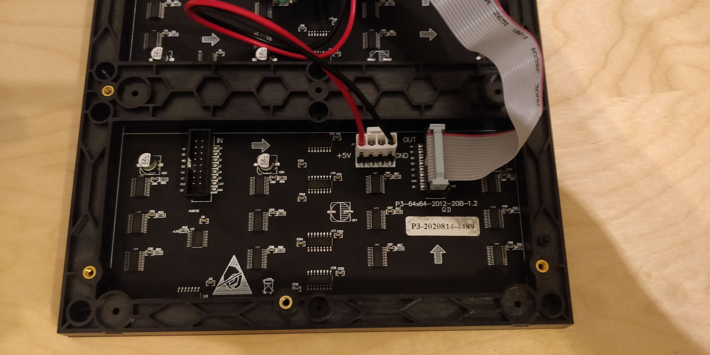
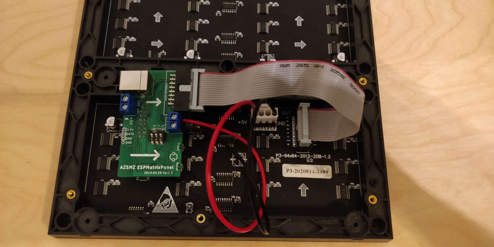

Matrix Display with PxMatrix library
====================================

The ``PxMatrix`` library  platform allows you to use
some LED Matrix displays with a "FM6126A", "FM6124" or a "SHIFT" register.
Example controller: `<https://github.com/cxandy/AZSMZ-ESPMatrixPanel>`__

    Matrix Display from the Back. 

    Matrix Display from the Back with a AZSMZ-ESPMatrixPanel controller attached. 

===================== =====================
**ESP Pin**           **ESPHome Option**
--------------------- ---------------------
``3.3V``              N/A
--------------------- ---------------------
``GND``               N/A
--------------------- ---------------------
Any GPIO              ``pin_latch``
--------------------- ---------------------
Any GPIO              ``pin_a``
--------------------- ---------------------
Any GPIO              ``pin_b``
--------------------- ---------------------
Any GPIO              ``pin_c``
--------------------- ---------------------
Any GPIO              ``pin_d``
--------------------- ---------------------
Any GPIO              ``pin_e``
--------------------- ---------------------
Any GPIO              ``pin_oe``
===================== =====================

.. code-block:: yaml

    # Example configuration entry
    display:
      platform: pxmatrix
      scan_pattern: "LINE"
      multiplexer: "BINARY"
      chipset: "FM6124"
      rgb_order: "RRGGBB"
      width: 64
      height: 64
      brightness: 1
      row_pattern: 32
      pin_latch: 16
      pin_a: 5
      pin_b: 4
      pin_c: 15
      pin_d: 12
      pin_e: 0
      pin_oe: 2
      id: my_display
      lambda: |-
        it.strftime(0, 0, id(font), "Test");

    interval:
    - interval: 4s
      then:
      - display.page.show_next: my_display
      - lambda: |-
          id(my_display).display();

Limitations:
------------
Because of limitations in the PxMatrix library the lambda has do be called from an External source.
This is only needed to what is on the Screen.

Configuration variables:
------------------------

- **row_pattern** (**Optional**): The Row Pattern.
- **brightness** (**Optional**): Brightness level of the LEDs.
- **height** (**Optional**): Height of Display in Pixels.
- **width** (**Optional**): Width of Display in Pixels.
- **rgb_order** (**Optional**): The Order the LEDs will be accessed.

  - ``RRGGBB``
  - ``RRBBGG``
  - ``GGRRBB``
  - ``GGBBRR``
  - ``BBRRGG``
  - ``BBGGRR``

- **chipset** (**Optional**): The used Chipset.

  - ``SHIFT``
  - ``FM6124``
  - ``FM6126A``

- **multiplexer** (**Optional**): Multiplexer algorithm that will be used.

  - ``BINARY``
  - ``STRAIGHT``

- **scan_pattern** (**Optional**): The used Scanning pattern.

  - ``LINE``
  - ``ZIGZAG``
  - ``VZAG``
  - ``WZAGZIG``
  - ``ZAGGIZ``
  - ``ZZAGG``

- **pin_latch** (**Optional**, :ref:`Pin Schema <config-pin_schema>`): The Latch pin.
- **pin_a** (**Optional**, :ref:`Pin Schema <config-pin_schema>`): The A pin.
- **pin_b** (**Optional**, :ref:`Pin Schema <config-pin_schema>`): The B pin.
- **pin_c** (**Optional**, :ref:`Pin Schema <config-pin_schema>`): The C pin.
- **pin_d** (**Optional**, :ref:`Pin Schema <config-pin_schema>`): The D pin.
- **pin_e** (**Optional**, :ref:`Pin Schema <config-pin_schema>`): The E pin.
- **pin_oe** (**Optional**, :ref:`Pin Schema <config-pin_schema>`): The OE pin.

- **id** (*Optional*, :ref:`config-id`): Manually specify the ID used for code generation.

See Also
--------

- :doc:`index`
- :apiref:`pxmatrix/pxmatrix_display.h`
- `PxMatrix library <https://github.com/2dom/PxMatrix>`__ by `Dominic Buchstaller (@2dom) <https://github.com/2dom>`__
- :ghedit:`Edit`
