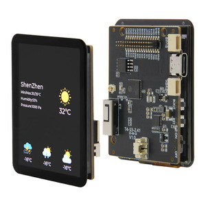
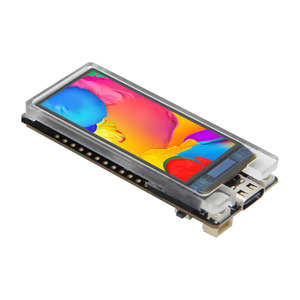

Quad SPI AMOLED Displays
========================

.. seo::
    :description: Instructions for setting up quad SPI AMOLED displays.
    :image: t4-s3.jpg

.. _qspi_amoled:

Models
------
This display driver supports AMOLED displays with quad SPI interfaces.

This driver has been tested with the following displays:

  - Lilygo T4-S3
  - Lilygo T-Display S3 AMOLED

Usage
-----
This component requires an ESP32 and the use of
ESP-IDF. PSRAM is a requirement due to the size of the display buffer. A :ref:`quad SPI bus <spi>` interface must be configured.

    Lilygo T4-S3

    Lilygo T-Display S3 AMOLED

.. code-block:: yaml

    # Example minimal configuration entry

    display:
      - platform: qspi_amoled
        model: RM690B0
        data_rate: 80MHz
        spi_mode: mode0
        dimensions:
          width: 450
          height: 600
          offset_width: 16
        color_order: rgb
        invert_colors: false
        brightness: 255
        cs_pin: GPIOXX
        reset_pin: GPIOXX
        enable_pin: GPIOXX

Configuration variables:
************************

- **model** (**Required**): One of ``RM67162`` or ``RM690B0``.
- **cs_pin** (**Required**, :ref:`Pin Schema <config-pin_schema>`): The chip select pin.
- **reset_pin** (*Optional*, :ref:`Pin Schema <config-pin_schema>`): The RESET pin.
- **enable_pin** (*Optional*, :ref:`Pin Schema <config-pin_schema>`): The display enable pin.
- **brightness** (*Optional*, int): A brightness value in the range 0-255
- **update_interval** (*Optional*, :ref:`config-time`): The interval to re-draw the screen. Defaults to ``5s``.
- **auto_clear_enabled** (*Optional*, boolean): Whether to automatically clear the display in each loop (''true'', default),
  or to keep the existing display content (must overwrite explicitly, e.g., only on data change).
- **pages** (*Optional*, list): Show pages instead of a single lambda. See :ref:`display-pages`.
- **id** (*Optional*, :ref:`config-id`): Manually specify the ID used for code generation.
- **color_order** (*Optional*): Should be one of ``rgb`` (default) or ``bgr``.
- **dimensions** (**Required**): Dimensions of the screen, specified either as *width* **x** *height* (e.g ``320x240``) or with separate config keys.
    - **height** (**Required**, int): Specifies height of display in pixels.
    - **width** (**Required**, int): Specifies width of display.
    - **offset_width** (*Optional*, int): Specify an offset for the x-direction of the display, typically used when a display is smaller than the maximum supported by the driver chip. Default is 0
    - **offset_height** (*Optional*, int): Specify an offset for the y-direction of the display. Default is 0.

- **rotation** (*Optional*): Rotate the display presentation in software. Choose one of ``0°``, ``90°``, ``180°``, or ``270°``.
- **transform** (*Optional*): Transform the display presentation using hardware. All defaults are ``false``. This option cannot be used with ``rotation``.

   - **swap_xy** (*Optional*, boolean): If true, exchange the x and y axes.
   - **mirror_x** (*Optional*, boolean): If true, mirror the x axis.
   - **mirror_y** (*Optional*, boolean): If true, mirror the y axis.
- **data_rate** (*Optional*): Set the data rate of the SPI interface to the display. One of ``80MHz``, ``40MHz``, ``20MHz``, ``10MHz`` (default), ``5MHz``, ``2MHz`` or  ``1MHz``.
- **spi_mode** (*Optional*): Set the mode for the SPI interface to the display. Default is ``MODE0``.
- **invert_colors** (*Optional*): With this boolean option you can invert the display colors.
- **lambda** (*Optional*, :ref:`lambda <config-lambda>`): The lambda to use for rendering the content on the display.
  See :ref:`display-engine` for more information.

Example configurations
----------------------

Lilygo T4-S3
************

.. code-block:: yaml

    spi:
      id: quad_spi
      type: quad
      clk_pin: 15
      data_pins: [14, 10, 16, 12]

    i2c:
      sda: 6
      scl: 7

    touchscreen:
      - platform: cst226
        id: my_touchscreen
        interrupt_pin: 8
        reset_pin: 17

    display:
      - platform: qspi_amoled
        model: RM690B0
        data_rate: 80MHz
        spi_mode: mode0
        dimensions:
          width: 450
          height: 600
          offset_width: 16
        color_order: rgb
        invert_colors: false
        brightness: 255
        cs_pin: 11
        reset_pin: 13
        enable_pin: 9
        update_interval: never
        auto_clear_enabled: false

    psram:
      mode: octal
      speed: 80MHz

Lilygo T-Display S3 AMOLED
**************************

.. code-block:: yaml

    spi:
      id: quad_spi
      type: quad
      clk_pin: 47
      data_pins:
        - 18
        - 7
        - 48
        - 5

    i2c:
      sda: 3
      scl: 2

    touchscreen:
      - platform: cst816
        id: my_touchscreen
        interrupt_pin:
          number: 21

    display:
      - platform: qspi_amoled
        model: RM67162
        id: main_lcd
        dimensions:
          height: 240
          width: 536
        transform:
          mirror_x: true
          swap_xy: true
        color_order: rgb
        brightness: 255
        cs_pin: 6
        reset_pin: 17
        enable_pin: 38

See Also
--------

- :doc:`index`
- :apiref:`qspi_amoled/qspi_amoled.h`
- :ghedit:`Edit`
