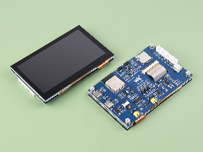

RPI_DPI_RGB Display Driver
===========================

.. seo::
    :description: Instructions for setting up 16 bit "RPI_DPI_RGB" parallel displays
    :image: waveshare_touch-s3.jpg

.. _rpi_dpi_rgb:

Models
------
This display driver supports displays with 16 bit parallel interfaces, often referred to as "RPI_DPI_RGB" type.
These have a parallel interface but no SPI interface and require no configuration of the driver chip.

This driver has been tested with the following displays:

  - Waveshare ESP32-S3-Touch-LCD-4.3
  - Makerfabs 4.3" display (Sunton)

Usage
-----
This component requires an ESP32 (usually an ESP32-S3 because of the number of GPIO pins required) and the use of
ESP-IDF. PSRAM is a requirement due to the size of the display buffer.

    Waveshare ESP32-S3 Touch 4.3

.. code-block:: yaml

    # Example minimal configuration entry
    display:
      - platform: rpi_dpi_rgb
        id: rpi_disp
        dimensions:
          width: 800
          height: 480
        de_pin: REPLACE_ME
        hsync_pin: REPLACE_ME
        vsync_pin: REPLACE_ME
        pclk_pin: REPLACE_ME

        data_pins:
          red:
            - XX        #r1
            - XX        #r2
            - XX        #r3
            - XX        #r4
            - XX        #r5
          green:
            - XX        #g0
            - XX        #g1
            - XX        #g2
            - XX        #g3
            - XX        #g4
            - XX        #g5
          blue:
            - XX        #b1
            - XX        #b2
            - XX        #b3
            - XX        #b4
            - XX        #b5

Configuration variables:
************************

- **data_pins** (**Required**) A list of pins used for the databus. Specified in 3 groups:

    - **red**: (**Required**, :ref:`Pin Schema <config-pin_schema>`) Exactly 5 pin numbers for the red databits, listed from least to most significant bit.
    - **green**: (**Required**, :ref:`Pin Schema <config-pin_schema>`) Exactly 6 pin numbers for the green databits, listed from least to most significant bit.
    - **blue**: (**Required**, :ref:`Pin Schema <config-pin_schema>`) Exactly 5 pin numbers for the blue databits, listed from least to most significant bit.
- **de_pin** (**Required**, :ref:`Pin Schema <config-pin_schema>`): The DE pin
- **pclk_pin** (**Required**, :ref:`Pin Schema <config-pin_schema>`): The PCLK pin.
- **hsync_pin** (**Required**, :ref:`Pin Schema <config-pin_schema>`): The Horizontal sync pin.
- **vsync_pin** (**Required**, :ref:`Pin Schema <config-pin_schema>`): The Vertical sync pin.
- **reset_pin** (*Optional*, :ref:`Pin Schema <config-pin_schema>`): The RESET pin.
- **hsync_pulse_width** (*Optional*, int): The horizontal sync pulse width.
- **hsync_front_porch** (*Optional*, int): The horizontal front porch length.
- **hsync_back_porch** (*Optional*, int): The horizontal back porch length.
- **vsync_pulse_width** (*Optional*, int): The vertical sync pulse width.
- **vsync_front_porch** (*Optional*, int): The vertical front porch length.
- **vsync_back_porch** (*Optional*, int): The vertical back porch length.
- **update_interval** (*Optional*, :ref:`config-time`): The interval to re-draw the screen. Defaults to ``5s``.
- **auto_clear_enabled** (*Optional*, boolean): Whether to automatically clear the display in each loop (''true'', default),
  or to keep the existing display content (must overwrite explicitly, e.g., only on data change).
- **pages** (*Optional*, list): Show pages instead of a single lambda. See :ref:`display-pages`.
- **id** (*Optional*, :ref:`config-id`): Manually specify the ID used for code generation.
- **color_order** (*Optional*): Should be one of ``bgr`` (default) or ``rgb``.
- **dimensions** (**Required**): Dimensions of the screen, specified either as *width* **x** *height* (e.g ``320x240``) or with separate config keys.
    - **height** (**Required**, int): Specifies height of display in pixels.
    - **width** (**Required**, int): Specifies width of display.
    - **offset_width** (*Optional*, int): Specify an offset for the x-direction of the display, typically used when an LCD is smaller than the maximum supported by the driver chip. Default is 0
    - **offset_height** (*Optional*, int): Specify an offset for the y-direction of the display. Default is 0.

- **pclk_frequency** (*Optional*): Set the pixel clock speed. Default is 16MHz.
- **pclk_inverted** (*Optional* bool): If the pclk is active negative (default is True)
- **invert_colors** (*Optional*): With this boolean option you can invert the display colors. **Note** some of the displays have this option set automatically to true and can't be changed.
- **rotation** (*Optional*): Rotate the display presentation in software. Choose one of ``0°``, ``90°``, ``180°``, or ``270°``.
- **lambda** (*Optional*, :ref:`lambda <config-lambda>`): The lambda to use for rendering the content on the display.
  See :ref:`display-engine` for more information.

The horizontal and vertical ``pulse_width``, ``front_porch`` and ``back_porch`` values are optional, but may require
changing for a specific display. Refer to the manufacturer's sample code for suitable values. These specify timing
requirements for the display.

Example configurations
----------------------

Waveshare ESP32-S3 Touch 4.3
****************************

.. code-block:: yaml

    display:
      - platform: rpi_dpi_rgb
        auto_clear_enabled: false
        color_order: RGB
        pclk_frequency: 16MHz
        dimensions:
          width: 800
          height: 480
        de_pin:
          number: 5
        hsync_pin:
          number: 46
          ignore_strapping_warning: true
        vsync_pin:
          number: 3
          ignore_strapping_warning: true
        pclk_pin: 7
        hsync_back_porch: 30
        hsync_front_porch: 210
        hsync_pulse_width: 30
        vsync_back_porch: 4
        vsync_front_porch: 4
        vsync_pulse_width: 4
        data_pins:
          red:
            - 1         #r3
            - 2         #r4
            - 42        #r5
            - 41        #r6
            - 40        #r7
          blue:
            - 14        #b3
            - 38        #b4
            - 18        #b5
            - 17        #b6
            - 10        #b7
          green:
            - 39        #g2
            - 0         #g3
            - 45        #g4
            - 48        #g5
            - 47        #g6
            - 21        #g7

Makerfabs 4.3" 800x480 display
******************************

.. code-block:: yaml

    display:
      - platform: rpi_dpi_rgb
        update_interval: never
        auto_clear_enabled: false
        id: rpi_display
        color_order: RGB
        rotation: 90
        dimensions:
          width: 800
          height: 480
        de_pin:
          number: 40
        hsync_pin: 39
        vsync_pin: 41
        pclk_pin: 42
        data_pins:
          red:
            - 45        #r1
            - 48        #r2
            - 47        #r3
            - 21        #r4
            - 14        #r5
          green:
            - 5         #g0
            - 6         #g1
            - 7         #g2
            - 15        #g3
            - 16        #g4
            - 4         #g5
          blue:
            - 8         #b1
            - 3         #b2
            - 46        #b3
            - 9         #b4
            - 1         #b5

See Also
--------

- :doc:`index`
- :apiref:`rpi_dpi_rgb/rpi_dpi_rgb.h`
- :ghedit:`Edit`
