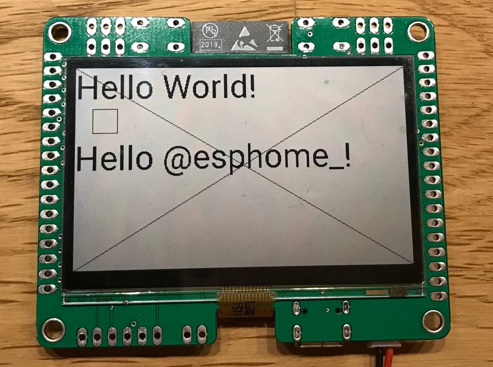

Sharp Memory LCD
=========================

.. seo::
    :description: Instructions for setting up Sharp Memory LCDs in ESPHome.
    :image: sharp_memory_lcd.jpg

The ``sharp_memory_lcd`` display platform allows you to use
Sharp Memory LCDs sold by `Adafruit <https://www.adafruit.com/product/4694>`__
with ESPHome. For The 2.7" variant use 400x240 resolution, 168x144 for the 1.3" one.

    2.7" Sharp Memory LCD.

The communication ESPHome works via :ref:`SPI <spi>`, and additional control pins `disp_pin`, `extmode_pin`, `extcomin_pin`.
`disp_pin` enables the LCD, `extmode_pin` controls how VCOM is generated. VCOM is alternating signal that helps to avoid DC bias buildup in the LCD.
In case that `extmode_pin` is high, VCOM signal is expected to be placed on `extcomin_pin`.

The underlying C++ driver implementation pulls `extmode_pin` low and generates VCOM per software.

==================== ===================== =====================
**Sharp Memory LCD**      **ESP Pin**      **ESPHome Option**
-------------------- --------------------- ---------------------
``VCC``              ``3.3V``              N/A
-------------------- --------------------- ---------------------
``GND``              ``GND``               N/A
-------------------- --------------------- ---------------------
``CLK``              Any GPIO              ``spi.clk_pin``
-------------------- --------------------- ---------------------
``DIN``              Any GPIO              ``spi.mosi_pin``
-------------------- --------------------- ---------------------
``CS``               Any GPIO              ``cs_pin``
-------------------- --------------------- ---------------------
``DISP``             Any GPIO or VCC       ``disp_pin``
-------------------- --------------------- ---------------------
``EXTMODE``          Any GPIO or GND       ``extmode_pin``
-------------------- --------------------- ---------------------
``EXTCOMIN``         Any GPIO or GND       ``extcomin_pin``
==================== ===================== =====================

.. code-block:: yaml

    # Example configuration entry
    spi:
      clk_pin: GPIO36
      mosi_pin: GPIO35

    font:
      - file: "gfonts://Roboto"
        id: roboto_40
        size: 40

    display:
      - platform: sharp_memory_lcd
        cs_pin: GPIO34
        width: 400
        height: 240
        update_interval: 30s
        invert_color: false
        lambda: |-
          it.print(0, 0, id(roboto_40), "Hello World!");
          it.line(0, 0, 400, 240);
          it.line(400, 0, 0, 240);
          it.rectangle(20, 50, 30, 30);

Configuration variables:
------------------------

- **cs_pin** (**Required**, :ref:`Pin Schema <config-pin_schema>`): The CS pin.
- **disp_pin** (*Optional*, :ref:`Pin Schema <config-pin_schema>`): The DISP pin, if not specified should be pulled high.
- **extmode_pin** (*Optional*, :ref:`Pin Schema <config-pin_schema>`): The EXTMODE pin, if not specified should be pulled low.
- **extcomin_pin** (*Optional*, :ref:`Pin Schema <config-pin_schema>`): The EXTCOMIN pin, if not specified should be pulled low.
- **width** (**Required**, int): LCD width in pixels.
- **height** (**Required**, int): LCD height in pixels.
- **invert_color** (*Optional*, bool): Inverts display color. Everything you draw in ``lambda:`` will be inverted.
- **update_interval** (*Optional*, :ref:`config-time`): The interval to re-draw the screen. Defaults to ``1s``, use ``never`` to only manually update the screen via ``component.update``.
- **spi_id** (*Optional*, :ref:`config-id`): Manually specify the ID of the :ref:`SPI Component <spi>` if you want
  to use multiple SPI buses.
- **id** (*Optional*, :ref:`config-id`): Manually specify the ID used for code generation.

See Also
--------

- :doc:`index`
- :apiref:`sharp_memory_lcd/sharp_memory_lcd.h`
- `Arduino Adafruit Sharp Memory LCD library <https://github.com/adafruit/Adafruit_SHARP_Memory_Display>`__
- :ghedit:`Edit`
