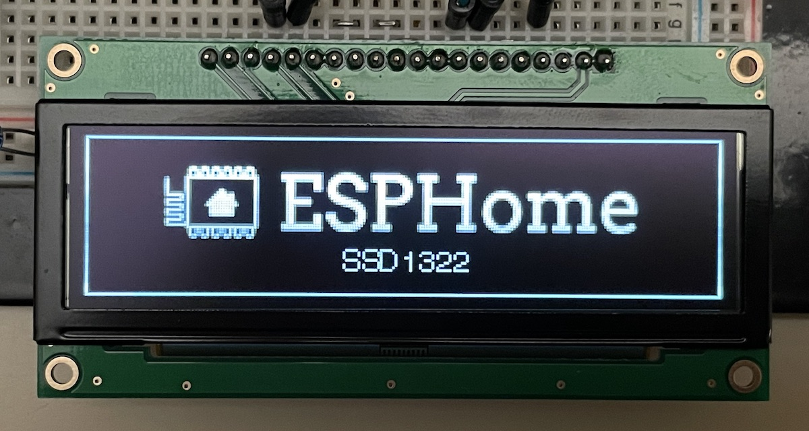

SSD1322 OLED Display
====================

.. seo::
    :description: Instructions for setting up SSD1322 OLED display drivers.
    :image: ssd1322.jpg

.. _ssd1322-spi:

``ssd1322_spi`` Component
-------------------------

The ``ssd1322_spi`` display platform allows you to use
SSD1322 (`datasheet <https://www.newhavendisplay.com/specs/NHD-3.12-25664UCW2.pdf>`__,
`Newhaven Display <https://www.newhavendisplay.com/nhd31225664ucw2-p-9583.html>`__)
displays with ESPHome. Note that this component is for displays that are connected via the 4-Wire :ref:`SPI bus <spi>`.

    SSD1322 OLED Display

Connect CLK, DIN, CS, DC, and RST to pins on your ESP. For power, connect
VCC to 3.3V and GND to GND.

.. code-block:: yaml

    # Example configuration entry
    spi:
      clk_pin: D5
      mosi_pin: D7

    display:
      - platform: ssd1322_spi
        model: "SSD1322 256x64"
        reset_pin: D0
        cs_pin: D8
        dc_pin: D1
        lambda: |-
          it.print(0, 0, id(font), "Hello World!");

Configuration variables:
************************

- **model** (**Required**): The model of the display. At present, only one option is available:

  - ``SSD1322 256x64``

- **dc_pin** (**Required**, :ref:`Pin Schema <config-pin_schema>`): The DC pin.
- **reset_pin** (*Optional*, :ref:`Pin Schema <config-pin_schema>`): The RESET pin.
- **cs_pin** (*Optional*, :ref:`Pin Schema <config-pin_schema>`): The CS pin.
- **lambda** (*Optional*, :ref:`lambda <config-lambda>`): The lambda to use for rendering the content on the display.
  See :ref:`display-engine` for more information.
- **update_interval** (*Optional*, :ref:`config-time`): The interval to re-draw the screen. Defaults to ``5s``.
- **pages** (*Optional*, list): Show pages instead of a single lambda. See :ref:`display-pages`.
- **id** (*Optional*, :ref:`config-id`): Manually specify the ID used for code generation.

See Also
--------

- :doc:`index`
- :apiref:`ssd1322_base/ssd1322_base.h`
- `SSD1322 Display documentation <https://www.newhavendisplay.com/specs/NHD-3.12-25664UCW2.pdf>`__ at `Newhaven Display <https://www.newhavendisplay.com/nhd31225664ucw2-p-9583.html>`__
- :ghedit:`Edit`
