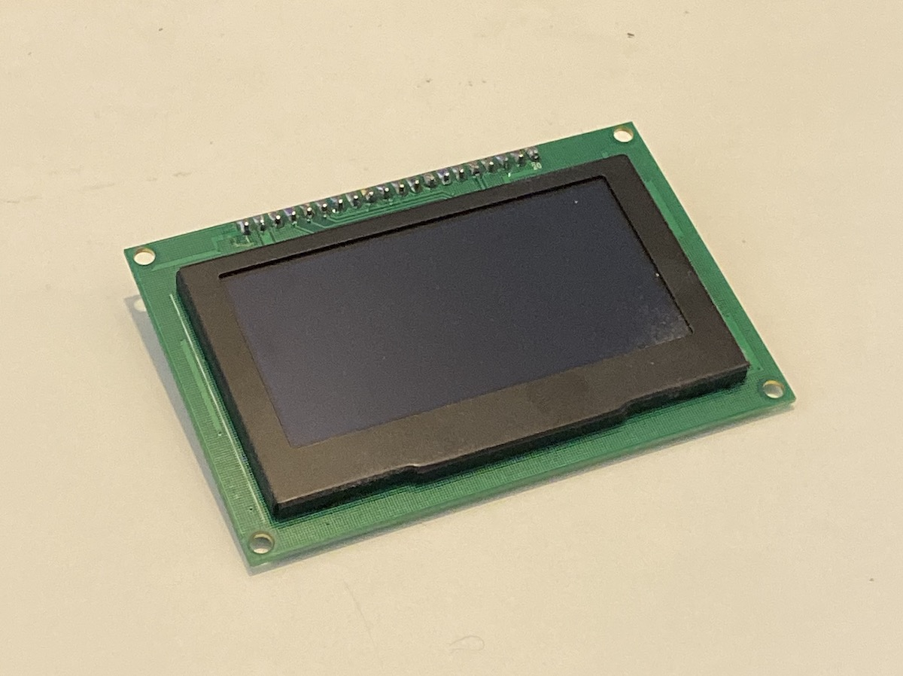

SSD1325/7 OLED Display
======================

.. seo::
    :description: Instructions for setting up SSD1325/7 OLED display drivers.
    :image: ssd1325.jpg

.. _ssd1325-spi:

``ssd1325_spi`` Component
-------------------------

The ``ssd1325_spi`` display platform allows you to use
SSD1325 (`datasheet <https://cdn-shop.adafruit.com/datasheets/SSD1325.pdf>`__,
`Adafruit <https://www.adafruit.com/product/2674>`__) displays with ESPHome. Note that this
component is for displays that are connected via the 4-Wire :ref:`SPI bus <spi>`.

    SSD1325 OLED Display

Connect CLK, DIN, CS, DC, and RST to pins on your ESP. For power, connect
VCC to 3.3V and GND to GND. Note that two jumper resistors on the back of the
display PCB may need to be moved to put the display into SPI mode.
`Adafruit <https://www.adafruit.com/product/2674>`__ has a
`guide <https://learn.adafruit.com/2-7-monochrome-128x64-oled-display-module/assembly>`__
that explains how to do this, if necessary.

.. code-block:: yaml

    # Example configuration entry
    spi:
      clk_pin: D5
      mosi_pin: D7

    display:
      - platform: ssd1325_spi
        model: "SSD1325 128x64"
        reset_pin: D0
        cs_pin: D8
        dc_pin: D1
        lambda: |-
          it.print(0, 0, id(font), "Hello World!");

Configuration variables:
************************

- **model** (**Required**): The model of the display. Options are:

  - ``SSD1325 128x32`` - SSD1325 with 128 columns and 32 rows
  - ``SSD1325 128x64``
  - ``SSD1325 96x16``
  - ``SSD1325 64x48``

- **dc_pin** (**Required**, :ref:`Pin Schema <config-pin_schema>`): The DC pin.
- **reset_pin** (*Optional*, :ref:`Pin Schema <config-pin_schema>`): The RESET pin.
- **cs_pin** (*Optional*, :ref:`Pin Schema <config-pin_schema>`): The pin on the ESP that that the CS line is connected to.
  The CS line can be connected to GND if this is the only device on the SPI bus.
- **lambda** (*Optional*, :ref:`lambda <config-lambda>`): The lambda to use for rendering the content on the display.
  See :ref:`display-engine` for more information.
- **update_interval** (*Optional*, :ref:`config-time`): The interval to re-draw the screen. Defaults to ``5s``.
- **pages** (*Optional*, list): Show pages instead of a single lambda. See :ref:`display-pages`.
- **id** (*Optional*, :ref:`config-id`): Manually specify the ID used for code generation.

Configuration examples
**********************

To utilize the grayscale capabilities of this display module, add a ``color:`` section to your YAML configuration;
please see :ref:`color <config-color>` for more details. As this is a grayscale display, it only uses the white color
element as shown below.

To use grayscale in your lambda:

.. code-block:: yaml

    color:
      - id: medium_gray
        white: 50%

    ...

    display:
        ...
        lambda: |-
          it.rectangle(0,  0, it.get_width(), it.get_height(), id(medium_gray));

To bring in grayscale images:

.. code-block:: yaml

    image:
      - file: "image.jpg"
        id: my_image
        resize: 120x120
        type: GRAYSCALE

    ...

    display:
        ...
        lambda: |-
          it.image(0, 0, id(my_image));

In this case, the image will be converted to grayscale (regardless of its original format) and rendered as such
when drawn on the display. Note that the original image may require some adjustment as not all images immediately
convert nicely to the 4-bit grayscale format this display supports.

Note that if ``type: GRAYSCALE`` is omitted, the image will render as a binary image (no grayscale); in this
case, a color attribute may be passed to the ``image()`` method as follows:

.. code-block:: yaml

    image:
      - file: "image.jpg"
        id: my_image
        resize: 120x120

    ...

    display:
        ...
        lambda: |-
          it.image(0, 0, id(medium_gray), id(my_image));

This will draw the complete image with the given shade of gray.

To create a new color as needed in code:

.. code-block:: yaml

    display:
        ...
        lambda: |-
          float white_intensity = 0.5;
          Color variable_gray(0, 0, 0, white_intensity);
          it.rectangle(0,  0, it.get_width(), it.get_height(), variable_gray);

The last argument of the ``Color`` constructor is the intensity of the white element; it is a percentage
(value of range 0 to 1). It may be defined by another variable so it is adjustable in code.

See Also
--------

- :doc:`index`
- :apiref:`ssd1325_base/ssd1325_base.h`
- `SSD1325 Library <https://github.com/adafruit/Adafruit_SSD1325>`__ by `Adafruit <https://www.adafruit.com/>`__
- :ghedit:`Edit`
