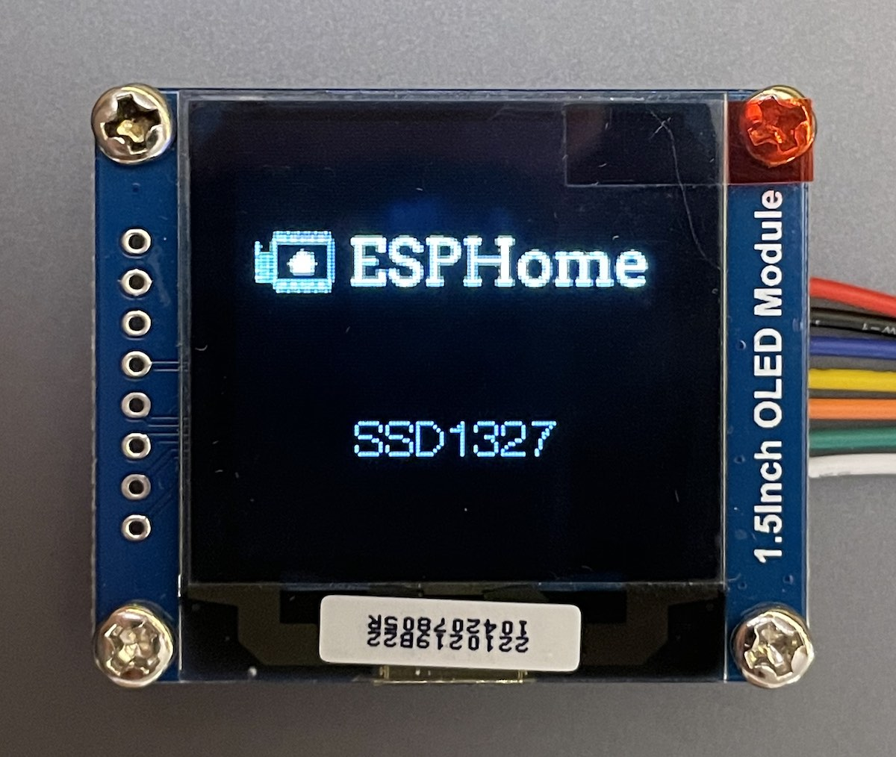

SSD1327 OLED Display
====================

.. seo::
    :description: Instructions for setting up SSD1327 OLED display drivers.
    :image: ssd1327.jpg

.. _ssd1327-i2c:

Over I²C
--------

The ``ssd1327_i2c`` display platform allows you to use
SSD1327 (`datasheet <https://www.generationrobots.com/media/Ecran_OLED_0_96/SSD1327_datasheet.pdf>`__,
`Waveshare <https://www.waveshare.com/1.5inch-oled-module.htm>`__) displays with ESPHome. Note that this component is for
displays that are connected via the :ref:`I²C Bus <i2c>`. If your SSD1327 is connected via the 4-Wire
:ref:`SPI bus <spi>`, see :ref:`ssd1327-spi`.

    SSD1327 OLED Display

Connect CLK to the SCL (clock) pin you chose for the :ref:`I²C Bus <i2c>` and connect DIN to the SDA (data) pin.
For power, connect VCC to 3.3V and GND to GND. You may also connect the ``RESET`` pin to an available pin on the
ESP; this is recommended as it improves reliability.

.. code-block:: yaml

    # Example configuration entry
    i2c:
      sda: D1
      scl: D2

    display:
      - platform: ssd1327_i2c
        model: "SSD1327 128x128"
        reset_pin: D0
        address: 0x3D
        lambda: |-
          it.print(0, 0, id(font), "Hello World!");

Configuration variables:
************************

- **model** (**Required**): The model of the display. At present, only one option is available:

  - ``SSD1327 128x128``

- **reset_pin** (*Optional*, :ref:`Pin Schema <config-pin_schema>`): The RESET pin. Defaults to not connected.
- **address** (*Optional*, int): Manually specify the :ref:`I²C <i2c>` address of the display. Defaults to 0x3D.
- **rotation** (*Optional*): Set the rotation of the display. Everything you draw in ``lambda:`` will be rotated
  by this option. One of ``0°`` (default), ``90°``, ``180°``, ``270°``.
- **brightness** (*Optional*, percentage): Set display brightness in %. Defaults to ``100%``
- **lambda** (*Optional*, :ref:`lambda <config-lambda>`): The lambda to use for rendering the content on the display.
  See :ref:`display-engine` for more information.
- **update_interval** (*Optional*, :ref:`config-time`): The interval to re-draw the screen. Defaults to ``5s``.
- **pages** (*Optional*, list): Show pages instead of a single lambda. See :ref:`display-pages`.
- **id** (*Optional*, :ref:`config-id`): Manually specify the ID used for code generation.

.. note::

    To speed up the display update process you can select higher I²C frequencies.

.. _ssd1327-spi:

Over SPI
--------

The ``ssd1327_spi`` display platform allows you to use
SSD1327 (`datasheet <https://cdn-shop.adafruit.com/datasheets/SSD1327.pdf>`__, `Adafruit <https://www.adafruit.com/product/326>`__)
displays with ESPHome. Note that this component is for displays that are connected via the 4-Wire :ref:`SPI bus <spi>`.
If your SSD1327 is connected via the :ref:`I²C Bus <i2c>`, see :ref:`ssd1327-i2c`.

    SSD1327 OLED Display

Connect CLK to the SCK (clock) pin you chose for the :ref:`SPI bus <spi>`, connect DIN to the MOSI/SDO pin, and connect ``DC``
to another pin of your choosing. ``CS`` may connect to a pin on the ESP or it may connect to ground if the display is the only
device connected to the SPI bus. For power, connect VCC to 3.3V and GND to GND. You may also connect the ``RESET`` pin to an
available pin on the ESP; this is recommended as it improves reliability.

.. code-block:: yaml

    # Example configuration entry
    spi:
      clk_pin: D0
      mosi_pin: D1

    display:
      - platform: ssd1327_spi
        model: "SSD1327 128x128"
        cs_pin: D2
        dc_pin: D3
        reset_pin: D4
        lambda: |-
          it.print(0, 0, id(font), "Hello World!");

Configuration variables:
************************

- **model** (**Required**): The model of the display. At present, only one option is available:

  - ``SSD1327 128x128``

- **cs_pin** (**Required**, :ref:`Pin Schema <config-pin_schema>`): The Chip Select (CS) pin.
- **dc_pin** (**Required**, :ref:`Pin Schema <config-pin_schema>`): The DC pin.
- **reset_pin** (*Optional*, :ref:`Pin Schema <config-pin_schema>`): The RESET pin. Defaults to not connected.
- **rotation** (*Optional*): Set the rotation of the display. Everything you draw in ``lambda:`` will be rotated
  by this option. One of ``0°`` (default), ``90°``, ``180°``, ``270°``.
- **brightness** (*Optional*, percentage): Set display brightness in %. Defaults to ``100%``
- **lambda** (*Optional*, :ref:`lambda <config-lambda>`): The lambda to use for rendering the content on the display.
  See :ref:`display-engine` for more information.
- **update_interval** (*Optional*, :ref:`config-time`): The interval to re-draw the screen. Defaults to ``5s``.
- **pages** (*Optional*, list): Show pages instead of a single lambda. See :ref:`display-pages`.
- **spi_id** (*Optional*, :ref:`config-id`): Manually specify the ID of the :ref:`SPI Component <spi>` if you want
  to use multiple SPI buses.
- **id** (*Optional*, :ref:`config-id`): Manually specify the ID used for code generation.

Configuration examples
**********************

To utilize the grayscale capabilities of this display module, add a ``color:`` section to your YAML configuration;
please see :ref:`color <config-color>` for more details. As this is a grayscale display, it only uses the white color
element as shown below.

To use grayscale in your lambda:

.. code-block:: yaml

    color:
      - id: medium_gray
        white: 50%

    ...

    display:
        ...
        lambda: |-
          it.rectangle(0,  0, it.get_width(), it.get_height(), id(medium_gray));

To bring in grayscale images:

.. code-block:: yaml

    image:
      - file: "image.jpg"
        id: my_image
        resize: 120x120
        type: GRAYSCALE

    ...

    display:
        ...
        lambda: |-
          it.image(0, 0, id(my_image));

In this case, the image will be converted to grayscale (regardless of its original format) and rendered as such
when drawn on the display. Note that the original image may require some adjustment as not all images immediately
convert nicely to the 4-bit grayscale format this display supports.

Note that if ``type: GRAYSCALE`` is omitted, the image will render as a binary image (no grayscale); in this
case, a color attribute may be passed to the ``image()`` method as follows:

.. code-block:: yaml

    image:
      - file: "image.jpg"
        id: my_image
        resize: 120x120

    ...

    display:
        ...
        lambda: |-
          it.image(0, 0, id(medium_gray), id(my_image));

This will draw the complete image with the given shade of gray.

To create a new color as needed in code:

.. code-block:: yaml

    display:
        ...
        lambda: |-
          float white_intensity = 0.5;
          Color variable_gray(0, 0, 0, white_intensity);
          it.rectangle(0,  0, it.get_width(), it.get_height(), variable_gray);

The last argument of the ``Color`` constructor is the intensity of the white element; it is a percentage
(value of range 0 to 1). It may be defined by another variable so it is adjustable in code.

See Also
--------

- :doc:`index`
- :apiref:`ssd1327_base/ssd1327_base.h`
- :ghedit:`Edit`
