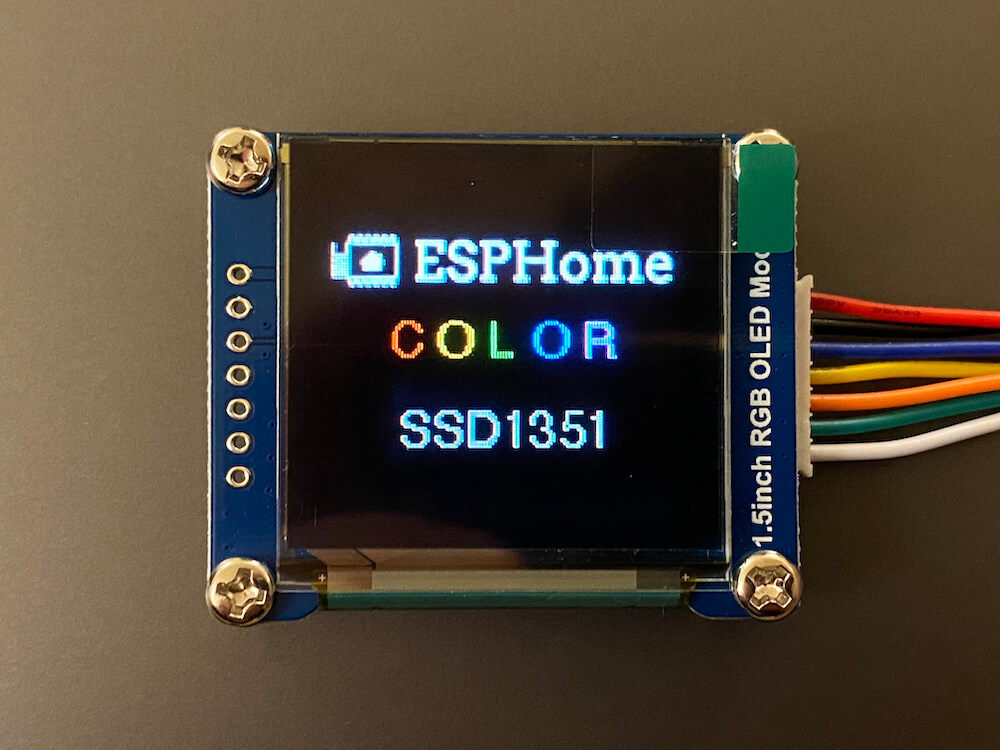

SSD1351 OLED Display
====================

.. seo::
    :description: Instructions for setting up SSD1351 OLED display drivers.
    :image: ssd1351.jpg

.. _ssd1351-spi:

``ssd1351_spi`` Component
-------------------------

The ``ssd1351_spi`` display platform allows you to use
SSD1351 (`datasheet <https://cdn-shop.adafruit.com/datasheets/SSD1351-Revision+1.3.pdf>`__,
`Adafruit 128x128 <https://www.adafruit.com/product/1431>`__,
`Adafruit 128x96 <https://www.adafruit.com/product/1673>`__,
`Waveshare 128x128 <https://www.waveshare.com/product/displays/lcd-oled/lcd-oled-3/1.5inch-rgb-oled-module.htm>`__)
displays with ESPHome. This component is for displays that are connected via the 4-Wire :ref:`SPI bus <spi>`.

    SSD1351 OLED Display

Connect CLK, DIN, CS, DC, and RST to pins on your ESP. For power, the Adafruit modules have two pins; connect
3.3 volts to their ``3v`` **or** connect 5 volts to their ``+`` pin. The Waveshare modules have only a Vcc pin
which should be connected to 3.3 volts only. Connect the GND or G pin to GND.

.. code-block:: yaml

    # Example configuration entry
    spi:
      clk_pin: D5
      mosi_pin: D7

    display:
      - platform: ssd1351_spi
        model: "SSD1351 128x128"
        reset_pin: D0
        cs_pin: D8
        dc_pin: D1
        lambda: |-
          it.print(0, 0, id(font), "Hello World!");

Configuration variables:
************************

- **model** (**Required**): The model of the display. Options are:

  - ``SSD1351 128x128`` - SSD1351 with 128 columns and 128 rows
  - ``SSD1351 128x96`` - SSD1351 with 128 columns and 96 rows

- **dc_pin** (**Required**, :ref:`Pin Schema <config-pin_schema>`): The DC pin.
- **cs_pin** (**Required**, :ref:`Pin Schema <config-pin_schema>`): The pin on the ESP that that the CS line is connected to.
- **reset_pin** (*Optional*, :ref:`Pin Schema <config-pin_schema>`): The RESET pin.
- **lambda** (*Optional*, :ref:`lambda <config-lambda>`): The lambda to use for rendering the content on the display.
  See :ref:`display-engine` for more information.
- **update_interval** (*Optional*, :ref:`config-time`): The interval to re-draw the screen. Defaults to ``5s``.
- **pages** (*Optional*, list): Show pages instead of a single lambda. See :ref:`display-pages`.
- **id** (*Optional*, :ref:`config-id`): Manually specify the ID used for code generation.

Configuration examples
**********************

Add a ``color:`` section to your YAML configuration; please see :ref:`color <config-color>` for more detail on this configuration section.

.. code-block:: yaml

    color:
      - id: my_red
        red: 100%
        green: 3%
        blue: 5%

    ...

    display:
        ...
        lambda: |-
          it.rectangle(0,  0, it.get_width(), it.get_height(), id(my_red));

To bring in color images:

.. code-block:: yaml

    image:
      - file: "image.jpg"
        id: my_image
        resize: 120x120
        type: RGB24

    ...

    display:
        ...
        lambda: |-
          it.image(0, 0, id(my_image));

See Also
--------

- :doc:`index`
- :apiref:`ssd1351_base/ssd1351_base.h`
- `SSD1351 Library <https://github.com/adafruit/Adafruit-SSD1351-library>`__ by `Adafruit <https://www.adafruit.com/>`__
- :ghedit:`Edit`
