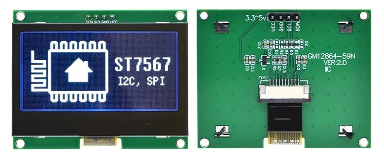

ST7567 LCD Graphic Display
==========================

.. seo::
    :description: Instructions for setting up ST7567 Mono STN-LCD display drivers.
    :image: st7567.jpg

.. _st7567:

Usage
-----

The ``st7567`` display platform allows you to use wide range of 128x64 display modules based on 
Sitronix ST7567 chipset family (ST7567A, ST7567S, ST7567G, etc.) (`datasheet <https://github.com/latonita/datasheets-storage/blob/main/lcd-modules/ST7567A_V1.2b.pdf>`__,
`Sitronix <https://www.sitronix.com.tw/en/products/industrial-display-driver-ic/mono-stn-lcd-driver-ic/>`__) with ESPHome. 
Note that this component is for displays that are connected via the :ref:`I²C Bus <i2c>` (see :ref:`st7567-i2c`) 
or 3-Wire or 4-Wire :ref:`SPI bus <spi>` (see :ref:`st7567-spi`).
It's a monochrome LCD graphic display.

    ST7567A LCD Graphic Display

.. note::

    Check your module specs for required power. Most of the modules are tolerant to range of voltages from 3.3V to 5V, but some might require either 5V or 3.3V.

.. _st7567-i2c:

Over I²C
--------

Connect SDA and SCL pins on a module to pins you chose for the :ref:`I²C Bus <i2c>`. 
If your display module has ``RESET`` pin you may optionally connect it to a pin on the 
ESP which may improve reliability. For power, connect VCC to 3.3V and GND to GND.

.. code-block:: yaml

    # Example minimal configuration entry
    i2c:
      sda: D1
      scl: D2

    display:
      - platform: st7567_i2c
        lambda: |-
          it.print(0, 0, id(font), "Hello World!");

Configuration variables:
************************

- **reset_pin** (*Optional*, :ref:`Pin Schema <config-pin_schema>`): The RESET pin. Defaults to not connected.
- **address** (*Optional*, int): Manually specify the :ref:`I²C <i2c>` address of the display. Defaults to 0x3F.
- **rotation** (*Optional*): Set the rotation of the display. Everything you draw in ``lambda:`` will be rotated
  by this option. One of ``0°`` (default), ``90°``, ``180°``, ``270°``.
- **flip_x** (*Optional*, boolean): Flip the horizontal axis on the screen. Defaults to ``false``.
- **flip_y** (*Optional*, boolean): Flip the vertical axis on the screen. Defaults to ``false``.
- **invert** (*Optional*, boolean): Invert all pixel state on the display. Defaults to ``false``.
- **lambda** (*Optional*, :ref:`lambda <config-lambda>`): The lambda to use for rendering the content on the display.
  See :ref:`display-engine` for more information.
- **update_interval** (*Optional*, :ref:`config-time`): The interval to re-draw the screen. Defaults to ``1s``.
- **pages** (*Optional*, list): Show pages instead of a single lambda. See :ref:`display-pages`.
- **id** (*Optional*, :ref:`config-id`): Manually specify the ID used for code generation.
- **i2c_id** (*Optional*, :ref:`config-id`): Manually specify the ID of the :ref:`I²C Component <i2c>` if you want
  to use multiple I²C buses.

.. note::

    To speed up the display update process you can select higher I²C frequencies.

.. _st7567-spi:

Over SPI
--------

Connect D0 to the CLK pin you chose for the :ref:`SPI bus <spi>`, connect D1 to the MOSI pin and ``DC`` and ``CS``
to some GPIO pins on the ESP. For power, connect VCC to 3.3V and GND to GND. 
Optionally you can also connect the ``RESET`` pin to a pin on the ESP which may
improve reliability.

.. code-block:: yaml

    # Example minimal configuration entry
    spi:
      clk_pin: D0
      mosi_pin: D1

    display:
      - platform: st7567_spi
        dc_pin: D3
        lambda: |-
          it.print(0, 0, id(font), "Hello World!");

Configuration variables:
************************

- **dc_pin** (**Required**, :ref:`Pin Schema <config-pin_schema>`): The DC pin.
- **cs_pin** (*Optional*, :ref:`Pin Schema <config-pin_schema>`): The Chip Select (CS) pin.
- **reset_pin** (*Optional*, :ref:`Pin Schema <config-pin_schema>`): The RESET pin. Defaults to not connected.
- **address** (*Optional*, int): Manually specify the :ref:`I²C <i2c>` address of the display. Defaults to 0x3F.
- **rotation** (*Optional*): Set the rotation of the display. Everything you draw in ``lambda:`` will be rotated
  by this option. One of ``0°`` (default), ``90°``, ``180°``, ``270°``.
- **flip_x** (*Optional*, boolean): Flip the horizontal axis on the screen. Defaults to ``false``.
- **flip_y** (*Optional*, boolean): Flip the vertical axis on the screen. Defaults to ``false``.
- **invert** (*Optional*, boolean): Invert all pixel state on the display. Defaults to ``false``.
- **lambda** (*Optional*, :ref:`lambda <config-lambda>`): The lambda to use for rendering the content on the display.
  See :ref:`display-engine` for more information.
- **update_interval** (*Optional*, :ref:`config-time`): The interval to re-draw the screen. Defaults to ``1s``.
- **pages** (*Optional*, list): Show pages instead of a single lambda. See :ref:`display-pages`.
- **id** (*Optional*, :ref:`config-id`): Manually specify the ID used for code generation.
- **spi_id** (*Optional*, :ref:`config-id`): Manually specify the ID of the :ref:`SPI Component <spi>` if you want
  to use multiple SPI buses.

See Also
--------

- :doc:`index`
- :apiref:`st7567/st7567.h`
- :ghedit:`Edit`
