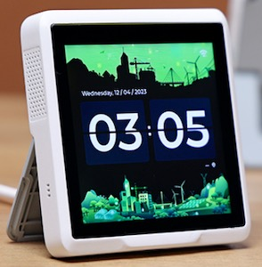

ST7701S Display Driver
======================

.. seo::
    :description: Instructions for setting up ST7701S 16 bit "RGB" parallel displays
    :image: indicator.jpg

.. _st7701s:

Models
------
This display driver supports displays with 16 bit parallel interfaces, often referred to as "RGB". It currently
supports the ST7701S chip.

This driver has been tested with the following displays:

  - Seeed Sensecap Indicator
  - Makerfabs 4" display

Usage
-----
This component requires an ESP32 (usually an ESP32-S3 because of the number of GPIO pins required) and the use of
ESP-IDF. PSRAM is a requirement due to the size of the display buffer.

    Sensecap Indicator display

.. code-block:: yaml

    # Example minimal configuration entry
    display:
      - platform: st7701s
        dimensions:
          width: 480
          height: 480
        cs_pin: REPLACE_ME
        reset_pin: REPLACE_ME
        de_pin: REPLACE_ME
        hsync_pin: REPLACE_ME
        vsync_pin: REPLACE_ME
        pclk_pin: REPLACE_ME
        # Replace XX with the correct pin number

        data_pins:
          red:
            - XX        #r1
            - XX        #r2
            - XX        #r3
            - XX        #r4
            - XX        #r5
          green:
            - XX        #g0
            - XX        #g1
            - XX        #g2
            - XX        #g3
            - XX        #g4
            - XX        #g5
          blue:
            - XX        #b1
            - XX        #b2
            - XX        #b3
            - XX        #b4
            - XX        #b5

Configuration variables:
************************

- **init_sequence** (*Optional*, A list of byte arrays): Specifies the init sequence for the display
- **data_pins** (**Required**): A list of pins used for the databus. Specified in 3 groups.

    - **red**: (**Required**, :ref:`Pin Schema <config-pin_schema>`) Exactly 5 pin numbers for the red databits, listed from least to most significant bit.
    - **green**: (**Required**, :ref:`Pin Schema <config-pin_schema>`) Exactly 6 pin numbers for the green databits, listed from least to most significant bit.
    - **blue**: (**Required**, :ref:`Pin Schema <config-pin_schema>`) Exactly 5 pin numbers for the blue databits, listed from least to most significant bit.
- **de_pin** (**Required**, :ref:`Pin Schema <config-pin_schema>`): The DE pin.
- **dc_pin** (*Optional*, :ref:`Pin Schema <config-pin_schema>`): The DC pin.
- **pclk_pin** (**Required**, :ref:`Pin Schema <config-pin_schema>`): The PCLK pin.
- **hsync_pin** (**Required**, :ref:`Pin Schema <config-pin_schema>`): The Horizontal sync pin.
- **vsync_pin** (**Required**, :ref:`Pin Schema <config-pin_schema>`): The Vertical sync pin.
- **reset_pin** (*Optional*, :ref:`Pin Schema <config-pin_schema>`): The RESET pin.
- **hsync_pulse_width** (*Optional*, int): The horizontal sync pulse width.
- **hsync_front_porch** (*Optional*, int): The horizontal front porch length.
- **hsync_back_porch** (*Optional*, int): The horizontal back porch length.
- **vsync_pulse_width** (*Optional*, int): The vertical sync pulse width.
- **vsync_front_porch** (*Optional*, int): The vertical front porch length.
- **vsync_back_porch** (*Optional*, int): The vertical back porch length.
- **pclk_frequency** (*Optional*): Set the pixel clock speed. Default is 8MHz.
- **pclk_inverted** (*Optional* bool): If the pclk is active negative (default is True)
- **update_interval** (*Optional*, :ref:`config-time`): The interval to re-draw the screen. Defaults to ``5s``.
- **auto_clear_enabled** (*Optional*, boolean): Whether to automatically clear the display in each loop (''true'', default),
  or to keep the existing display content (must overwrite explicitly, e.g., only on data change).
- **pages** (*Optional*, list): Show pages instead of a single lambda. See :ref:`display-pages`.
- **id** (*Optional*, :ref:`config-id`): Manually specify the ID used for code generation.
- **color_order** (*Optional*): Should be one of ``bgr`` (default) or ``rgb``.
- **dimensions** (**Required**): Dimensions of the screen, specified either as *width* **x** *height* (e.g ``320x240``) or with separate config keys.

    - **height** (**Required**, int): Specifies height of display in pixels.
    - **width** (**Required**, int): Specifies width of display.
    - **offset_width** (*Optional*, int): Specify an offset for the x-direction of the display, typically used when an LCD is smaller than the maximum supported by the driver chip. Default is 0
    - **offset_height** (*Optional*, int): Specify an offset for the y-direction of the display. Default is 0.

- **data_rate** (*Optional*): Set the data rate of the SPI interface to the display. One of ``80MHz``, ``40MHz``,
    ``20MHz``, ``10MHz``, ``5MHz``, ``2MHz``, ``1MHz`` (default), ``200kHz``, ``75kHz`` or ``1kHz``.
- **spi_mode** (*Optional*): Set the mode for the SPI interface to the display. Default is ``MODE0`` but some displays require ``MODE3``.
- **invert_colors** (*Optional*): With this boolean option you can invert the display colors. **Note** some of the displays have this option set automatically to true and can't be changed.
- **rotation** (*Optional*): Rotate the display presentation in software. Choose one of ``0°``, ``90°``, ``180°``, or ``270°``. This option cannot be used with ``transform``.
- **transform** (*Optional*): Transform the display presentation using hardware. All defaults are ``false``. This option cannot be used with ``rotation``.

   - **swap_xy** (*Optional*, boolean): If true, exchange the x and y axes.
   - **mirror_x** (*Optional*, boolean): If true, mirror the x axis.
   - **mirror_y** (*Optional*, boolean): If true, mirror the y axis.
- **lambda** (*Optional*, :ref:`lambda <config-lambda>`): The lambda to use for rendering the content on the display.
  See :ref:`display-engine` for more information.

**Note:** To rotate the display in hardware use one of the following combinations:

    - 90 degrees - use ``swap_xy`` with ``mirror_x``
    - 180 degrees - use ``mirror_x`` with ``mirror_y``
    - 270 degrees - use ``swap_xy`` with ``mirror_y``

The horizontal and vertical ``pulse_width``, ``front_porch`` and ``back_porch`` values are optional, but may require
changing for a specific display. Refer to the manufacturer's sample code for suitable values. These specify timing
requirements for the display.

The ``init_sequence`` requires a list of elements, one of which may be a single integer selecting a canned init
sequence (the default and currently the only sequence is 1), the remainder must be byte arrays providing additional
init commands, each consisting of a command byte followed by zero or more data bytes.

These will be collected and sent to the display via SPI during initialisation.

Example configurations
----------------------

Seeed Sensecap Indicator
************************

.. code-block:: yaml

    display:
      - platform: st7701s
        auto_clear_enabled: false
        update_interval: never
        spi_mode: MODE3
        color_order: RGB
        dimensions:
          width: 480
          height: 480
        invert_colors: true
        transform:
          mirror_x: true
          mirror_y: true
        cs_pin:
          pca9554: p_c_a
          number: 4
        reset_pin:
          pca9554: p_c_a
          number: 5
        de_pin: 18
        hsync_pin: 16
        vsync_pin: 17
        pclk_pin: 21
        init_sequence:
          - 1 # select canned init sequence number 1
          - [ 0xE0, 0x1F ]  # Set sunlight readable enhancement
        data_pins:
          red:
            - 4         #r1
            - 3         #r2
            - 2         #r3
            - 1         #r4
            - 0         #r5
          green:
            - 10        #g0
            - 9         #g1
            - 8         #g2
            - 7         #g3
            - 6         #g4
            - 5         #g5
          blue:
            - 15        #b1
            - 14        #b2
            - 13        #b3
            - 12        #b4
            - 11        #b5
        lambda: |-
          it.fill(COLOR_BLACK);
          it.print(0, 0, id(my_font), id(my_red), TextAlign::TOP_LEFT, "Hello World!");

See Also
--------

- :doc:`index`
- :apiref:`st7701s/st7701s.h`
- :ghedit:`Edit`
