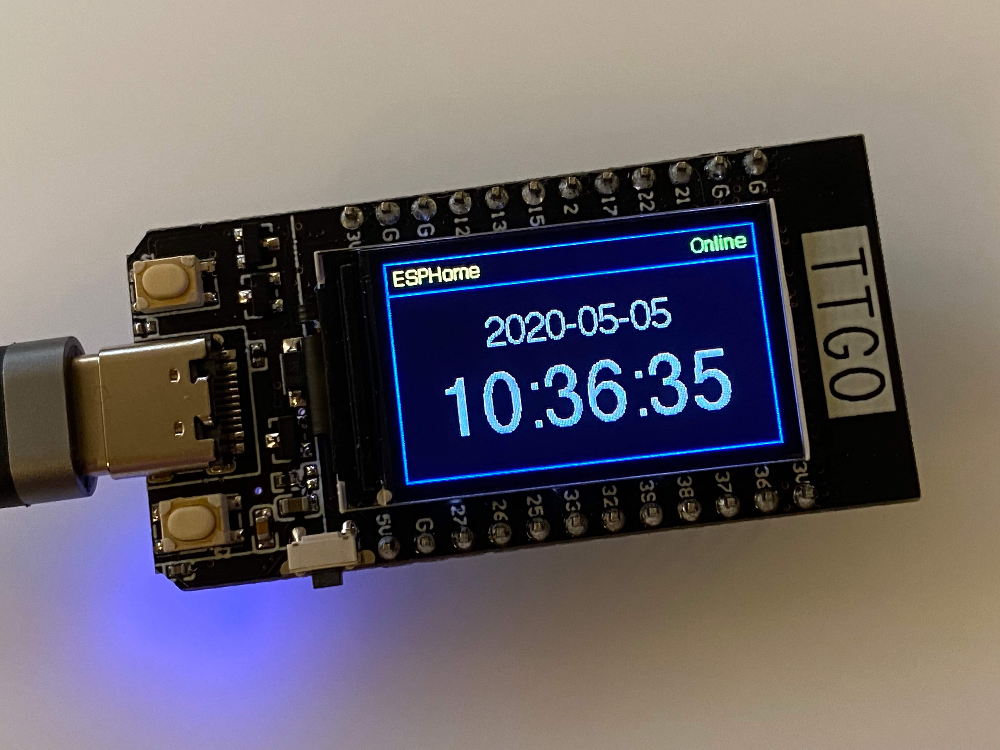

ST7789V TFT LCD
===============

.. seo::
    :description: Instructions for setting up ST7789V TFT LCD display drivers.
    :image: st7789v.jpg

.. _st7789v:

Usage
-----

The ``st7789v`` display platform allows you to use
ST7789V (`datasheet <https://github.com/Xinyuan-LilyGO/TTGO-T-Display>`__,
`Tindie <https://www.tindie.com/products/ttgo/lilygor-ttgo-t-display/>`__)
displays with ESPHome. Note that this component utilizes the 4-Wire :ref:`SPI bus <spi>`.

    ST7789V TFT LCD on TTGO T-Display module

The TTGO T-Display module shown has the display attached to the module's board and its connections to the ESP32
cannot be changed. Other display modules have pin headers or other connectors which must be connected appropriately
to an ESP module.

.. warning::

    This component has been made redundant since the ST7789V is now supported by the :ref:`ILI9XXX component <ili9xxx>`. It is recommended
    that you use the ``ili9xxx`` component as it will be maintained, whereas this component may not be, or may be removed completely
    in the future.

.. note::

    Displays larger than the 135x240 pixel display on the TTGO T-Display shown require a significant amount of RAM
    to operate correctly. Some ESP devices, such as the ESP8266, do not have sufficient memory to support this display.
    If you attempt to use this component and experience repeated crashes, this is likely the cause of the issue.

.. code-block:: yaml

    # Example minimal configuration entry
    display:
      - platform: st7789v
        model: TTGO TDisplay 135x240
        backlight_pin: GPIOXX
        cs_pin: GPIOXX
        dc_pin: GPIOXX
        reset_pin: GPIOXX
        lambda: |-
          it.print(0, 0, id(font), "Hello World!");

    font:
      - file: "gfonts://Roboto"
        id: font
        size: 20

.. note::

    For more information about the font options see: :ref:`display-fonts`.

Configuration variables:
************************

Options below marked **Required** might have default values set for some models and do not need to be set.
If you do specify them they will override any default.

- **model** (**Required**, string): The display model to use. One of the following options:

  - ``TTGO TDisplay 135x240``
  - ``Adafruit Funhouse 240x240``
  - ``Adafruit RR 280x240`` (round-rectangular display -- some pixels are "deleted" from corners to form rounded shape)
  - ``Adafruit S2 TFT FEATHER 240X135``
  - ``LILYGO T-Embed 170X320``
  - ``Waveshare 1.47in 172X320`` (round-rectangular display -- some pixels are "deleted" from corners to form rounded shape)
  - ``Custom`` For other displays not listed above

- **height** (**Required**, int): Sets height of display in pixels. Defaults depends ``model``.
- **width** (**Required**, int): Sets width of display. Defaults depends ``model``.
- **offset_height** (**Required**, int): When ``model`` is set to "Custom", use this to specify the display's vertical
  offset in pixels. This option may not be specified when the ``model`` is not set to "Custom". Defaults depends ``model``.
- **offset_width** (**Required**, int): When ``model`` is set to "Custom", use this to specify the display's horizontal
  offset in pixels. This option may not be specified when the ``model`` is not set to "Custom". Defaults depends ``model``.
- **cs_pin** (**Required**, :ref:`Pin Schema <config-pin_schema>`): The CS pin. Defaults depends ``model``.
- **dc_pin** (**Required**, :ref:`Pin Schema <config-pin_schema>`): The DC pin. Defaults depends ``model``.
- **reset_pin** (**Required**, :ref:`Pin Schema <config-pin_schema>`): The RESET pin. Defaults depends ``model``.
- **eightbitcolor** (*Optional*, boolean): Limits the supported color depth to eight bits. May be useful on
  memory-constrained devices. Defaults to ``false``.
- **backlight_pin** (*Optional*, :ref:`Pin Schema <config-pin_schema>`): The display's backlight pin. May be required
  depending on the hardware configuration. To disable a preset backlight pin (e.g. if controlled by another component) set this to ``no``.
- **power_supply** (*Optional*, :ref:`config-id`): The :doc:`power supply </components/power_supply>` to connect to
  this display if required by hardware. The power supply will be turned on before attempting to initialize the display.
- **lambda** (*Optional*, :ref:`lambda <config-lambda>`): The lambda to use for rendering the content on the display.
  See :ref:`display-engine` for more information.
- **update_interval** (*Optional*, :ref:`config-time`): The interval to re-draw the screen. Defaults to ``5s``.
- **pages** (*Optional*, list): Show pages instead of a single lambda. See :ref:`display-pages`.
- **id** (*Optional*, :ref:`config-id`): Manually specify the ID used for code generation.
- **data_rate** (*Optional*, frequency): The SPI data rate (default 20MHz.) Can be reduced if required, e.g. to
  compensate for long data cables.
- **spi_mode** (*Optional*, 0-3): The SPI clock mode to use (default: ``mode0``.) The ST7789V datasheet specifies mode 0,
  but some displays appear to require mode 3. This should be one of ``mode0``, ``mode1``, ``mode2`` or ``mode3`` (or just
  a digit from 0-3.)

Preset configuration
********************

For specific models there is some preset configuration which will satisy some of the **Required** *unless preset* values.
All models except ``Custom`` preset the ``height``, ``width`` and ``offset_...`` values.
The table below summarises the other presets. Note that SPI CLK and SDO (mosi) pins, and the power supply pin must be separately
configured in ``spi:`` and ``power_supply:`` blocks - the pins are noted below for convenience only.

Items marked RQ are hardware dependent but required and not preset. Items marked ? are optional depending on the hardware.

.. list-table:: Model presets
   :header-rows: 1

   * - Model
     - Height/ width
     - Offsets
     - CS
     - DC
     - Reset
     - Back light
     - Pwr sup
     - SPI clk
     - SPI mosi
   * - TTGO TDisplay 135x240
     - 240/135
     - 52/40
     - 5
     - 6
     - 23
     - 4
     -
     - 18
     - 19
   * - Adafruit Funhouse 240x240
     - 240/240
     - 0/0
     - 40
     - 39
     - 41
     - 21
     -
     - 36
     - 35
   * - Adafruit RR 280x240
     - 240/240
     - 0/20
     - RQ
     - RQ
     - RQ
     - ?
     - ?
     - RQ
     - RQ
   * - Adafruit S2 TFT FEATHER 240X135
     - 240/135
     - 52/40
     - 7
     - 39
     - 40
     - 45
     - 21
     - 36
     - 35
   * - LILYGO T-Embed 170X320
     - 320/170
     - 35/0
     - 10
     - 13
     - 9
     - 15
     - 46
     - 12
     - 11
   * - Waveshare 1.47in 172X320
     - 320/172
     - 34/0
     - 21
     - 22
     - 23
     - 4
     -
     - 18
     - 19
   * - Custom
     - RQ
     - RQ
     - RQ
     - RQ
     - RQ
     - ?
     - ?
     - RQ
     - RQ

For all boards you can override the presets by specifying any of the configuration options. Pin assignments on some
boards can change between versions so if it doesn't work with the presets check the board pinouts and override options as
required.

.. note::

    On memory-constrained devices, it may be possible to use *part* of the display area by
    specifying a smaller ``height`` and/or ``width`` than that of the actual display.

Configuration examples
**********************

To use colors in your lambda:

.. code-block:: yaml

    color:
      - id: my_red
        red: 100%
        green: 3%
        blue: 5%

    ...

    display:
        ...
        lambda: |-
          it.rectangle(0,  0, it.get_width(), it.get_height(), id(my_red));

To bring in color images:

.. code-block:: yaml

    image:
      - file: "image.jpg"
        id: my_image
        resize: 200x200
        type: RGB24

    ...

    display:
        ...
        lambda: |-
          it.image(0, 0, id(my_image));

Complete example
****************

The following is an example YAML configuration that you can add to your base device configuration. It defines:

- three fonts (well, one font in three sizes)
- a ``binary_sensor`` that indicates the state of connectivity to the API
- a ``binary_sensor`` for each of the two buttons on the TTGO module
- a ``switch``, allowing control of the backlight from HA
- several colors
- a color image to be shown on the display
- time, for display...on the display
- the SPI configuration for communicating with the display
- the display component itself, for use on the TTGO module
- a lambda which paints the screen as shown in the picture above:

  - blue borders, with a sort of "title bar" along the top
  - "ESPHome" in yellow in the top left corner
  - the API connection status, "Online" in green when connected, "Offline" in red when not
  - the time and date, more or less in the center of the display

To use this example, you need only to provide the font file, "Helvetica.ttf" (or update it to
a font of your choosing) and an image file, "image.png" (it may also be a ".jpg"). Place these
into the same directory as the YAML configuration file itself. Comment/Uncomment/Modify the
appropriate lines of C code in the lambda to hide or show the image or text as you wish.

.. code-block:: yaml

    color:
      - id: my_red
        red: 100%
        green: 0%
        blue: 0%
      - id: my_yellow
        red: 100%
        green: 100%
        blue: 0%
      - id: my_green
        red: 0%
        green: 100%
        blue: 0%
      - id: my_blue
        red: 0%
        green: 0%
        blue: 100%
      - id: my_gray
        red: 50%
        green: 50%
        blue: 50%

    font:
      - file: "Helvetica.ttf"
        id: helvetica_48
        size: 48
      - file: "Helvetica.ttf"
        id: helvetica_24
        size: 24
      - file: "Helvetica.ttf"
        id: helvetica_12
        size: 12

    binary_sensor:
      - platform: status
        name: "Node Status"
        id: system_status
      - platform: gpio
        pin:
          number: GPIO0
          inverted: true
          mode:
            input: true
            pullup: true
        name: "T-Display Button Input 0"
        id: tdisplay_button_input_0
      - platform: gpio
        pin:
          number: GPIO35
          inverted: true
        name: "T-Display Button Input 1"
        id: tdisplay_button_input_1

    # Allow dimmable control of the backlight (pin GPIO4)
    output:
      - platform: ledc
        pin: GPIO4
        id: gpio4

    light:
      - platform: monochromatic
        output: gpio4
        name: "Backlight"

    image:
      - file: "image.png"
        id: my_image
        resize: 200x200
        type: RGB24

    time:
      - platform: homeassistant
        id: esptime

    spi:
      clk_pin: GPIO18
      mosi_pin: GPIO19

    display:
      - platform: st7789v
        cs_pin: GPIO5
        dc_pin: GPIO16
        reset_pin: GPIO23
        rotation: 270
        lambda: |-
          it.rectangle(0,  0, it.get_width(), it.get_height(), id(my_blue));
          it.rectangle(0, 20, it.get_width(), it.get_height(), id(my_blue));   // header bar

          it.strftime((240 / 2), (140 / 3) * 1 + 5, id(helvetica_24), id(my_gray), TextAlign::CENTER, "%Y-%m-%d", id(esptime).now());
          it.strftime((240 / 2), (140 / 3) * 2 + 5, id(helvetica_48), id(my_gray), TextAlign::CENTER, "%H:%M:%S", id(esptime).now());
          it.print(5, 5, id(helvetica_12), id(my_yellow), TextAlign::TOP_LEFT, "ESPHome");

          // Comment out the above lines to see the image without text overlaid
          // it.image(0, 0, id(my_image));

          if (id(system_status).state) {
            it.print(235, 5, id(helvetica_12), id(my_green), TextAlign::TOP_RIGHT, "Online");
          }
          else {
            it.print(235, 5, id(helvetica_12), id(my_red), TextAlign::TOP_RIGHT, "Offline");
          }

See Also
--------

- :doc:`index`
- :doc:`Power Supply Component </components/power_supply>`
- :apiref:`st7789v_base/st7789v_base.h`
- :ghedit:`Edit`
