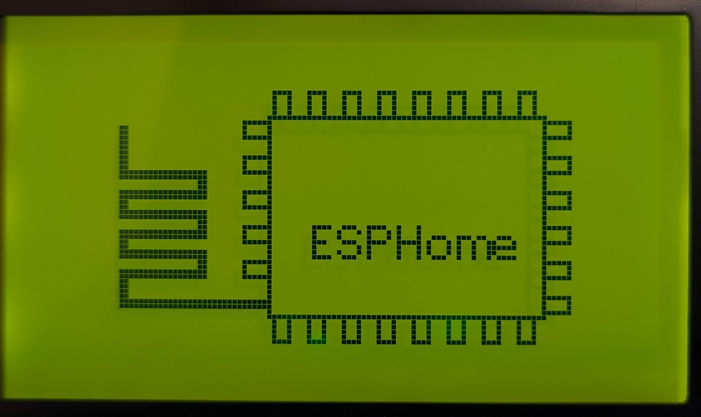

ST7920 LCD Graphic Display
==========================

.. seo::
    :description: Instructions for setting up ST7920 LCD display drivers.
    :image: st7920.jpg

.. _st7920:

Usage
-----

The ``st7920`` display platform allows you to use
ST7920 (`datasheet <http://www.elecrow.com/download/SPE_IM120424014_EONE_12864_Graphic_LCD.pdf>`__,
`electrodragon <https://www.elecrow.com/128x64-graphic-lcd-p-1143.html>`__)
displays with ESPHome. Note that this component is for displays that are connected via the 3-Wire :ref:`SPI bus <spi>`.
It's a monochrome LCD graphic display.

    ST7920 LCD Graphic Display

Connect D5 to the E pin you chose for the :ref:`SPI bus <spi>`, connect D7 to the R/W pin and ``RS`` to some GPIO pins on the ESP.
For SPI communication it's important to connect PSB on the LCD to GND.

.. code-block:: yaml

    # Example configuration entry
    spi:
      clk_pin: D5
      mosi_pin: D7

    display:
      - platform: st7920
        cs_pin: 
          number: 4
          inverted: true
        lambda: |-
          it.print(0, 0, id(font), "Hello World!");

Configuration variables:
************************

- **cs_pin** (**Required**, :ref:`Pin Schema <config-pin_schema>`): Sometimes also called ``RS``. For ST7920 should be inverted.
- **width** (**Required**, int): The "width" of a screen. Defaults to 128.
- **height** (**Required**, int): The "height" of a screen. Defaults to 64;
- **rotation** (*Optional*): Set the rotation of the display. Everything you draw in ``lambda:`` will be rotated
  by this option. One of ``0°`` (default), ``90°``, ``180°``, ``270°``.
- **lambda** (*Optional*, :ref:`lambda <config-lambda>`): The lambda to use for rendering the content on the display.
  See :ref:`display-engine` for more information.
- **update_interval** (*Optional*, :ref:`config-time`): The interval to re-draw the screen. Defaults to ``60s``.
- **pages** (*Optional*, list): Show pages instead of a single lambda. See :ref:`display-pages`.
- **id** (*Optional*, :ref:`config-id`): Manually specify the ID used for code generation.

See Also
--------

- :doc:`index`
- :apiref:`st7920/st7920.h`
- :ghedit:`Edit`
