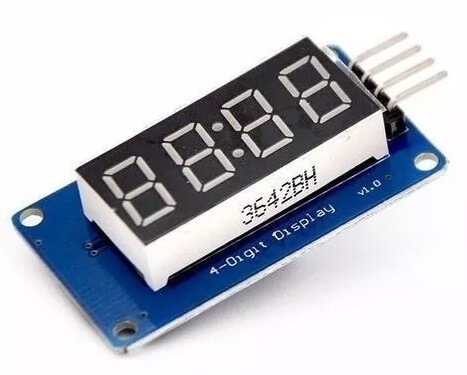
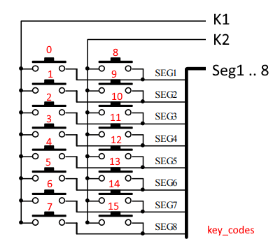
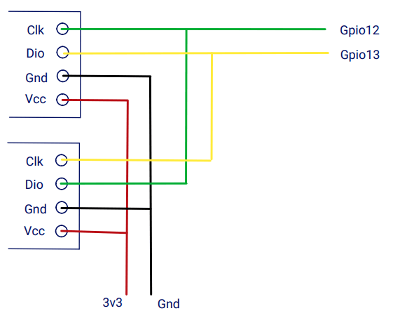
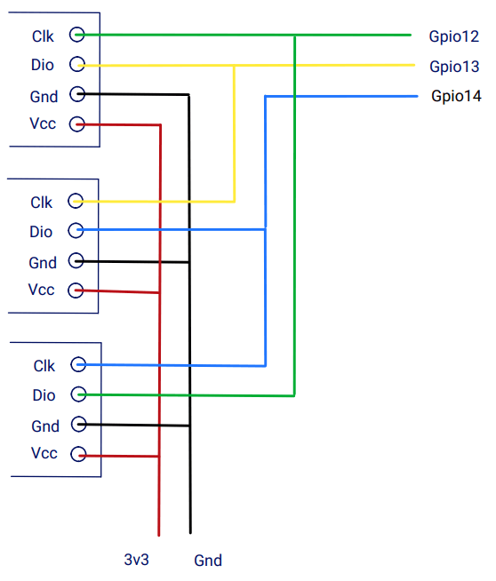

TM1637 7-Segment Display
========================

.. seo::
    :description: Instructions for setting up TM1637 7-segment displays.
    :image: tm1637.jpg

The ``tm1637`` display platform allows you to use the popular TM1637 7-segment display drivers with ESPHome.

    TM1637 7-Segment Display.

The module can be powered with 5v or with 3.3v too. To display the colon punctuation use the
``.`` in the colon place. (See clock example below)

.. code-block:: yaml

    # Example configuration entry
    display:
        platform: tm1637
        id: tm1637_display
        clk_pin: D6
        dio_pin: D5
        inverted: true
        length: 4
        lambda: |-
          it.print("0123");

Configuration variables:
------------------------

- **clk_pin** (**Required**, :ref:`Pin Schema <config-pin_schema>`): The pin you have the CLK line hooked up to.
- **dio_pin** (**Required**, :ref:`Pin Schema <config-pin_schema>`): The pin you have the DIO line hooked up to.
- **intensity** (*Optional*, int): The intensity with which the TM1637 should drive the outputs. Range is from
  0 (least intense) to 7 (the default).
- **inverted** (*Optional*, bool): Invert character rendering to the TM1637 so you can physically flip the display around.
- **length** (*Optional*, int): The amount of digits your TM1637 is driving. Only used when ``inverted: true``
  Range is from 1 to 6 (the default).
- **lambda** (*Optional*, :ref:`lambda <config-lambda>`): The lambda to use for rendering the content on the TM1637.
  See :ref:`display-tm1637_lambda` for more information.
- **update_interval** (*Optional*, :ref:`config-time`): The interval to re-draw the screen. Defaults to ``1s``.
- **id** (*Optional*, :ref:`config-id`): Manually specify the ID used for code generation.

Binary Sensor
-------------

The TM1637 LED display controller also includes a special circuit with keyboard scan interface and enhanced identification circuit with anti-interference keys.
This circuit uses the 8 segment lines that also drive the LED display. But combined with the K1 and K2 pins we can add 16 keys that can be used as binary sensors in esphome.

    TM1637 display keyboard connections

.. code-block:: yaml

    binary_sensor:
      - platform: tm1637
        id: key0
        name: key1-00
        tm1637_id: tm1637_display
        key: 0

Configuration variables:
************************

- **id** (*Optional*, :ref:`config-id`): Set the ID of this sensor.
- **name** (*Optional*, string): The name for the binary sensor.
- **tm1637_id** (*Optional*, ::ref:`config-id`): The id of the tm1637 that should be used to scan the keys in case you are using multiple devices.
- **key** (**Required**, integer): The keycode for the connected key (Seg0 = 0, Seg1 = 1 etc,). Range is from
  0 to 15.
- All other options from :ref:`Binary Sensor <config-binary_sensor>`.

.. _display-tm1637_lambda:

Rendering Lambda
----------------

The TM1637 has a similar API to the fully fledged :ref:`display-engine`, but it's only a subset as the TM1637
7-segment displays don't have a concept of individual pixels. In the lambda you're passed a variable called ``it``
as with all other displays. In this case however, ``it`` is a TM1637 instance (see API Reference).

The most basic operation with the TM1637 is writing a simple number to the screen as in the configuration example
at the top of this page. But even though you're passing in a string (here ``"0123"``), ESPHome converts it
into a representation that the TM1637 can understand: The exact pixels that should be turned on. And of course,
not all characters can be represented. You can see a full list of characters :ref:`at the MAX7219 docs <display-max7219_characters>`.

Each of the three methods (``print``, ``printf`` and ``strftime``) all optionally take a position argument at the
beginning which can be used to print the text at a specific position. This argument is ``0`` by default which
means the first character of the first TM1637. For example to start the first character of your text at
the end of the TM1637, you would write ``it.print(3, "0");``.

Also note that the ``.`` (dot) character is special because when ESPHome encounters it in the string the dot
segment of the previous position will be enabled.

.. code-block:: yaml

    display:
      - platform: tm1637
        # ...
        lambda: |-
          // Print 0 at position 0 (left)
          it.print("0");
          // Result: "0   "

          // Print 1 at position 1 (second character)
          it.print(1, "1");
          // Result: "01  "

          // Let's write a sensor value (let's assume it's 42.1)
          it.printf(0, "%.1f", id(my_sensor).state);
          // Result: "42.1 " (the dot will appear on the "2" segment)

          // Overwrite the previous content with blank
          it.print("    ");
          // Print a right-padded sensor value with 0 digits after the decimal
          it.printf("S%3.0f", id(my_sensor).state);
          // Result: "S 42"

          // Print the current time
          it.strftime("%H.%M");
          // Result for 10:06:42 -> "10:06" on a display with : and "10.06" on a display with .

Please see :ref:`display-printf` for a quick introduction into the ``printf`` formatting rules and
:ref:`display-strftime` for an introduction into the ``strftime`` time formatting.

Creating a digital clock
************************

The following example creates a typical digital clock with the ``:`` colon flashing every second.

.. code-block:: yaml

    time:
      - platform: homeassistant
        id: homeassistant_time

    display:
      platform: tm1637
      clk_pin: D6
      dio_pin: D5
      update_interval: 500ms
      lambda: |-
          static int i = 0;
          i++;
          if ((i % 2) == 0)
            it.strftime("%H.%M", id(homeassistant_time).now());
          else
            it.strftime("%H%M", id(homeassistant_time).now());

Connect multiple displays
-------------------------

To connect multiple TM1636 displays you need as many control lines as you have displays. This is achived by sharing control-lines for clk and dio between displays.

    Two TM1637 displays on only 2 control lines

When using more than 2 devices like 3 or more you add a control-line for the Dio pin and share this with the next display Clk pin.
The last displays Dio pin shares the Clk pin of the first display. 

    Three TM1637 displays on 3 control lines

See Also
--------

- :doc:`index`
- :apiref:`tm1637/tm1637.h`
- `TD1637 Library <https://github.com/avishorp/TM1637>`__ by `Avishay <https://github.com/avishorp>`__
- :ghedit:`Edit`
