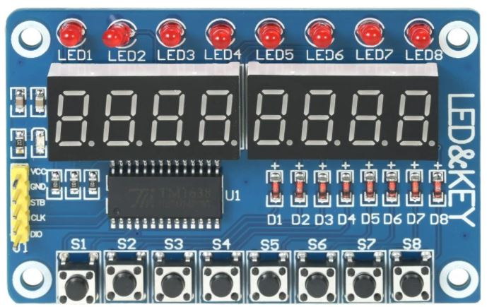

TM1638 7 Segment Display Keypad & LED Module
============================================

.. seo::
    :description: Instructions for setting up TM1638 7 Segment Display Keypad & LED Module
    :image: tm1638.jpg

The ``tm1638`` display platform allows you to use the popular TM1638 7 Segment Display Keypad & LED Module with ESPHome.

    TM1638 8-Segment Display Keypad & LED Module.

The module can be powered with 5v DC. To display the colon punctuation use the
``.`` in the colon place. (See clock example below)

.. code-block:: yaml

    # Example configuration entry
    display:
        platform: tm1638
        id: tm1638_display
        stb_pin: GPIOXX
        clk_pin: GPIOXX
        dio_pin: GPIOXX
        intensity: 5
        update_interval: 5s
        lambda: |-
          it.print("0123");

Configuration variables:
------------------------

- **stb_pin** (**Required**, :ref:`Pin Schema <config-pin_schema>`): The pin you have the STB line hooked up to.
- **clk_pin** (**Required**, :ref:`Pin Schema <config-pin_schema>`): The pin you have the CLK line hooked up to.
- **dio_pin** (**Required**, :ref:`Pin Schema <config-pin_schema>`): The pin you have the DIO line hooked up to.
- **intensity** (*Optional*, int): The intensity with which the TM1638 should drive the outputs. Range is from
  0 (least intense) to 7 (the default).  This setting will affect the 7 segment display and the 8 individual LED lights.
- **lambda** (*Optional*, :ref:`lambda <config-lambda>`): The lambda to use for rendering the content on the TM1638.
  See :ref:`display-tm1638_lambda` for more information.
- **update_interval** (*Optional*, :ref:`config-time`): The interval to re-draw the screen. Defaults to ``1s``.
- **id** (*Optional*, :ref:`config-id`): Manually specify the ID used for code generation.

.. _display-tm1638_lambda:

Rendering Lambda
----------------

The TM1638 has a similar API to the fully fledged :ref:`display-engine`, but it's only a subset as the TM1638
7-segment Display Keypad & LED Module does not have a concept of individual pixels. In the lambda you're passed a variable called ``it``
as with all other displays. In this case however, ``it`` is a TM1638 instance (see API Reference).

The most basic operation with the TM1638 is writing a simple number to the screen as in the configuration example
at the top of this page. But even though you're passing in a string (here ``"0123"``), ESPHome converts it
into a representation that the TM1638 can understand: The exact pixels that should be turned on. And of course,
not all characters can be represented. You can see a full list of characters :ref:`at the MAX7219 docs <display-max7219_characters>`.

Each of the three methods (``print``, ``printf`` and ``strftime``) all optionally take a position argument at the
beginning which can be used to print the text at a specific position. This argument is ``0`` by default which
means the first character of the first TM1638. For example to start the first character of your text at
the end of the TM1638, you would write ``it.print(3, "0");``.

Also note that the ``.`` (dot) character is special because when ESPHome encounters it in the string the dot
segment of the previous position will be enabled.

.. code-block:: yaml

    display:
      - platform: tm1638
        # ...
        lambda: |-
          // Print 0 at position 0 (left)
          it.print("0");
          // Result: "0   "

          // Print 1 at position 1 (second character)
          it.print(1, "1");
          // Result: "01  "

          // Let's write a sensor value (let's assume it's 42.1)
          it.printf(0, "%.1f", id(my_sensor).state);
          // Result: "42.1 " (the dot will appear on the "2" segment)

          // Overwrite the previous content with blank
          it.print("    ");
          // Print a right-padded sensor value with 0 digits after the decimal
          it.printf("S%3.0f", id(my_sensor).state);
          // Result: "S 42"

          // Print the current time
          it.strftime("%H.%M");
          // Result for 10:06:42 -> "10:06" on a display with : and "10.06" on a display with .

Please see :ref:`display-printf` for a quick introduction into the ``printf`` formatting rules and
:ref:`display-strftime` for an introduction into the ``strftime`` time formatting.

Creating a digital clock
************************

The following example creates a typical digital clock with the ``:`` colon flashing every second.

.. code-block:: yaml

    time:
      - platform: homeassistant
        id: homeassistant_time

    display:
      platform: tm1638
      clk_pin: GPIOXX
      dio_pin: GPIOXX
      stb_pin: GPIOXX
      update_interval: 500ms
      lambda: |-
          static int i = 0;
          i++;
          if ((i % 2) == 0)
            it.strftime("%H.%M", id(homeassistant_time).now());
          else
            it.strftime("%H%M", id(homeassistant_time).now());

LEDs
----------------
The TM1638 7 Segment Display Keypad & LED Module has 8 LED lights across the top or middle of the display, depending on the board.  These LEDs can be exposed as :doc:`switches </components/switch/index>` or :doc:`outputs </components/output/index>` with the led property set between 0 and 7.  The board has the LEDs labelled 1-8, but the leds use zero based addressing.   The LED labelled "1" is LED 0 in the configuration.

.. code-block:: yaml

    switch:
      - platform: tm1638
        id: TM1638Led1
        led: 0

    output:
      - platform: tm1638
        id: TM1638Led2
        led: 1

Buttons
----------------
The TM1638 7 Segment Display Keypad & LED Module has 8 buttons across the top or middle of the display, depending on the board.  These buttons are exposed as binary sensor components with the key property set between 0 and 7,  They can be accessed via the binary sensor component configuration.  As with the LEDs the buttons are labeled 1-8 on the board, but use zero based addressing.  Therefore the button labelled "1" is key 0 in the configuration.   See :doc:`/components/binary_sensor/index`

.. code-block:: yaml

    binary_sensor:
      - platform: tm1638
        name: "TM1638 Button 1"
        id: TM1638Button1
        key: 0
        filters:
          - delayed_on: 10ms
        on_press:
         then:
            - switch.turn_on: TM1638Led1
        on_release:
         then:
            - switch.turn_off: TM1638Led1

      - platform: tm1638
        name: "TM1638 Button 2"
        id: TM1638Button2
        key: 1
        filters:
          - delayed_on: 10ms
        on_press:
         then:
            - output.turn_on: TM1638Led2
        on_release:
         then:
            - output.turn_off: TM1638Led2

See Also
--------

- :doc:`index`
- :doc:`/components/switch/index`
- :doc:`/components/binary_sensor/index`
- :apiref:`tm1638/tm1638.h`
- :ghedit:`Edit`
