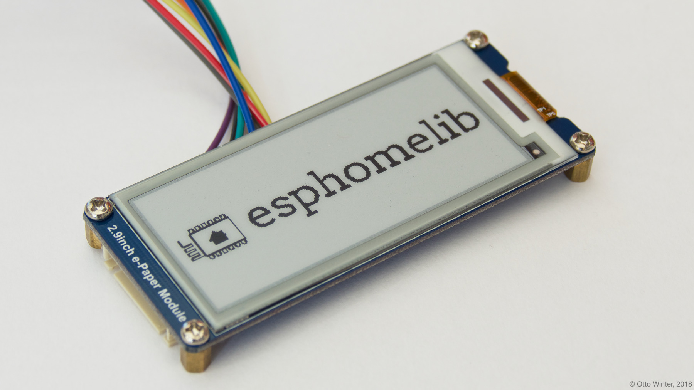
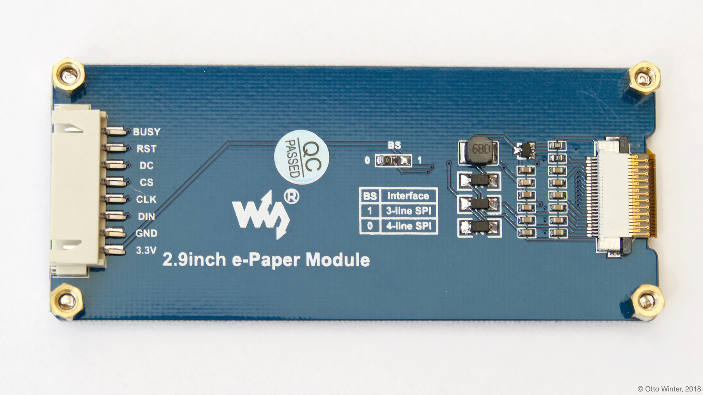

Waveshare E-Paper Display
=========================

.. seo::
    :description: Instructions for setting up Waveshare E-Paper displays in ESPHome.
    :image: waveshare_epaper.jpg

The ``waveshare_epaper`` display platform allows you to use
some E-Paper displays sold by `Waveshare <https://www.waveshare.com/product/displays/e-paper.htm>`__
with ESPHome. The 2.13" `TTGO module <https://github.com/lewisxhe/TTGO-EPaper-Series>`__ and the
`Waveshare Cloud Module <https://www.waveshare.com/wiki/2.13inch_e-Paper_Cloud_Module>`__ with an ESP32
on the board are supported as well. Depending on your specific revision of the TTGO board you might need to try out the ``-b73`` or ``-b1`` 
version (see below).
The 1.54" `Good Display gdew0154m09 <https://www.good-display.com/product/206.html>`__ 
as used in the `M5Stack Core Ink <https://shop.m5stack.com/products/m5stack-esp32-core-ink-development-kit1-54-elnk-display>`__
is also supported.
Similar modules sold by other vendors might also work but not have been tested yet. Currently only
single-color E-Ink displays are implemented and of those only a few modules.

    Waveshare E-Paper 2.9 Inch E-Paper Display.

The communication ESPHome has chosen to use for this component is 4-wire :ref:`SPI <spi>`, as it's the most stable
and high-speed. So you need to make sure your board is set to the 4-wire SPI mode and have an ``spi:`` section in your
configuration.

==================== ===================== =====================
**E-Paper Pin**      **ESP Pin**           **ESPHome Option**
-------------------- --------------------- ---------------------
``VCC``              ``3.3V``              N/A
-------------------- --------------------- ---------------------
``GND``              ``GND``               N/A
-------------------- --------------------- ---------------------
``CLK``              Any GPIO              ``spi.clk_pin``
-------------------- --------------------- ---------------------
``DIN``              Any GPIO              ``spi.mosi_pin``
-------------------- --------------------- ---------------------
``CS``               Any GPIO              ``cs_pin``
-------------------- --------------------- ---------------------
``DC``               Any GPIO              ``dc_pin``
-------------------- --------------------- ---------------------
``BUSY`` (Optional)  Any GPIO              ``busy_pin``
-------------------- --------------------- ---------------------
``RESET`` (Optional) Any GPIO              ``reset_pin``
==================== ===================== =====================

.. code-block:: yaml

    # Example configuration entry
    font:
      - file: 'fonts/Comic Sans MS.ttf'
        id: font1
        size: 8

    spi:
      clk_pin: D0
      mosi_pin: D1

    display:
      - platform: waveshare_epaper
        cs_pin: D2
        dc_pin: D3
        busy_pin: D4
        reset_pin: D5
        model: 2.90in
        full_update_every: 30
        lambda: |-
          it.print(0, 0, id(font1), "Hello World!");

Configuration variables:
------------------------

- **cs_pin** (**Required**, :ref:`Pin Schema <config-pin_schema>`): The CS pin.
- **dc_pin** (**Required**, :ref:`Pin Schema <config-pin_schema>`): The DC pin.
- **model** (**Required**): The model of the E-Paper display. Options are:

  - ``1.54in``
  - ``1.54inv2``
  - ``2.13in`` - not tested
  - ``2.13in-ttgo`` - T5_V2.3 tested. Also works for Wemos D1 Mini ePaper Shield 2.13 1.0.0 "LOLIN"
  - ``2.13in-ttgo-b73`` - T5_V2.3 with B73 display tested
  - ``2.13in-ttgo-b74`` - T5_V2.3.1 with B74 display tested
  - ``2.13in-ttgo-b1`` - T5_V2.3 with B1 display tested
  - ``2.13in-ttgo-dke`` - T5_V2.3 with DKE group display (DEPG0213BN) tested
  - ``2.13inv2`` - 2.13in V2 display (Pico e-Paper 2.13v2 and Cloud Module)
  - ``2.13inv3`` - 2.13in V3 display (Pico e-Paper 2.13v3)
  - ``2.70in`` - currently not working with the HAT Rev 2.1 version
  - ``2.70inv2``
  - ``2.70in-b`` - Black/White/Red
  - ``2.70in-bv2`` - Black/White/Red
  - ``2.90in``
  - ``2.90in-dke``
  - ``2.90inv2``
  - ``2.90inv2-r2`` - 2.9in V2 display, but with different initialization and full/partial display refresh management than ``2.90inv2`` 
  - ``2.90in-b`` - B/W rendering only
  - ``2.90in-bV3`` - B/W rendering only
  - ``4.20in``
  - ``4.20in-bV2`` - B/W rendering only
  - ``5.83in``
  - ``5.83inv2``
  - ``7.50in``
  - ``7.50in-bV2`` - also supports v3, B/W rendering only
  - ``7.50in-bV3`` - display with the '(V3)' sticker on the back, B/W rendering only
  - ``7.50in-bc`` - display with version sticker '(C)' on the back, B/W rendering only
  - ``7.50inV2`` - Can't use with an ESP8266 as it runs out of RAM
  - ``7.50inV2alt`` (alternative version to the above ``7.50inV2``)
  - ``7.50in-hd-b`` - Can't use with an ESP8266 as it runs out of RAM
  - ``gdey029t94`` - GooDisplay GDEY029T94, as used on the AdaFruit MagTag
  - ``1.54in-m5coreink-m09`` - GoodDisplay gdew0154m09, as used in the M5Stack Core Ink

.. warning::

    The BUSY pin on the gdew0154m09 and Waveshare 7.50in V2 models must be inverted to prevent permanent display damage. Set the pin to 
    ``inverted: true`` in the config. 

- **busy_pin** (*Optional*, :ref:`Pin Schema <config-pin_schema>`): The BUSY pin. Defaults to not connected.
- **reset_pin** (*Optional*, :ref:`Pin Schema <config-pin_schema>`): The RESET pin. Defaults to not connected.
  Make sure you pull this pin high (by connecting it to 3.3V with a resistor) if not connected to a GPIO pin.
  The 2.13" B74 and V2 display variants require the reset pin.
- **rotation** (*Optional*): Set the rotation of the display. Everything you draw in ``lambda:`` will be rotated
  by this option. One of ``0°`` (default), ``90°``, ``180°``, ``270°``.
- **full_update_every** (*Optional*, int): E-Paper displays have two modes of switching to the next image: A partial
  update that only changes the pixels that have changed and a full update mode that first clears the entire display
  and then re-draws the image. The former is much quicker and nicer, but every so often a full update needs to happen
  because artifacts accumulate. On the ``1.54in``, ``1.54inv2``, ``2.13in``, ``2.13inv2``, ``2.90in`` and ``2.90inv2`` models, you have the option to only
  do a full-redraw every x-th time using this option. Defaults to ``30`` on the described models and a full update for
  all other models.
- **reset_duration** (*Optional*, :ref:`config-time`): Duration for the display reset operation. Defaults to ``200ms``.
  Setting this value to ``2ms`` may resolve issues with newer e-Paper Driver modules (e.g. Rev 2.1).
- **lambda** (*Optional*, :ref:`lambda <config-lambda>`): The lambda to use for rendering the content on the display.
  See :ref:`display-engine` for more information.
- **update_interval** (*Optional*, :ref:`config-time`): The interval to re-draw the screen. Defaults to ``1s``, use ``never`` to only manually update the screen via ``component.update``.
- **pages** (*Optional*, list): Show pages instead of a single lambda. See :ref:`display-pages`.
- **spi_id** (*Optional*, :ref:`config-id`): Manually specify the ID of the :ref:`SPI Component <spi>` if you want
  to use multiple SPI buses.
- **id** (*Optional*, :ref:`config-id`): Manually specify the ID used for code generation.

See Also
--------

- :doc:`index`
- :apiref:`waveshare_epaper/waveshare_epaper.h`
- `Arduino Waveshare E-Paper library <https://github.com/soonuse/epd-library-arduino>`__ by `Yehui (@soonuse) <https://github.com/soonuse>`__
- :ghedit:`Edit`
