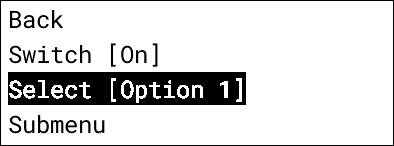

.. _graphical_display_menu:

Graphical Display Menu
======================

.. seo::
    :description: Instructions for setting up a simple hierarchical menu on displays.
    :image: lcd_menu.png

The component provides an infrastructure for setting up a hierarchical menu
on graphical displays. This offers the user an interactive method to display 
labels, control entities like ``switch``, ``select``, ``number``  available locally on the 
ESPHome node, without the requirement of a network connection.

Overview
--------

The component implements the :ref:`Display Menu <display_menu>` component providing
a hierarchical menu primarily intended to be controlled either by a rotary encoder
with a button or a five-button joystick controller.

The component needs to be connected to an instance of a display supporting ESPHome's rendering 
engine such as :doc:`E-Paper displays </components/display/waveshare_epaper>` or :doc:`OLED displays </components/display/ssd1306>`.

.. code-block:: yaml

    # Example configuration entry
    graphical_display_menu:
      id: my_graphical_display_menu
      display: my_display_component
      on_redraw:
        then:
          component.update: my_display_component
      active: false
      mode: rotary
      items:
        ...

Configuration variables:

- **id** (*Optional*, :ref:`config-id`): Manually specify the ID used for code generation.
- **display** (*Optional*, :ref:`config-id`): ID of the display to render to. See 
  :ref:`drawing_modes` for more details
- **font** (:ref:`Font <display-fonts>`): Specifies the font to use
- **foreground_color** (*Optional*, :ref:`config-color`): Specifies the foreground color to use.
  Defaults to COLOR_ON
- **background_color** (*Optional*, :ref:`config-color`): Specifies the background color to use.
  Defaults to COLOR_OFF

Automations:

- **on_redraw** (*Optional*, :ref:`Automation <automation>`): An automation to perform
  when the menu needs to be redrawn. This can be useful if your display has slow refresh rates.
  For example E-Ink displays that are used with `display_interval: never`

Additional configuration is described in the :ref:`Display Menu <display_menu>` component.

.. _drawing_modes:

Drawing Modes
-------------

Pop Up Mode
***********

When a **display** is specified the menu will create a :ref:`page <display-pages>` as part of the initialisation. It will render to the entire
of the display when invoked. This is useful when you may want to use the display for other purposes but show a menu in response to user
interaction.

.. note::

    Pop Up Mode requires that your display makes use of :ref:`pages <display-pages>`. If you are using a drawing lambda, without pages, it will not
    behave as expected. Instead you will have to use Advanced Mode

Advanced Drawing Mode
*********************

If you do not specify a **display** when setting up a menu you will be responsible for controlling drawing of the menu. This also allows you to
render the menu to a smaller portion than the available screen size. It May be useful in situations where you want to display a menu as part of a
larger user interface (for example rendering a sensor graph and a control menu next to it)

.. code-block:: yaml

    # Example configuration entry
    graphical_display_menu:
      - id: my_menu
        # Note: No display specified
        active: true

    display:
      - platform: waveshare_epaper
        id: my_display_component
        pages:
        - id: advanced_drawing_mode_page
          lambda: |-
            const auto display_width = it.get_width();
            const auto display_height = it.get_height();
            auto half_display_width = (int)(display_width / 2.0f);
            
            // This will render the menu to the right half of the screen leaving the left half for other drawing purposes
            // Arguments: it.menu(x, y, menu, width, height);
            it.menu(half_display_width, 0, id(my_menu), half_display_width, display_height);

Emulating Pop Up Mode
*********************

If you wish to emulate Pop Up Mode the following sample will emulate the same behaviour. This can
be useful if you're using a display without :ref:`pages <display-pages>` or if you have other
requirements that requires control over how and where the menu is rendered.

.. code-block:: yaml

    graphical_display_menu:
      id: my_menu
      items:
        # ... other items here ...

        # An exit menu item (or some other mechanism) that calls display_menu.hide
        - type: command
          on_value:
            then:
              - display_menu.hide: my_menu

    display:
      - platform: ..
        lambda: |-
          const auto width = it.get_width();
          const auto height = it.get_height();

          if (id(my_menu).is_active()) {
            it.menu(0, 0, id(my_menu), width, height);
          } else {
            it.print(0, 0, id(font), "Menu is hidden, other drawing would go here here");
          }

Controlling Menu Item Rendering
-------------------------------

By default menu items with a value will be rendered between a set of parenthesis. This can be
controlled via the `menu_item_value` parameter.

- **menu_item_value** (*Optional*, :ref:`config-lambda`): Specifies how to render values for
  menu items that have values (eg. Selects, numbers). Defaults to rendering the value as 
  "(value here)". Receives a MenuItemValueArguments as the argument`it`.

.. code-block:: yaml

    graphical_display_menu:
      menu_item_value: !lambda |-
        // Will render your menu item value as "My menu label ~my value here~"" normally and "My menu label *my value here*" when in edit mode
        std::string label = " ";
        if (it->is_item_selected && it->is_menu_editing) {
          label.append("*");
          label.append(it->item->get_value_text());
          label.append("*");
        } else {
          label.append("~");
          label.append(it->item->get_value_text());
          label.append("~");
        }
        return label;

.. note::

    Ensure that all characters you use in the menu_item_value are available glyphs for your :ref:`font <display-fonts>`

User Interaction Example
------------------------

The below example is a more complete example showing how you might use a rotary encoder and button to display/hide the menu and move through the available options

.. code-block:: yaml

    # Example configuration entry
    display:
      - platform: waveshare_epaper
        id: my_display_component
        pages:
        - id: graph_page
          lambda: |-
            it.print(0, 0, id(my_font), "My menu is not currently active");

    font:
      - file: ...
        id: my_font
        size: 16

    graphical_display_menu:
      id: my_graphical_display_menu
      display: my_display_component
      on_redraw:
        then:
          component.update: my_display_component
      active: false
      mode: rotary
      items:
        - type: Label
          text: Menu Item 1
        - type: Label
          text: Menu Item 2

    # Rotary encoder to provide navigation
    sensor:
      - platform: rotary_encoder
        ...
        filters:
          debounce: 30ms
        on_anticlockwise:
          - display_menu.up: my_graphical_display_menu
        on_clockwise:
          - display_menu.down: my_graphical_display_menu

    # A debounced GPIO push button is used to 'click'
    binary_sensor:
      - platform: gpio
        ...
        filters:
          - delayed_on: 30ms
          - delayed_off: 30ms
        on_press:
      - if:
          condition:
            display_menu.is_active: my_graphical_display_menu
          then:
            - display_menu.enter: my_graphical_display_menu
          else:
            - display_menu.show:  my_graphical_display_menu

See Also
--------

- :ref:`Display Menu <display_menu>`
- :ref:`Display <display-engine>`
- :ref:`display-fonts`
- :ref:`display-pages`
- :apiref:`graphical_display_menu/graphical_display_menu.h`
- :ghedit:`Edit`
