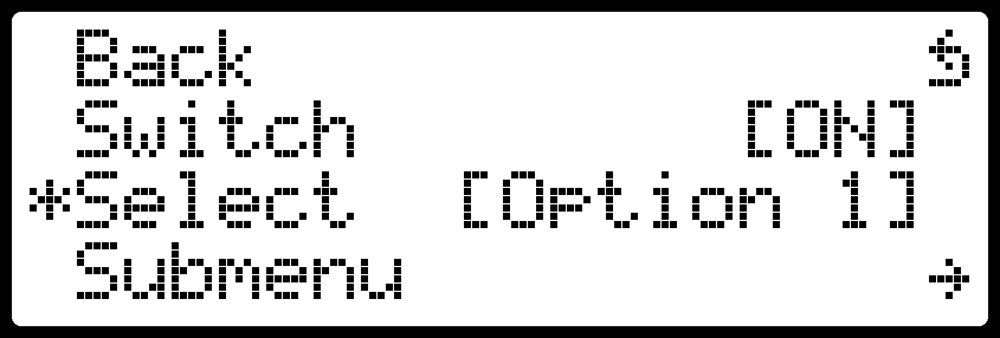

.. _lcd_menu:

LCD Menu
========

.. seo::
    :description: Instructions for setting up a simple hierarchical menu on displays.
    :image: lcd_menu.png

The component provides an infrastructure for setting up a hierarchical menu
on character based LCD displays. This offers the user an interactive method to display
labels, control entities like ``switch``, ``select``, ``number``  available locally on the
ESPHome node, without the requirement of a network connection.

Overview
--------

The component implements the :ref:`Display Menu <display_menu>` component providing
a hierarchical menu primarily intended to be controlled either by a rotary encoder
with a button or a five-button joystick controller.

The component needs to be connected to an instance of a character based LCD display, which
like :ref:`lcd-pcf8574` or :ref:`lcd-gpio`. For the best results the GPIO connection is
recommended; the I²C one running at the speed according to the datasheet (usually ``100``
kHz) or even ESPHome default (``50`` kHz) will create perceptible delays especially when
changing a numeric value using the rotary encoder. Most ``PCF8574`` adapters used with
these displays will happily run at ``200`` or even ``400`` kHz though so if you are comfortable
accepting risks from running your hardware out of spec, you might want to try that
in your :ref:`i2c` configuration.

.. code-block:: yaml

    # Example configuration entry
    display:
      - platform: lcd_pcf8574
        id: my_lcd
        dimensions: 20x4
        ...
        user_characters:
          - position: 0
            data:  # mark_back symbol
              - 0b00100
              - 0b01000
              - 0b11110
              - 0b01001
              - 0b00101
              - 0b00001
              - 0b11110
              - 0b00000
        lambda: |-
          id(my_lcd_menu).draw();
          if (!id(my_lcd_menu).is_active())
            it.print("Menu is not active");

    # Declare a LCD menu
    lcd_menu:
      id: my_lcd_menu
      display_id: my_lcd
      active: true
      mode: rotary
      mark_back: 0x08
      mark_selected: 0x3e
      mark_editing: 0x2a
      mark_submenu: 0x7e
      items:
        ...

    # Rotary encoder to provide navigation
    sensor:
      - platform: rotary_encoder
        ...
        filters:
          debounce: 30ms
        on_anticlockwise:
          - display_menu.up:
        on_clockwise:
          - display_menu.down:

    # A debounced GPIO push button is used to 'click'
    binary_sensor:
      - platform: gpio
        ...
        filters:
          - delayed_on: 30ms
          - delayed_off: 30ms
        on_press:
          - display_menu.enter:

Configuration variables:

- **id** (*Optional*, :ref:`config-id`): Manually specify the ID used for code generation.
- **display_id** (*Optional*, :ref:`config-id`): Manually specify the ID of the LCD display.
- **mark_back** (*Optional*, 0-255): Code of the character used to mark menu items going back
  one level. As the character set lacks a good looking back arrow, using a user defined character
  is advisable (use ``8`` to reference one at  position ``0`` to avoid problems with zeros
  in a string). Defaults to ``0x5e`` (``^``).
- **mark_selected** (*Optional*, 0-255): Code of the character used to mark menu item selected.
  Defaults to ``0x3e`` (``>``).
- **mark_editing** (*Optional*, 0-255): Code of the character used to mark menu item editing mode.
  Defaults to ``0x2a`` (``*``).
- **mark_submenu** (*Optional*, 0-255): Code of the character used to mark menu item leading to a
  submenu. Defaults to ``0x7e`` (a right arrow).

The rest of the configuration is described in the :ref:`Display Menu <display_menu>` component.
The menu inherits the dimensions of the connected LCD display and uses the entire area.

See Also
--------

- :ref:`i2c`
- :ref:`lcd-pcf8574`
- :ref:`lcd-gpio`
- :ref:`Display Menu <display_menu>`
- :doc:`/components/sensor/rotary_encoder`
- :doc:`/components/binary_sensor/index`
- :apiref:`lcd_menu/lcd_menu.h`
- :ghedit:`Edit`
