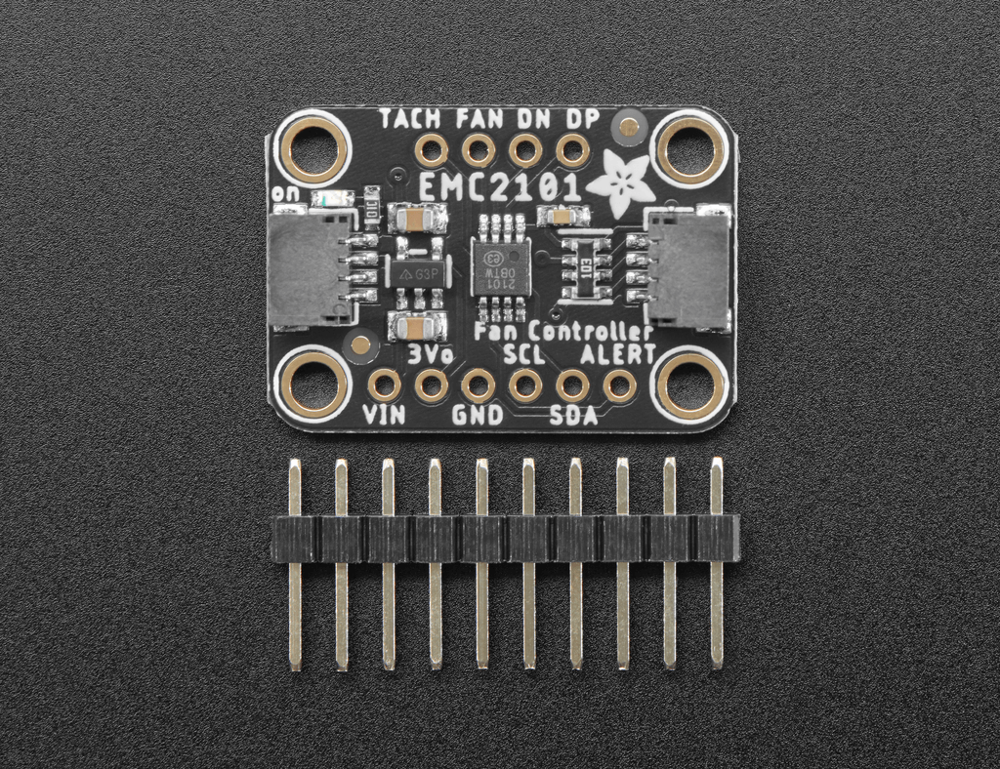

EMC2101 Fan Controller and Temperature sensor
=============================================

.. seo::
    :description: Instructions for setting up EMC2101 fan controller and temperature sensor in ESPHome.
    :image: emc2101.jpg
    :keywords: EMC2101

The ``emc2101`` component allows you to control a cooling fan from ESPHome (`datasheet <https://ww1.microchip.com/downloads/aemDocuments/documents/MSLD/ProductDocuments/DataSheets/EMC2101-Data-Sheet-DS20006703.pdf>`__). It also provides temperature
sensors and a tachometer. The fan can be controlled either by a PWM signal or by outputing a DC voltage
using its DAC.

The :ref:`I²C Bus <i2c>` is required to be set up in your configuration for this sensor to work.

    EMC2101 Fan Controller and Temperature sensor

.. note::

    Original image at https://learn.adafruit.com/assets/97827 created by 
    by user `Bryan Siepert <https://learn.adafruit.com/u/siddacious>`__ under
    `Creative Commons BY-SA 3.0 <https://creativecommons.org/licenses/by-sa/3.0/>`__ and modified
    for this documentation.

EMC2101 Component
-----------------

.. code-block:: yaml

    # Example configuration entry
    emc2101:
      pwm:
        resolution: 8

Configuration variables:
************************

- **address** (*Optional*, int): Manually specify the I²C address of the sensor. Defaults to ``0x4C``.
- **inverted** (*Optional*, boolean): Inverts the output so 0 means 100% duty cycle and 1 means 0%.  Defaults to ``false``.
- **pwm** (*Optional*): Enable PWM output.

  - **resolution** (*Optional*, int): Determines effective resolution and the frequency of the PWM signal. Defaults to ``23``.
  - **divider** (*Optional*, int): Value for the frequency divider. Defaults to ``1``.

- **dac** (*Optional*): Enable DAC output.

  - **conversion_rate** (*Optional*, string): The number of digital to analog conversions perfomed per second. One of ``1/16``, ``1/8``,
    ``1/4``, ``1/2``, ``1``, ``2``, ``4``, ``8``, ``16``, ``32``. Defaults to ``16``.

The PWM signal frequency is determined by the following formula:

.. math::

    \text{PWM Frequency} = \frac{360KHz}{2 \times resolution \times divider}

And the PWM resolution, the steps in the duty cycle, is calculated by the following formula:

.. math::

    \text{PWM resolution} = \frac{100\%}{2 \times resolution}

So, with the default values the PWM signal will have a frequency of 7.83KHz and a resolution of 2.17%. The maximum
resolution value is ``31`` which will configure a frequency of 5.81KHz with a resolution of 1.61%.

EMC2101 Output
--------------

.. code-block:: yaml

    output:
      - platform: emc2101
        id: fan_duty_cycle

Configuration variables:
************************

- **id** (**Required**, :ref:`config-id`): The ID to use for code generation, and for reference by dependent components.

.. note::

    When using the ``emc2101`` output with a :doc:`/components/fan/speed` it is advised to configure the **speed_count**
    as twice the **resolution** so the number of speeds in the fan matches the number of steps in the fan controller.

EMC2101 Sensors
---------------

.. code-block:: yaml

    sensor:
      - platform: emc2101
        internal_temperature:
          id: internal_temperature_sensor
          name: "Internal Temperature Sensor"
        speed:
          id: speed_sensor
          name: "Speed Sensor"
        duty_cycle:
          id: duty_cycle_sensor
          name: "Duty Cycle Sensor"
        update_interval: 5s

Configuration variables:
************************
- **internal_temperature** (*Optional*): The internal temperature sensor. 
  All options from :ref:`Sensor <config-sensor>`.

- **external_temperature** (*Optional*): The external temperature sensor. More accurate but it needs an additional transistor to be installed. 
  All options from :ref:`Sensor <config-sensor>`.

- **speed** (*Optional*): The fan speed sensor in RPMs. 
  All options from :ref:`Sensor <config-sensor>`.

- **duty_cycle** (*Optional*): Duty cycle sensor. 
  All options from :ref:`Sensor <config-sensor>`.

- **update_interval** (*Optional*, :ref:`config-time`): The interval to check the sensor. Defaults to ``60s``.

See Also
--------

- :ref:`config-sensor`
- :doc:`/components/fan/speed`
- :apiref:`emc2101/emc2101.h`
- :ghedit:`Edit`
