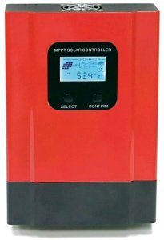

eSmart3 MPPT PV charger
=======================

.. seo::
    :description: Instructions for setting up eSmart3 MPPT PV charger in ESPHome.
    :image: esmart3_mppt.jpg

The ``esmart3`` component allows you to integrate the eSmart3 MPPT PV charger in ESPHome.
It uses :ref:`UART <uart>` for communication.

Once configured you can use sensors as described below for your projects.

    eSmart3 MPPT PV charger

Overview
--------

The eSmart3 has an RS485 port, with the following pinout:

+---+-----------+
|Pin|Function   |
+===+===========+
| 1 |RS-485 A/+ |
+---+-----------+
| 2 |RS-485 B/- |
+---+-----------+
|5,6|GND        |
+---+-----------+
|7,8|+5V out    |
+---+-----------+

The device communicates at ``9600`` baud ``8N1``. To connect to ESPHome, an RS485 transceiver is needed. Choose a type which does not need a trigger to send and receive data,  for example:

.. figure:: ../images/rs485.jpg

The controller connects to the UART of the MCU. For ESP32 GPIO `16` to `TXD` and `17` to RXD are the default ones but any other pins can be used as well. 3.3V to VCC and GND to GND.

If your ESP board can be powered at 5V, you can take the power from the connector above. But please keep in mind that you need an RS485 transceiver operating a 3.3V so that powers through the ESP board.

.. note::

    If you are using an ESP8266, serial logging may cause problems reading from UART. For best results, hardware serial is recommended. Software serial may not be able to read all received data if other components spend a lot of time in the ``loop()``.

    For hardware serial only a limited set of pins can be used. Either ``tx_pin: GPIO1`` and ``rx_pin: GPIO3``  or ``tx_pin: GPIO15`` and ``rx_pin: GPIO13``.

    The disadvantage of using the hardware uart is that you can't use serial logging because the serial logs would be sent to the modbus device and cause errors.

    Serial logging can be disabled by setting ``baud_rate: 0``.

    See :doc:`logger` for more details

    .. code-block:: yaml

        logger:
            level: <level>
            baud_rate: 0

.. code-block:: yaml

    # Example configuration entry
    uart:
      - id: uart_bus
        tx_pin: GPIO16
        rx_pin: GPIO17
        baud_rate: 9600

    sensor:
      - platform: esmart3
        charge_mode:
          id: cm
        input_voltage:
          id: iv
        battery_voltage:
          id: bv
        charging_current:
          id: cc
        load_voltage:
          id: lv
        load_current:
          id: lc
        charging_power:
          id: cp
        load_power:
          id: lp
        battery_temp:
          id: bt
        internal_temp:
          id: it
        battery_level:
          id: bl

Configuration variables:
~~~~~~~~~~~~~~~~~~~~~~~~

- **charge_mode**: Charge mode
- **input_voltage**: Input voltage
- **battery_voltage**: Battery voltage
- **charging_current**: Charging current
- **load_voltage**: Load voltage
- **load_current**: Load current
- **charging_power**: Charging power
- **load_power**: Load power
- **battery_temp**: Battery temperature
- **internal_temp**: Internal tempoerature
- **battery_level**: Battery level

All sensors are *Optional* and support all other options from :ref:`Sensor <config-sensor>`.

See Also
--------

- :ref:`uart`
- :ref:`Sensor <config-sensor>`
- `eSmart3 review <https://skagmo.com/page.php?p=documents/04_esmart3_review>`__
- `Communication protocol <https://github.com/skagmo/esmart_mppt/files/3401128/esmart3-serial-comm.pdf>`__
- :ghedit:`Edit`
