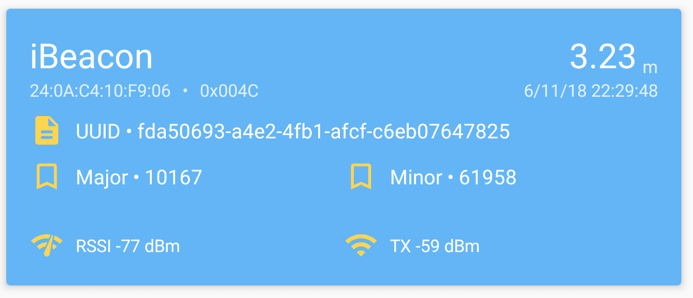

ESP32 Bluetooth Low Energy Beacon
=================================

.. seo::
    :description: Instructions for setting up Bluetooth Low Energy iBeacons using the BLE feature on ESP32s.
    :image: bluetooth.svg

The ``esp32_ble_beacon`` component creates a Bluetooth Low Energy Beacon with your ESP32 device.
Beacons are BLE devices that repeatedly just send out a pre-defined packet of data. This packet
can then be received by devices like smartphones and can then be used to track a phone's location.

.. code-block:: yaml

    # Example configuration entry
    esp32_ble_beacon:
      type: iBeacon
      uuid: 'c29ce823-e67a-4e71-bff2-abaa32e77a98'

Configuration variables:
------------------------

- **type** (**Required**): The type of beacon to create, currently only supports ``iBeacon``.
- **uuid** (**Required**): The `universally unique identifier <https://en.wikipedia.org/wiki/Universally_unique_identifier>`__
  to identify the beacon.
- **id** (*Optional*, :ref:`config-id`): Manually specify the ID for code generation.

Advanced options:

- **major** (*Optional*, int): The iBeacon major identifier of this beacon. Usually used to
  group beacons, for example for grouping all beacons in the same building, but has no effect if
  the BLE receiver doesn't use it. Defaults to ``10167``.
- **minor** (*Optional*, int): The iBeacon minor identifier of this beacon. Usually used to
  identify beacons within an iBeacon group. Defaults to ``61958``.

Setting Up
----------

First, you'll need to set up the configuration for ESPHome. Just copy the configuration above and
change the UUID to something unique. For example, you can copy this randomly generated UUID:

.. raw:: html

    <input type="text" id="ble-uuid" onclick="this.focus();this.select()" style="width: 240px;" readonly="readonly">
    

Then, just compile and flash the ESP32.

When everything is set up correctly, you should see a show up using your iBeacon scanner of choice. On iPhones,
this should already work from the Bluetooth screen (not tested), on Android, you will need to use an app like
`"Beacon Scanner" <https://play.google.com/store/apps/details?id=com.bridou_n.beaconscanner>`__ by Nicolas Bridoux.

For using these beacons to track the location of your phone, you will need to use another app. For example, I used
`this guide by the owntracks <https://owntracks.org/booklet/features/beacons/>`__ app to let my Home Automation system
know when I'm home or away. Another nice Android app is `Beacon MQTT <https://turbo-lab.github.io/android-beacon-mqtt/>`__.
It can work with multiple beacons simultaneously.

See Also
--------

- :doc:`esp32_ble_tracker`
- :doc:`binary_sensor/ble_presence`
- :apiref:`esp32_ble_beacon/esp32_ble_beacon.h`
- `ESP32 BLE for Arduino <https://github.com/nkolban/ESP32_BLE_Arduino>`__ by `Neil Kolban <https://github.com/nkolban>`__.
- :ghedit:`Edit`
