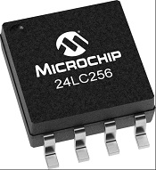

External EEPROM I²C Memory
=================================

.. _24LC256_datasheet: https://ww1.microchip.com/downloads/en/devicedoc/21203m.pdf

The ``external_epprom`` components allow you to use an I2C EEPROM for 
non-volatile storage to save arbitrary data.

Typical serial EEPROM devices on the market range from 128 to 64 K bytes.

For instance Microchip 24LC256
(`datasheet <24LC256_datasheet_>`__)
has 32KB.

.. _eeprom-comp-device:

Device
------

First you need to set up :doc:`/components/i2c` then the Eeprom device:
Example I2C configuration for ESP32. Yours will depend on which pins/bus you use

.. code-block:: yaml

    i2c:
      sda: GPIO21
      scl: GPIO22
      scan: true 
      id: bus_1  

Now the Eeprom device

.. code-block:: yaml

    external_eeprom:
      id: ext_eeprom_component_1
      address: 0x57
      ee_memory_type: 24XX32
      i2c_buffer_size: 128

- **id** (*Required*, :ref:`config-id`): ID for use in lambdas
- **i2c_id** (*Optional*, :ref:`config-id`): I²C Bus ID need on ESP32 devices with multiple I2C ports configured
- **address** (*Required*, int): I²C address, see :ref:`eeprom-types`, default: ``0x57``
- **ee_memory_type** (*Required*, eeprom_types): See :ref:`eeprom-types`
- **i2c_buffer_size** (*Required*, int): Size of the I2C buffer, for ESP32 & ESP8266 this is 128

Full example:
-------------

.. code-block:: yaml

    esphome:
      name: "schedule-test"

    esp32:
      board: esp32dev
      framework:
        type: arduino

    api:
      password: !secret api_password

    ota:
      password: !secret ota_password

    logger:
      
      # Enable fallback hotspot (captive portal) in case wifi connection fails
      level: DEBUG
      logs: 
          api: DEBUG
          homeassistant: DEBUG
          nextion: DEBUG
          api.service: DEBUG
          sensor: DEBUG
          scheduler: DEBUG
          dallas: DEBUG
          i2c: DEBUG
          ext_eeprom: DEBUG

    wifi:
      ssid: !secret wifi_ssid
      password: !secret wifi_password

      # Enable fallback hotspot (captive portal) in case wifi connection fails
      ap:
        ssid: "Esphome-Web-C34484"
        password: "hlVBVePNuBE3"

    captive_portal:

    time:
      - platform: homeassistant
        id: homeassistant_time

    i2c:
      sda: GPIO21
      scl: GPIO22
      scan: true 
      id: bus_1   
    
    external_eeprom:
      id: ext_eeprom_component_1
      address: 0x57
      ee_memory_type: 24XX32
      i2c_buffer_size: 128
      i2c_id: bus_1

    switch:
      - platform: template    
        name: "Test EEPROM Switch"
        id: "test_ee_switch"
        turn_on_action:
            - lambda: |-
                ESP_LOGD("Eeprom", "Mem size in bytes: %d", ext_eeprom_component_1->get_memory_size());
                uint8_t myValue1 = 42;
                ext_eeprom_component_1->write8(5, myValue1);
                uint8_t myRdValue1;
                myRdValue1 = ext_eeprom_component_1->read8(5);
                ESP_LOGD("Eeprom", "I read: %d",myRdValue1 );
                int32_t myValue2 = -480;
                ext_eeprom_component_1->write_object(10, myValue2); //(location, data)
                int32_t myRead2;
                ext_eeprom_component_1->read_object(10, myRead2); //location to read, thing to put data into
                ESP_LOGD("Eeprom", "I read: %d",myRead2 );
                float myValue3 = -7.35;
                ext_eeprom_component_1->write_object(20, myValue3); //(location, data)
                float myRead3;
                ext_eeprom_component_1->read_object(20, myRead3); //location to read, thing to put data into
                ESP_LOGD("Eeprom","I read: %f",myRead3);
                std::string myString = "This is a test of a very long string This is a test of a very long string This is a test of a very long string This is a test of a very long string This is a test of a very long string This is a test of a very long string ";
                ext_eeprom_component_1->write_string_to_eeprom(40, myString); //(location, data)
                std::string myRead4;
                ext_eeprom_component_1->read_string_from_eeprom(40, myRead4); //location to read, thing to put data into
                ESP_LOGD("Eeprom","I read: %s",myRead4.c_str());
                // ext_eeprom_component_1->dump_eeprom(0,96);
             
.. _eeprom-types:

Devices
*******
The list below lists of type and sizes of serial Eeprom devices supported. Please use the **EEPROM_TYPE** to cofigure your device

.. list-table::
    :header-rows: 1

    * - Device
      - EEPROM_TYPE
      - Size
      - Page Size
      - Page Write (ms)
    * - 24LC00
      - 24XX00
      - 16 B
      - 1
      - 5
    * - 24LC01
      - 24XX01
      - 128 B
      - 8
      - 5
    * - 24LC02
      - 24XX02
      - 256 B
      - 8
      - 5
    * - 24LC04
      - 24XX04
      - 512 B
      - 16
      - 5
    * - 24LC08
      - 24XX08
      - 1 KB
      - 16
      - 5
    * - 24LC16
      - 24XX16
      - 2 KB
      - 16
      - 5
    * - 24LC32
      - 24XX32
      - 4 KB
      - 32
      - 5
    * - 24LC64
      - 24XX64
      - 8 KB
      - 32
      - 5
    * - 24LC128
      - 24XX128
      - 16 KB
      - 64
      - 5
    * - 24LC256
      - 24XX256
      - 32 KB
      - 64
      - 5
    * - 24LC512
      - 24XX512
      - 64 KB
      - 128
      - 5
    * - 24LC1025
      - 24XX1025
      - 128 KB
      - 128
      - 5
    * - 24LC2048
      - 24XX2048
      - 256 KB
      - 128
      - 5

Address can be selected by connecting the address pins to VCC (pull them high).
Some devices have three pins (``A0,A1,A2``) some have two and some have none.

Address is then the ``0x57`` + the sum of the pins pulled high.

- ``A0``: add ``0x01``
- ``A1``: add ``0x02``
- ``A2``: add ``0x04``

So, if ``A0`` and ``A2`` are high, address will be ``0x57 + 0x01 + 0x04 = 0x5C``

.. _eeprom-usage:

Usage
*****

This component can be used from other components or lambdas:

.. code-block:: yaml

    on_...:
      - lambda: |-
          // write 16 bit int at address 15
          id(ext_eeprom_component_1).write16(0x000A, 12345);
          
          // read back that number
          uint16_t value_read = id(ext_eeprom_component_1).read16(0x000A);

Methods
========

Writing a single variable
-------------------------

- ``void write8(uint32_t address, uint8_t value)``
- ``void write16(uint32_t memaddr, uint16_t value)``
- ``void write32(uint32_t memaddr, uint32_t value)``
- ``void write_float(uint32_t address, float value)``
- ``void write_double(uint32_t address, double value)``

Reading a single variable
-------------------------

- ``uint8_t read8(uint32_t address)``
- ``uint16_t read16(uint32_t address)``
- ``uint32_t read32(uint32_t address)``
- ``float read_float(uint32_t address)``
- ``double read_double(uint32_t address)``

Reading and Writing Objects
---------------------------

- ``void read_object(uint32_t address, uint8_t *obj, uint32_t size)``
- ``void write_object(uint32_t address, uint8_t *obj, uint32_t size)``

Reading and Writing Strings
---------------------------
String are limited 254 characters and are stored with an extra leading byte that includes the length.

- ``uint32_t read_string_from_eeprom(uint32_t memaddr, std::string &str_to_read);``
- ``uint32_t write_string_to_eeprom(uint32_t memaddr, std::string &str_to_write);``

Both return the next available storage location

Miscellaneous Methods
---------------------

- ``void dump_eeprom(uint32_t start_addr, uint16_t word_count);``
- ``void erase(uint8_t value_to_write);``

The dump_eeprom methods display the contents of EEPROM in hex to the debug log starting at ``start_addr`` and for length ``word_count``.
The erase method erases the entire eeprom, the default value written to erase the eeprom is ``0x00``. This can be overridden by supplying ``value_to_write``.

.. warning::

    A call to the ``erase`` is **irreversible** so use carefully. You have been warned!

.. note::

    It your responsibility to maintain a list of addresses used to store various values. 
    Also you need to understand the size to the item being stored EG ``write32`` will use 4 bytes. Otherwise data will get over written.

    **Special care is required with writing strings, as strings are varible length and can be upto 254 bytes long.**
