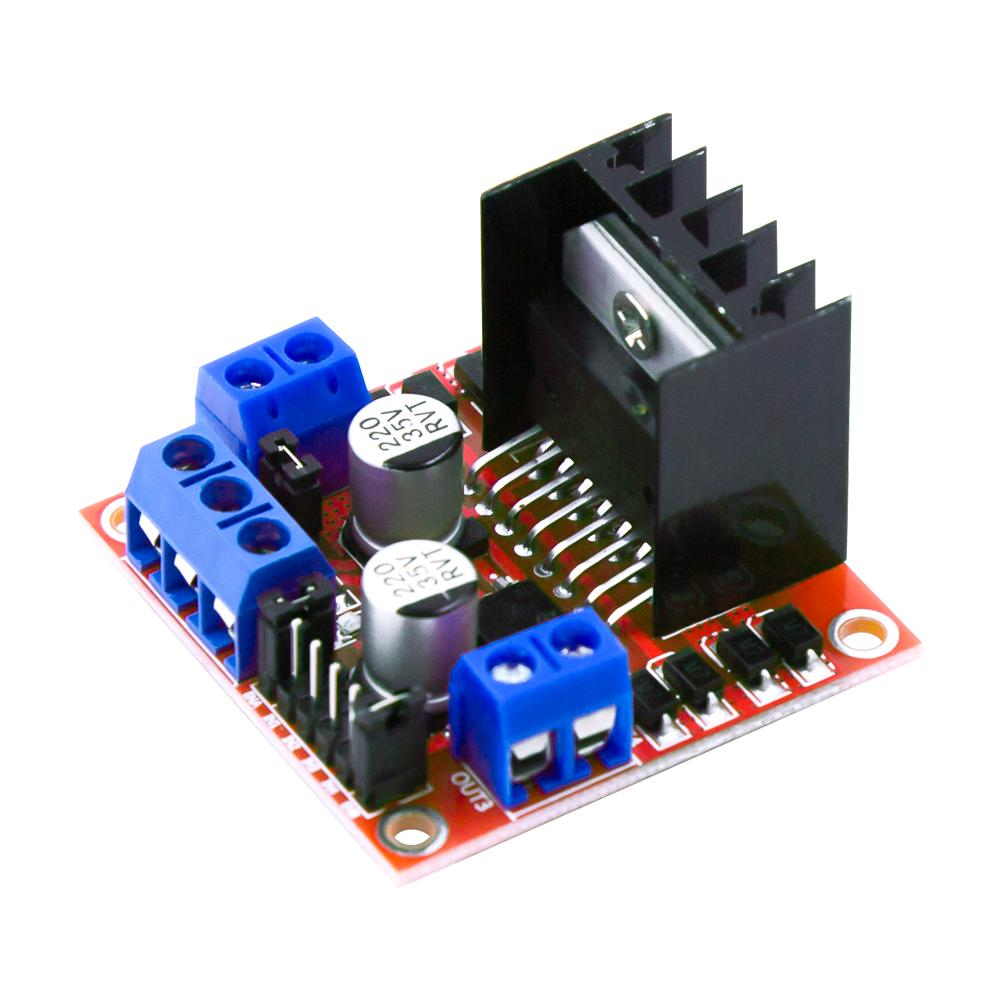

H-bridge Fan
============

.. seo::
    :description: Instructions for setting up hbridge controlled fans (or motors).
    :image: fan.svg

The ``hbridge`` fan platform allows you to use a compatible *h-bridge* (L298N, DRV8871, MX1508, BTS7960, L9110S, DRV8833, TB6612, etc.) to control a fan (or motor/solenoid).

    L298N H-bridge module. Image by `kuongshun`_.

.. _kuongshun: https://kuongshun.com/products/l298n-stepper-motor-driver-board-red

.. figure:: images/fan-ui.png
    :align: center
    :width: 80.0%

.. code-block:: yaml

    # Example configuration entry
    fan:
      - platform: hbridge
        id: my_fan
        name: "Living Room Fan"
        pin_a: motor_forward_pin
        pin_b: motor_reverse_pin
        # enable_pin: motor_enable
        decay_mode: slow   # slow decay mode (coasting) or fast decay (braking).

Configuration variables:
------------------------

- **pin_a** (**Required**, :ref:`config-id`): The id of the
  :ref:`float output <output>` connected to Pin A (alternatively IN1, etc.) of the h-bridge.
- **pin_b** (**Required**, :ref:`config-id`): The id of the
  :ref:`float output <output>` connected to Pin B (alternatively IN2, etc.) of the h-bridge.
- **enable_pin** (*Optional*, :ref:`config-id`): The id of the
  :ref:`float output <output>` connected to the Enable pin of the h-bridge (if h-bridge uses enable).
- **decay_mode** (*Optional*, string): The decay mode you want to use with
  the h-bridge. Either ``slow`` (coasting) or ``fast`` (braking). Defaults to ``slow``.
- **speed_count** (*Optional*, int): Set the number of supported discrete speed levels. The value is used
  to calculate the percentages for each speed. E.g. ``2`` means that you have 50% and 100% while ``100``
  will allow 1% increments in the output. Defaults to ``100``.
- **name** (**Required**, string): The name for this fan.
- **id** (*Optional*, :ref:`config-id`): Manually specify the ID used for code generation.
- **preset_modes** (*Optional*): A list of preset modes for this fan. Preset modes can be used in automations (i.e. `on_preset_set`).
- All other options from :ref:`Fan Component <config-fan>`.

.. _fan-hbridge_brake_action:

``fan.hbridge.brake`` Action
----------------------------

Set all h-bridge pins high, shorting the fan/motor's windings and forcing the motor to actively stop.

.. code-block:: yaml

    on_...:
      then:
        - fan.hbridge.brake: my_fan

See Also
--------

- :doc:`/components/output/index`
- :doc:`/components/fan/index`
- :doc:`/components/output/ledc`
- :doc:`/components/output/esp8266_pwm`
- :apiref:`fan/fan_state.h`
- `Adafruit's excellent H-bridge tutorial <https://learn.adafruit.com/improve-brushed-dc-motor-performance>`__
- :ghedit:`Edit`
