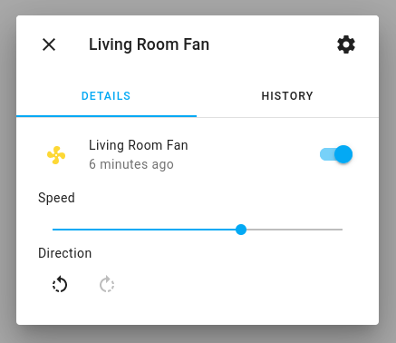

Fan Component
=============

.. seo::
    :description: Instructions for setting up the base fan component.
    :image: folder-open.png

With the ``fan`` domain you can create components that appear as fans in
the Home Assistant frontend. A fan can be switched ON or OFF, optionally
has a speed level between 1 and the maximum supported speed level of the fan, and can have an
oscillate and direction output.

This component restores its state on reboot/reset.

.. _config-fan:

Base Fan Configuration
----------------------

.. code-block:: yaml

    fan:
      - platform: ...
        name: ...

Configuration variables:

- **name** (**Required**, string): The name of the fan.
- **icon** (*Optional*, icon): Manually set the icon to use for the fan in the frontend.
- **internal** (*Optional*, boolean): Mark this component as internal. Internal components will
  not be exposed to the frontend (like Home Assistant). Only specifying an ``id`` without
  a ``name`` will implicitly set this to true.
- **disabled_by_default** (*Optional*, boolean): If true, then this entity should not be added to any client's frontend,
  (usually Home Assistant) without the user manually enabling it (via the Home Assistant UI).
  Requires Home Assistant 2021.9 or newer. Defaults to ``false``.

MQTT options:

- **oscillation_state_topic** (*Optional*, string): The topic to
  publish fan oscillation state changes to.
- **oscillation_command_topic** (*Optional*, string): The topic to
  receive oscillation commands on.
- **speed_level_state_topic** (*Optional*, int): The topic to publish
  numeric fan speed state changes to (range: 0 to speed count).
- **speed_level_command_topic** (*Optional*, int): The topic to receive
  numeric speed commands on (range: 0 to speed count).
- **speed_state_topic** (*Optional*, string): The topic to publish fan
  speed state changes to (options: LOW, MEDIUM, HIGH).
- **speed_command_topic** (*Optional*, string): The topic to receive
  speed commands on (options: LOW, MEDIUM, HIGH).
- All other options from :ref:`MQTT Component <config-mqtt-component>`.

Automation triggers:

- **on_turn_on** (*Optional*, :ref:`Action <config-action>`): An automation to perform
  when the fan is turned on. See :ref:`fan-on_turn_on_off_trigger`.
- **on_turn_off** (*Optional*, :ref:`Action <config-action>`): An automation to perform
  when the fan is turned off. See :ref:`fan-on_turn_on_off_trigger`.
- **on_speed_set** (*Optional*, :ref:`Action <config-action>`): An automation to perform
  when the fan speed is set/changed. See :ref:`fan-on_speed_set_trigger`.

.. _fan-toggle_action:

``fan.toggle`` Action
---------------------

Toggles the ON/OFF state of the fan with the given ID when executed.

.. code-block:: yaml

    on_...:
      then:
        - fan.toggle: fan_1

.. _fan-turn_off_action:

``fan.turn_off`` Action
-----------------------

Turns the fan with the given ID off when executed.

.. code-block:: yaml

    on_...:
      then:
        - fan.turn_off: fan_1

.. _fan-turn_on_action:

``fan.turn_on`` Action
----------------------

Turns the fan with the given ID on when executed.

.. code-block:: yaml

    on_...:
      then:
        - fan.turn_on:
            id: fan_1
        # Shorthand:
        - fan.turn_on: fan_1

Configuration options:

- **id** (**Required**, :ref:`config-id`): The ID of the fan.
- **oscillating** (*Optional*, boolean, :ref:`templatable <config-templatable>`):
  Set the oscillation state of the fan. Defaults to not affecting oscillation.
- **speed** (*Optional*, int, :ref:`templatable <config-templatable>`):
  Set the speed level of the fan. Can be a number between 1 and the maximum speed level of the fan.
- **direction** (*Optional*, string, :ref:`templatable <config-templatable>`):
  Set the diretion of the fan. Can be either ``forward`` or ``reverse``. Defaults to not changing the direction.

.. _fan-cycle_speed_action:

``fan.cycle_speed`` Action
--------------------------

Increments through speed levels of the fan with the given ID when executed. If the fan's speed level is set to maximum when executed, turns fan off.

.. code-block:: yaml

    on_...:
      then:
        - fan.cycle_speed: fan_1

.. _fan-is_on_condition:
.. _fan-is_off_condition:

``fan.is_on`` / ``fan.is_off`` Condition
----------------------------------------

This :ref:`condition <config-condition>` passes if the given fan is on/off.

.. code-block:: yaml

    # in a trigger:
    on_...:
      if:
        condition:
          fan.is_on: my_fan
          # same goes for is_off
        then:
        - script.execute: my_script

.. _fan-on_turn_on_off_trigger:

``fan.on_turn_on`` / ``fan.on_turn_off`` Trigger
------------------------------------------------

This trigger is activated each time the fan is turned on or off. It does not fire
if a command to turn the fan on or off already matches the current state.

.. code-block:: yaml

    fan:
      - platform: speed # or any other platform
        # ...
        on_turn_on:
        - logger.log: "Fan Turned On!"
        on_turn_off:
        - logger.log: "Fan Turned Off!"

.. _fan-on_speed_set_trigger:

``fan.on_speed_set`` Trigger
----------------------------

This trigger is activated each time the fan speed is changed. It will fire when the speed is either set via API e.g. in Home Assistant or locally by an automation or a lambda function.

.. code-block:: yaml

    fan:
      - platform: speed # or any other platform
        # ...
        on_speed_set:
        - logger.log: "Fan Speed was changed!"

Lambda calls
------------

From :ref:`lambdas <config-lambda>`, you can call several methods on all fans to do some
advanced stuff (see the full API Reference for more info).

- ``state``: Retrieve the current state (on/off) of the fan.

  .. code-block:: yaml

      // Within lambda, get the fan state and conditionally do something
      if (id(my_fan).state) {
        // Fan is ON, do something here
      } else {
        // Fan is OFF, do something else here
      }

- ``speed``: Retrieve the current speed of the fan.

  .. code-block:: yaml

      // Within lambda, get the fan speed and conditionally do something
      if (id(my_fan).speed == 2) {
        // Fan speed is 2, do something here
      } else {
        // Fan speed is not 2, do something else here
      }

- ``oscillating``: Retrieve the current oscillating state of the fan.

  .. code-block:: yaml

      // Within lambda, get the fan oscillating state and conditionally do something
      if (id(my_fan).oscillating) {
        // Fan is oscillating, do something here
      } else {
        // Fan is not oscillating, do something else here
      }

- ``direction``: Retrieve the current direction of the fan.

  .. code-block:: yaml

      // Within lambda, get the fan direction and conditionally do something
      if (id(my_fan).direction == FanDirection::FAN_DIRECTION_FORWARD) {
        // Fan direction is forward, do something here
      } else {
        // Fan direction is reverse, do something else here
      }

- ``turn_off()``/``turn_on()``/``toggle()``: Manually turn the fan ON/OFF from code.
  Similar to the ``fan.turn_on``, ``fan.turn_off``, and ``fan.toggle`` actions,
  but can be used in complex lambda expressions.

  .. code-block:: yaml

      // Turn the fan off
      auto call = id(my_fan).turn_off();
      call.perform();

      // Turn the fan on and set the speed, oscillating, and direction
      auto call = id(my_fan).turn_on();
      call.set_speed(2);
      call.set_oscillating(true);
      call.set_direction(FanDirection::FAN_DIRECTION_REVERSE);
      call.perform();

      // Toggle the fan on/off
      auto call = id(my_fan).toggle();
      call.perform();

Full Fan Index
--------------

- :apiref:`fan/fan_state.h`
- :ghedit:`Edit`

.. toctree::
    :maxdepth: 1
    :glob:

    *
