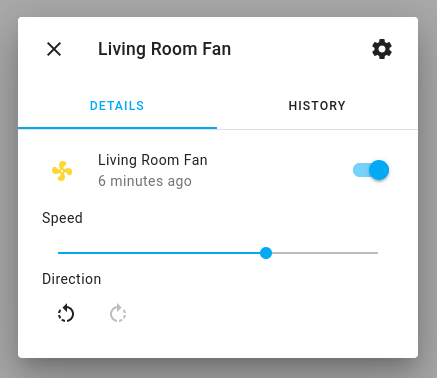

Template Fan
============

.. seo::
    :description: Instructions for setting up template fans.
    :image: fan.svg

The ``template`` fan platform lets you create a fan interface using only triggers.

.. code-block:: yaml

    # Example configuration entry
    fan:
      - platform: template
        name: "Virtual Fan"
        on_state:
          - do something
        on_speed_set:
          - do something

Configuration variables:
------------------------

- **id** (*Optional*, :ref:`config-id`): Manually specify the ID used for code generation.
- **name** (*Optional*, string): The name for this fan.
- **has_direction** (*Optional*, boolean): Indicates if there should be a control for direction.  Default is ``false``.
- **has_oscillating** (*Optional*, boolean): Indicates if there should be a control for oscillating.  Default is ``false``.
- **speed_count** (*Optional*, int): Set the number of supported discrete speed levels.  Default is only on/off.
- **preset_modes** (*Optional*): A list of preset modes for this fan. Preset modes can be used in automations (i.e. `on_preset_set`).
- All other options from :ref:`Fan Component <config-fan>`.

See Also
--------

- :doc:`/components/fan/index`
- :apiref:`template/fan/template_fan.h`
- :ghedit:`Edit`
