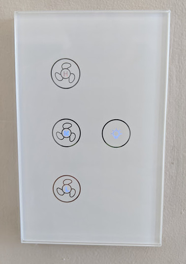

Tuya Fan
========

.. seo::
    :description: Instructions for setting up a Tuya ceiling fan switch.
    :image: fan.svg

The ``tuya`` fan platform creates a variable speed fan from a
tuya component.

    A Tuya based fan controller wall plate.

The Tuya fan requires a :doc:`/components/tuya` to be configured.

Here is an example output for a Tuya fan controller:

.. code-block:: text

    [12:39:45][C][tuya:023]: Tuya:
    [12:39:45][C][tuya:032]:   Datapoint 1: switch (value: ON)
    [12:39:45][C][tuya:036]:   Datapoint 3: enum (value: 1)
    [12:39:45][C][tuya:036]:   Datapoint 6: enum (value: 0)
    [12:39:45][C][tuya:034]:   Datapoint 7: int value (value: 0)
    [12:39:45][C][tuya:032]:   Datapoint 9: switch (value: OFF)
    [12:39:45][C][tuya:046]:   Product: '{"p":"hqq73kftvzh8c92u","v":"1.0.0","m":0}'

On this controller, the data points are:

- 1 represents the fan on/off state.
- 3 represents the speed setting.
- 9 represents the additional light switch. (use the :doc:`/components/light/tuya` component to control this)
- 6 & 7 are unknown and don't seem to affect the state.

Based on this, you can create the fan as follows:

.. code-block:: yaml

    # Create a fan
    fan:
      - platform: "tuya"
        name: "MyFan"
        switch_datapoint: 1
        speed_datapoint: 3

Configuration variables:
------------------------

- **id** (*Optional*, :ref:`config-id`): Manually specify the ID used for code generation.
- **name** (**Required**, string): The name of the fan.
- **speed_datapoint** (**Required**, int): The datapoint id number of the fan speed.
- **switch_datapoint** (**Required**, int): The datapoint id number of the fan switch.
- **oscillation_datapoint** (*Optional*, int): The datapoint id number of the oscillation
  switch. Probably not supported on any Tuya controllers currently, but it's there if need be.
- **direction_datapoint** (*Optional*, int): The datapoint id number of the direction
  switch. Supported by some ceiling fans.
- **speed_count** (*Optional*, int): Set the number of supported discrete speed levels. Defaults to ``3``.
- All other options from :ref:`Fan <config-fan>`.

.. note::

    The MCU on the Tuya dimmer handles the LEDs and they dont seem to be controllable
    over the serial bus.

See Also
--------

- :doc:`/components/tuya`
- :doc:`/components/fan/index`
- :apiref:`tuya/fan/tuya_fan.h`
- :ghedit:`Edit`
