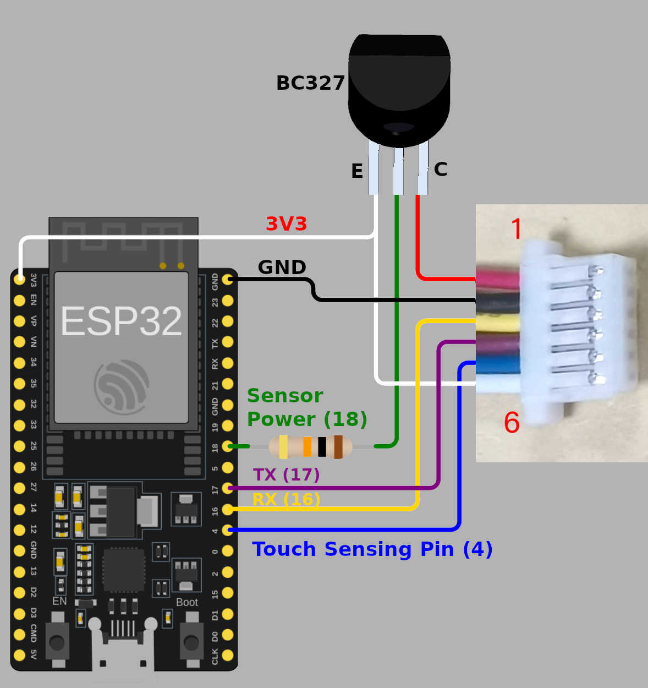

Grow Fingerprint Reader
=======================

.. seo::
    :description: Instructions for setting up Grow Fingerprint Reader component in ESPHome.
    :image: fingerprint.svg

The ``fingerprint_grow`` component allows you to use your R307, R503, R503-RGB, ZFM-20, ... fingerprint sensors with ESPHome.

    R307/ZFM-20 Optical Fingerprint Reader (`datasheet <https://cdn-shop.adafruit.com/datasheets/ZFM+user+manualV15.pdf>`__, `Adafruit <https://www.adafruit.com/product/751>`__). Image by `Adafruit <https://www.adafruit.com/product/751>`__.

    R503 Capacitive Fingerprint Reader with Bi-Color Aura LED (`datasheet <https://cdn-shop.adafruit.com/product-files/4651/4651_R503+fingerprint+module+user+manual.pdf>`__, `Adafruit <https://www.adafruit.com/product/4651>`__). Image by `Adafruit <https://www.adafruit.com/product/4651>`__.

Component/Hub
-------------

The reader can be powered by the 3.3V output of an NodeMCU. As the communication with the reader is done using UART (default baud rate is 57600), you need to have an :ref:`UART bus <uart>` in your configuration with the ``rx_pin`` connected to the reader's ``TX`` and the ``tx_pin`` connected to the reader's ``RX``.

If available on your reader model, it's recommended to connect 3.3VT (touch induction power supply) & 3.3V to 3.3V; WAKEUP (finger detection signal) to a free GPIO pin and define it with the ``sensing_pin`` option to allow the polling function to quickly return when there's no finger on the reader.

.. code-block:: yaml

    # Example configuration entry
    fingerprint_grow:
      sensing_pin: GPIOXX
      sensor_power_pin:
          number: GPIOXX
          inverted: true
      idle_period_to_sleep: 5s

      on_finger_scan_start:
        ...
      on_finger_scan_matched:
        ...
      on_finger_scan_unmatched:
        ...
      on_finger_scan_misplaced:
        ...
      on_finger_scan_invalid:
        ...
      on_enrollment_scan:
        ...
      on_enrollment_done:
        ...
      on_enrollment_failed:
        ...

Configuration variables:

The configuration is made up of three parts: The central component, optional individual sensors, and the optional enrolling binary sensor.

Base Configuration:

- **uart_id** (*Optional*, :ref:`config-id`): Manually specify the ID of the UART hub.
- **id** (*Optional*, :ref:`config-id`): Manually specify the ID used for code generation.
- **sensing_pin** (*Optional*, :ref:`Pin Schema <config-pin_schema>`): Pin connected to the reader's finger detection signal (WAKEUP) output.
- **sensor_power_pin** (*Optional*, :ref:`Pin Schema <config-pin_schema>`): Output pin responsible for toogling the sensor power on and off.
- **password** (*Optional*, int): Password to use for authentication. Defaults to ``0x00``.
- **new_password** (*Optional*, int): Sets a new password to use for authentication. See :ref:`fingerprint_grow-set_new_password` for more information.
- **idle_period_to_sleep** (*Optional*, :ref:`config-time`): The sensor idle period to wait before powering it off (sleep). Defaults to ``5s``. See :ref:`fingerprint_grow-sleep_mode` for more information.
- **on_finger_scan_start** (*Optional*, :ref:`Automation <automation>`): An action to be performed when the finger touches the sensor. See :ref:`fingerprint_grow-on_finger_scan_start`.
- **on_finger_scan_matched** (*Optional*, :ref:`Automation <automation>`): An action to be performed when an enrolled fingerprint is scanned. See :ref:`fingerprint_grow-on_finger_scan_matched`.
- **on_finger_scan_unmatched** (*Optional*, :ref:`Automation <automation>`): An action to be performed when an unknown fingerprint is scanned. See :ref:`fingerprint_grow-on_finger_scan_unmatched`.
- **on_finger_scan_misplaced** (*Optional*, :ref:`Automation <automation>`): An action to be performed when the finger is not entirely touching the sensor. See :ref:`fingerprint_grow-on_finger_scan_misplaced`.
- **on_finger_scan_invalid** (*Optional*, :ref:`Automation <automation>`): An action to be performed when the scan of a fingerprint failed. See :ref:`fingerprint_grow-on_finger_scan_invalid`.
- **on_enrollment_scan** (*Optional*, :ref:`Automation <automation>`): An action to be performed when a fingerprint is scanned during enrollment. See :ref:`fingerprint_grow-on_enrollment_scan`.
- **on_enrollment_done** (*Optional*, :ref:`Automation <automation>`): An action to be performed when a fingerprint is enrolled. See :ref:`fingerprint_grow-on_enrollment_done`.
- **on_enrollment_failed** (*Optional*, :ref:`Automation <automation>`): An action to be performed when a fingerprint enrollment failed. See :ref:`fingerprint_grow-on_enrollment_failed`.

Binary Sensor
-------------

Configuration variables:

- **name** (**Required**, string): The name for the enrolling binary sensor.
- **id** (*Optional*, :ref:`config-id`): Manually specify the ID used for code generation.
- All other options from :ref:`Binary Sensor <config-binary_sensor>`.

Sensor
------

- **fingerprint_count**: The number of enrolled fingerprints stored on the reader.
  All options from :ref:`Sensor <config-sensor>`.

- **last_finger_id**: The last matched enrolled fingerprint as set by :ref:`fingerprint_grow-on_finger_scan_matched`.
  All options from :ref:`Sensor <config-sensor>`.

- **last_confidence**: The last matched confidence as set by :ref:`fingerprint_grow-on_finger_scan_matched`.
  All options from :ref:`Sensor <config-sensor>`.

- **status**: The integer representation of the internal status register of the reader.
  All options from :ref:`Sensor <config-sensor>`.

- **capacity**: The fingerprint storage capacity of the reader.
  All options from :ref:`Sensor <config-sensor>`.

- **security_level**: The integer representation of the currently configured security level of the reader. Higher security levels reduce the false acceptance rate (FAR) at the expense of increasing the false rejection rate (FRR). Range is 1 (lowest) to 5 (highest).
  All options from :ref:`Sensor <config-sensor>`.

.. _fingerprint_grow-sleep_mode:

Sleep Mode
----------
The sensor idle power consumption is roughly 20mA. If you plan to keep the device running continuously, it is wise to implement the Sleep Mode, which puts the sensor to sleep (power off) a few seconds after the last communication (configurable with ``idle_period_to_sleep``). It can only be implemented along with the Touch Sensing Feature, since it uses the touch feedback to wake up the sensor.
To implement this feature, you will need one more free GPIO pin to toggle the sensor power on and off and two external components: a 10kOhms resistor and a PNP transistor (like a BC327).

This is a wiring example for the R503 and below you can find the respective configuration:

.. code-block:: yaml

    uart:
      rx_pin: GPIOXX
      tx_pin: GPIOXX
      baud_rate: 57600

    fingerprint_grow:
      sensing_pin: GPIOXX
      sensor_power_pin:
          number: GPIOXX
          inverted: true
      idle_period_to_sleep: 5s

.. _fingerprint_grow-set_new_password:

Setting a New Password
----------------------

.. warning::

    Forgetting the password will render your fingerprint reader unusable!

You can set a new password for your fingerprint reader using the ``new_password:`` configuration option. The password is defined as a 32-bit unsigned integer.

.. code-block:: yaml

    fingerprint_grow:
      password: 0x275FE3D2      # Existing password, can be omitted if it's the default of 0x00
      new_password: 0x72AB96CD  # New password

The ``new_password:`` configuration option is meant to be compiled, flashed to the ESP device and run once, after which it's removed and the new password is defined in the ``password:`` configuration option to be compiled and flashed again.

.. code-block:: yaml

    fingerprint_grow:
      password: 0x72AB96CD      # Update the existing password with the new one

.. _fingerprint_grow-on_finger_scan_start:

``on_finger_scan_start`` Trigger
------------------------------------

With this configuration option, you can trigger an automation when a finger is detected touching the sensor. Very useful to indicate to the user via AuraLed that the sensor has detected the finger touch and will perform the scan. This trigger will **only** activate if your fingerprint sensor is configured with the ``sensing_pin`` option.

.. code-block:: yaml

    on_finger_scan_start:
      - fingerprint_grow.aura_led_control:
          state: ALWAYS_ON
          color: GREEN
          speed: 0
          count: 0

.. _fingerprint_grow-on_finger_scan_invalid:

``on_finger_scan_invalid`` Trigger
----------------------------------

With this configuration option you can write complex automations whenever a scan fails, e.g. when the finger is not placed correctly on the reader. This is different from ``on_finger_scan_unmatched`` which is triggered when an unknown fingerprint is scanned. This option works best with the ``sensing_pin`` option defined.

.. code-block:: yaml

    on_finger_scan_invalid:
      - text_sensor.template.publish:
          id: fingerprint_state
          state: "Invalid finger"

.. _fingerprint_grow-on_finger_scan_matched:

``on_finger_scan_matched`` Trigger
----------------------------------

With this configuration option you can write complex automations whenever a finger scan is matched to an enrolled fingerprint.
To use the variables, use a :ref:`lambda <config-lambda>` template, the matched slot number and the confidence are available inside that lambda under the variables named ``finger_id`` and ``confidence``.

.. code-block:: yaml

    on_finger_scan_matched:
      - text_sensor.template.publish:
          id: fingerprint_state
          state: !lambda 'return "Authorized finger " + to_string(finger_id) + ", confidence " + to_string(confidence);'
      # Pushing a tag_scanned event based on finger_id only if confidence is greater than 50
      - if:
          condition:
            lambda: 'return confidence > 50;'
          then:
            - homeassistant.tag_scanned: !lambda |-
                switch (finger_id) {
                  case 0:
                    return "person_a";
                  case 1:
                    return "person_b";
                  ...
                  default:
                    return "person_unknown";
                }

.. _fingerprint_grow-on_finger_scan_unmatched:

``on_finger_scan_unmatched`` Trigger
------------------------------------

With this configuration option you can write complex automations whenever an unknown fingerprint is scanned.

.. code-block:: yaml

    on_finger_scan_unmatched:
      - text_sensor.template.publish:
          id: fingerprint_state
          state: "Unauthorized finger"

.. _fingerprint_grow-on_finger_scan_misplaced:

``on_finger_scan_misplaced`` Trigger
------------------------------------

With this configuration option, you can create automations for situations when the finger is in contact with the sensor but not fully covering it, enabling you to perform a successful scan.
This trigger will **only** activate if your fingerprint sensor is configured with the ``sensing_pin`` option. It serves as a useful indicator to alert the user when their touch on the sensor is insufficient.

.. code-block:: yaml

    on_finger_scan_misplaced:
      - text_sensor.template.publish:
          id: fingerprint_state
          state: "Misplaced finger"

.. _fingerprint_grow-on_enrollment_scan:

``on_enrollment_scan`` Trigger
------------------------------

With this configuration option you can write complex automations whenever a finger is scanned during enrollment.
To use the variables, use a :ref:`lambda <config-lambda>` template, the scan number and the slot number to be enrolled into are available inside that lambda under the variables named ``scan_num`` and ``finger_id``.

.. code-block:: yaml

    on_enrollment_scan:
      - text_sensor.template.publish:
          id: fingerprint_state
          state: !lambda 'return "Enrolling into slot " + to_string(finger_id) + ", scanned " + to_string(scan_num) + " time(s)";'

.. _fingerprint_grow-on_enrollment_done:

``on_enrollment_done`` Trigger
------------------------------

With this configuration option you can write complex automations whenever a finger is successfully enrolled.
To use the variables, use a :ref:`lambda <config-lambda>` template, the slot number enrolled into is available inside that lambda under the variable named ``finger_id``.

.. code-block:: yaml

    on_enrollment_done:
      - text_sensor.template.publish:
          id: fingerprint_state
          state: !lambda 'return "Enrolled into slot " + to_string(finger_id);'

.. _fingerprint_grow-on_enrollment_failed:

``on_enrollment_failed`` Trigger
--------------------------------

With this configuration option you can write complex automations whenever a finger failed to be enrolled.
To use the variables, use a :ref:`lambda <config-lambda>` template, the slot number that failed to be enrolled into is available inside that lambda under the variable named ``finger_id``.

.. code-block:: yaml

    on_enrollment_failed:
      - text_sensor.template.publish:
          id: fingerprint_state
          state: !lambda 'return "Failed to enroll into slot " + to_string(finger_id);'
      # Retry enrollment into the same slot
      - delay: 3s
      - text_sensor.template.publish:
          id: fingerprint_state
          state: !lambda 'return "Retrying enrollment into slot " + to_string(finger_id) + " in 3 seconds...";'
      - delay: 3s
      - fingerprint_grow.enroll: !lambda 'return finger_id;'

``fingerprint_grow.enroll`` Action
----------------------------------

Starts the fingerprint enrollment process on the slot number defined.

.. code-block:: yaml

    on_...:
      then:
        - fingerprint_grow.enroll:
            finger_id: 0
            num_scans: 2
        # Shorthand
        - fingerprint_grow.enroll: 0
        # Update the template text sensor for visual feedback
        - text_sensor.template.publish:
            id: fingerprint_state
            state: "Place a finger on the reader"

Configuration options:

- **finger_id** (**Required**, int, :ref:`templatable <config-templatable>`): The slot number to enroll the new fingerprint into. Limited to the fingerprint capacity available on the reader.
- **num_scans** (*Optional*, int, :ref:`templatable <config-templatable>`): Number of times to scan the finger to be enrolled. Limited to the number of character buffers available on the reader. Defaults to 2.

``fingerprint_grow.cancel_enroll`` Action
-----------------------------------------

Cancels the current fingerprint enrollment process. Triggers the ``on_enrollment_failed`` trigger.

.. code-block:: yaml

    on_...:
      then:
        - fingerprint_grow.cancel_enroll:

``fingerprint_grow.delete`` Action
----------------------------------

Removes the enrolled fingerprint from the slot number defined.

.. code-block:: yaml

    on_...:
      then:
        - fingerprint_grow.delete:
            finger_id: 0
        # Shorthand
        - fingerprint_grow.delete: 0

Configuration options:

- **finger_id** (**Required**, int, :ref:`templatable <config-templatable>`): The slot number of the enrolled fingerprint to delete.

``fingerprint_grow.delete_all`` Action
--------------------------------------

Removes all enrolled fingerprints.

.. code-block:: yaml

    on_...:
      then:
        - fingerprint_grow.delete_all:

``fingerprint_grow.led_control`` Action
---------------------------------------

Turns on or off the LED on the reader. Only available on select models. If you have the R503 or R503-RGB use :ref:`fingerprint_grow-aura_led_control` instead.

.. code-block:: yaml

    on_...:
      then:
        - fingerprint_grow.led_control:
            state: ON
        # Shorthand
        - fingerprint_grow.led_control: ON

Configuration options:

- **state** (**Required**, boolean, :ref:`templatable <config-templatable>`): The state to set the LED.

.. _fingerprint_grow-aura_led_control:

``fingerprint_grow.aura_led_control`` Action
--------------------------------------------

Controls the Aura LED on the reader. Only available on select models.  NOTE: The R503 has 2 variants with different LED colour options.

.. code-block:: yaml

    on_...:
      then:
        - fingerprint_grow.aura_led_control:
            state: BREATHING
            speed: 100
            color: BLUE
            count: 2
    # Sample Aura LED config for all reader triggers
    fingerprint_grow:
      on_finger_scan_start:
        - fingerprint_grow.aura_led_control:
            state: ALWAYS_ON
            color: GREEN
            speed: 0
            count: 0
      on_finger_scan_matched:
        - fingerprint_grow.aura_led_control:
            state: BREATHING
            speed: 200
            color: BLUE
            count: 1
      on_finger_scan_unmatched:
        - fingerprint_grow.aura_led_control:
            state: FLASHING
            speed: 25
            color: RED
            count: 2
      on_finger_scan_misplaced:
        - fingerprint_grow.aura_led_control:
            state: FLASHING
            speed: 25
            color: PURPLE
            count: 2
      on_enrollment_scan:
        - fingerprint_grow.aura_led_control:
            state: FLASHING
            speed: 25
            color: BLUE
            count: 2
        - fingerprint_grow.aura_led_control:
            state: ALWAYS_ON
            speed: 0
            color: PURPLE
            count: 0
      on_enrollment_done:
        - fingerprint_grow.aura_led_control:
            state: BREATHING
            speed: 100
            color: BLUE
            count: 2
      on_enrollment_failed:
        - fingerprint_grow.aura_led_control:
            state: FLASHING
            speed: 25
            color: RED
            count: 4
    on...:
      then:
        - fingerprint_grow.enroll: ...
        - fingerprint_grow.aura_led_control:
            state: ALWAYS_ON
            speed: 0
            color: PURPLE
            count: 0

Configuration options:

- **state** (**Required**, string, :ref:`templatable <config-templatable>`): The state to set the LED. One of ``BREATHING``, ``FLASHING``, ``ALWAYS_ON``, ``ALWAYS_OFF``, ``GRADUAL_ON`` and ``GRADUAL_OFF``.
- **speed** (**Required**, int, :ref:`templatable <config-templatable>`): The duration each cycle lasts, a factor of 10ms. Only relevant for ``BREATHING``, ``FLASHING``, ``GRADUAL_ON`` and ``GRADUAL_OFF`` states. The total duration is defined by 10ms * speed * count. Range is 0 to 255.
- **color** (**Required**, string, :ref:`templatable <config-templatable>`): The LED color to activate. For R503, one of ``RED``, ``BLUE`` and ``PURPLE``.  For R503-RGB, one of ``RED``, ``BLUE``, ``PURPLE``, ``GREEN``, ``YELLOW``, ``CYAN`` and ``WHITE``.
- **count** (**Required**, int, :ref:`templatable <config-templatable>`): How many times to repeat the pattern. Only relevant for ``BREATHING`` and ``FLASHING`` states. 0 for infinite, or 1 to 255.

All actions
-----------

- **id** (*Optional*, :ref:`config-id`): Manually specify the ID of the Grow fingerprint reader if you have multiple components.

Test setup
----------

With the following code you can quickly setup a node and use Home Assistant's service in the developer tools.
E.g. for calling ``fingerprint_grow.enroll`` select the service ``esphome.test_node_enroll`` and in service data enter

.. code-block:: json

    { "finger_id": 0, "num_scans": 2 }

Sample code
***********

.. code-block:: yaml

    uart:
      rx_pin: GPIOXX
      tx_pin: GPIOXX
      baud_rate: 57600

    fingerprint_grow:
      sensing_pin: GPIOXX
      on_finger_scan_invalid:
        - homeassistant.event:
            event: esphome.test_node_finger_scan_invalid
      on_finger_scan_matched:
        - homeassistant.event:
            event: esphome.test_node_finger_scan_matched
            data:
              finger_id: !lambda 'return finger_id;'
              confidence: !lambda 'return confidence;'
      on_finger_scan_unmatched:
        - homeassistant.event:
            event: esphome.test_node_finger_scan_unmatched
      on_finger_scan_misplaced:
        - homeassistant.event:
            event: esphome.frontdoor_finger_scan_misplaced
      on_enrollment_scan:
        - homeassistant.event:
            event: esphome.test_node_enrollment_scan
            data:
              finger_id: !lambda 'return finger_id;'
              scan_num: !lambda 'return scan_num;'
      on_enrollment_done:
        - homeassistant.event:
            event: esphome.test_node_enrollment_done
            data:
              finger_id: !lambda 'return finger_id;'
      on_enrollment_failed:
        - homeassistant.event:
            event: esphome.test_node_enrollment_failed
            data:
              finger_id: !lambda 'return finger_id;'

    api:
      services:
      - service: enroll
        variables:
          finger_id: int
          num_scans: int
        then:
          - fingerprint_grow.enroll:
              finger_id: !lambda 'return finger_id;'
              num_scans: !lambda 'return num_scans;'
      - service: cancel_enroll
        then:
          - fingerprint_grow.cancel_enroll:
      - service: delete
        variables:
          finger_id: int
        then:
          - fingerprint_grow.delete:
              finger_id: !lambda 'return finger_id;'
      - service: delete_all
        then:
          - fingerprint_grow.delete_all:

See Also
--------

- :apiref:`fingerprint_grow/fingerprint_grow.h`
- `Tutorial from Adafruit <https://learn.adafruit.com/adafruit-optical-fingerprint-sensor>`__
- `Adafruit Fingerprint Sensor Library <https://github.com/adafruit/Adafruit-Fingerprint-Sensor-Library>`__ by `Adafruit <https://www.adafruit.com/>`__
- :ghedit:`Edit`
