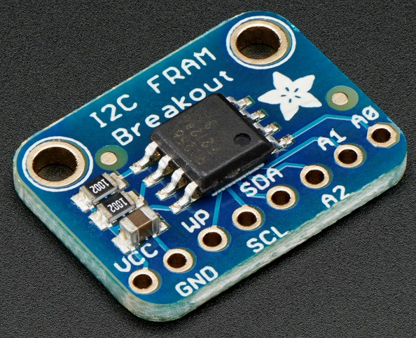

FRAM Non-Volatile I²C Memory
=================================

.. _MB85RC256V_datasheet: https://www.fujitsu.com/uk/Images/MB85RC256V-20171207.pdf

The ``fram`` and ``fram_pref`` components allow you to use an FRAM
(Ferroelectric RAM, `Wikipedia <https://en.wikipedia.org/wiki/Ferroelectric_RAM>`__)
non-volatile storage to save arbitrary data, states and preferences.

FRAM has over 10\ :sup:`10` write cycles and many years of data retention,
but much lower capacity compared to flash memory.

Typical FRAM devices on the market range from 512B to 128KiB.

Fujitsu MB85RC256V
(`datasheet <MB85RC256V_datasheet_>`__,
`Adafruit I²C Breakout <https://www.adafruit.com/product/1895>`__)
has 32KiB.

.. _fram-comp-device:

Device
------

First you need to set up :doc:`/components/i2c` then the FRAM device:

.. code-block:: yaml

    fram:

Adds an FRAM device on default address (``0x50``) on the default I²C Bus.

This is enough for other components and if you connect only one device
and you don't need it directly in lambdas.

However, it's better to give it an ``id``:

.. code-block:: yaml

    fram:
      id: fram_1

You can also add multiple devices:

.. code-block:: yaml

    fram:
      - id: fram_1
      - id: fram_2
        address: 0x52

This will add a device with ``id``: ``fram_1`` on default address
and another with ``id``: ``fram_2`` on address ``0x52``.

Full example:

.. code-block:: yaml

    i2c:
      scl: 10
      sda: 8
      id: i2c_1
  
    fram:
      id: fram_1
      i2c_id: i2c_1
      address: 0x50
      type: FRAM
      size: 2KiB

- **id** (*Optional*, :ref:`config-id`): ID for use in lambdas
- **i2c_id** (*Optional*, :ref:`config-id`): I²C Bus ID
- **address** (*Optional*, int): I²C address, see :ref:`fram-types`, default: ``0x50``
- **type** (*Optional*, string): See :ref:`fram-types`, default: ``FRAM``
- **size** (*Optional*, string): FRAM size, see :ref:`fram-size`
    - ``100`` - 100 bytes, ``1 KB`` - 1000 bytes, ``1 KiB`` - 1024 bytes

.. _fram-size:

Size
****

Some devices do not have "Device ID" command and will not return their size.
This will be shown in the logs with ``Size: 0KiB, set size in config!`` message.

Use the **size** option to set it.

``FRAM::clear()`` method and :ref:`fram-comp-pref` component (``fram_pref``)
can not be used if size is unknown.

.. _fram-types:

Types and Addresses
*******************

The **type** option sets how I²C address and memory address
are being sent to the device.

If your device isn't in the list bellow,
it may still be supported if
it handles addresses according to one of the types.

.. list-table::
    :header-rows: 1

    * - Device
      - Size
      - Type
      - I²C address
    * - MB85RC04
      - 512 B
      - FRAM9
      - ``0x50,0x52,0x54,0x56``
    * - MB85RC16
      - 2 KiB
      - FRAM11
      - ``0x50``
    * - MB85RC64T
      - 8 KiB
      - FRAM
      - ``0x50-0x57``
    * - MB85RC128A
      - 16 KiB
      - FRAM
      - ``0x50-0x57``
    * - MB85RC256V
      - 32 KiB
      - FRAM
      - ``0x50-0x57``
    * - MB85RC512T
      - 64 KiB
      - FRAM
      - ``0x50-0x57``
    * - MB85RC1MT
      - 128 KiB
      - FRAM17
      - ``0x50,0x52,0x54,0x56``

Address can be selected by connecting the address pins to VCC (pull them high).
Some devices have three pins (``A0,A1,A2``) some have two and some have none.

Address is then the ``0x50`` + the sum of the pins pulled high.

- ``A0``: add ``0x01``
- ``A1``: add ``0x02``
- ``A2``: add ``0x04``

So, if ``A0`` and ``A2`` are high, address will be ``0x50 + 0x01 + 0x04 = 0x55``

.. _fram-usage:

Usage
*****

This component can be used from other components or lambdas:

.. code-block:: yaml

    on_...:
      - lambda: |-
          // write 16 bit int at address 15
          id(fram_1).write16(0x000A, 12345);
          
          // read back that number
          uint16_t = id(fram_1).read16(0x000A);

Methods:

- ``void write8(uint32_t address, uint8_t value)``
- ``void write16(uint32_t address, uint16_t value)``
- ``void write32(uint32_t address, uint32_t value)``
- ``void write_float(uint32_t address, float value)``
- ``void write_double(uint32_t address, double value)``
- ``void write(uint32_t address, uint8_t *obj, uint32_t size)``
- ``uint8_t read8(uint32_t address)``
- ``uint16_t read16(uint32_t address)``
- ``uint32_t read32(uint32_t address)``
- ``float read_float(uint32_t address)``
- ``double read_double(uint32_t address)``
- ``void read(uint32_t address, uint8_t *obj, uint32_t size)``

More on Types and Addresses
***************************

The I²C address is 7 bit, before being sent to the device
it will be shifted 1 bit to the left,
and that is how you are going to see it in the datasheet.

``0x50`` - ``0 1 0 1  0 0 0 0``, shifted ``1 0 1 0  0 0 0 0``

For the devices above of type **FRAM** the shifted address
is presented in the datasheet like this:

``1 0 1 0  A2 A1 A0 R/W``

``A0-A2`` are toggled by the address pins.
May be labeled differently (like ``A8``, ``A16``)
if your device uses them for memory address.

``R/W`` is toggled by the bus and is not important here.

The difference between types comes in those address bits (``A0-A2``)
and the size of the memory address.

Assuming base device address is ``0x50`` (``0101 0000``).

Types:

- **FRAM**: 16 bit memory address, up to 64KiB
    Device address is sent as is.
    Full range can be used ``0x50-0x57`` if ``A0-A2`` are exposed.
    Up to 8 devices on the same bus.

- **FRAM9**: 9 bit memory address, up to 512B
    ``A0`` is used as the first bit of the memory address.
    Available device address bits are ``A1`` and ``A2``.
    Only even device addresses can be used ``0x50,0x52,0x54,0x56``.
    Up to 4 devices on the same bus.
    Odd adresses can not be used by another device on the bus.

- **FRAM11**: 11 bit memory address, up to 2KiB
    All three address bits are used for the memory address.
    No address pins available, device is fixed to base address ``0x50``.
    Only one device on the same bus.
    ``0x51-0x57`` can not be used by another device on the bus.

- **FRAM17**: 17 bit memory address, up to 128KiB
    Same as **FRAM9**, 1 bit stolen from device address,
    used together with the next 16 bits to form a 17 bit memory address.
    Address pins ``A1,A2``, four even device addresses.

.. _fram-comp-pref:

Global Preferences
------------------

This component will replace the default storage (in flash) for persistent states
and preferences of other components.

This can be useful for sensors that need to save their state very often.
Or if you change your config in a way that invalidates the preference storage.
Like change the load order of components, or entity names.

There are two ways to use the component.
:ref:`fram-pref-pool` and :ref:`fram-pref-static`.
You can have both, so some preferences are saved as static
and the rest are in the pool.

You can also define neither a pool nor static preferences.
This will result in no preferences being saved anywhere,
but they will be reported in logs, so you can see the requested size
and set it for a static preference. 

.. _fram-pref-pool:

Storage Pool
************

The pool acts just like the default storage.
Some component wants to save something and if there is enough space,
it will be granted a chunk of it.

.. code-block:: yaml

    fram_pref:
      fram_id: fram_1
      pool_start: 1024
      pool_size: 2KiB

- **fram_id** (**Required** :ref:`config-id`) ID of the FRAM :ref:`fram-comp-device`
- **pool_start** (*Optional*, int) Starting address, ex.: ``1024`` (``0x0400``)
- **pool_size** (*Optional*, string) Size of the pool
    - ``100`` - 100 bytes, ``1 KB`` - 1000 bytes, ``1 KiB`` - 1024 bytes

If using a pool, you have to define both **pool_start** and **pool_size**.

The storage pool will be cleared on reflash!
Use :ref:`fram-pref-static` to keep selected preferences.

.. _fram-pref-static:

Static preferences
******************

This is the way... to save preferences that survive reflash, entity names change
and even transfer the FRAM device to another ESP.

.. code-block:: yaml

    fram_pref:
      static_prefs:
        - key: sw1
          lambda: |-
            return id(switch_1).get_object_id_hash();
          addr: 12
          size: 3
          persist_key: true
        - key: wifi
          lambda: |-
            return fnv1_hash(App.get_compilation_time());

- **key** (**Required** string) Unique key
- **lambda** (**Required** :ref:`lambda <config-lambda>`) Lambda to return the ``hash``
- **addr** (*Optional*, int) Starting address
- **size** (*Optional*, string) Size
    - ``100`` - 100 bytes, ``1 KB`` - 1000 bytes, ``1 KiB`` - 1024 bytes
- **persist_key** (*Optional*, bool) Persist after ``hash`` change, default: ``false``

The lamda must return the same hash as is being requested
by the component's ``make_preference`` call.
Search ESPHome source for ``make_preference`` and see how that component do it.
Most (entities) use ``get_object_id_hash()`` as shown for the ``sw1`` preference above.

If you do not define **addr** and **size**, the preference will not be saved,
but will appear in the logs.

Use **persist_key** option to keep a preference even if its hash changes.
Beware, if the hash changes, the component may want its storage cleared.

Use this if you are sure that keeping the preference is fine for that component.
Like, nothing else changed in code but the name of your entity.

To find out the size, do not define **addr** and **size** and look in the logs.
You will see a line like this ``Pref: key: wifi, request size: 100``.
If you don't see ``request size: 100``,
a preference with hash returned by **lambda** was not requested.

Logs
****

Sample logs:

.. code-block::

    [19:15:06][C][fram_pref:135]: FramPref:
    [19:15:06][C][fram_pref:144]:   Pool: 2048 bytes (1024-3071)
    [19:15:06][C][fram_pref:153]:   Pool: 4 bytes used
    [19:15:06][C][fram_pref:190]:   Pref: key: sw1, persist_key, addr: 12-14, request size: 3
    [19:15:06][W][fram_pref:176]:   Pref: key: wifi, request size: 100
    [19:15:06][E][fram_pref:178]:   Pref: key: foo, addr: 4000-36767
    [19:15:06][E][fram_pref:184]:   * Does not fit in FRAM (0-32767)!

If ``key`` is numeric, like ``key: 2006088186``, the preference is in the pool and not static.

If there is no ``addr: 12-14``, the preference is not saved.
Meaning, **addr** and **size** were not defined and there is no pool defined
or the pool has not enough space.
Address ranges are inclusive, start address ``2`` with size ``3`` is range ``2-4``.
