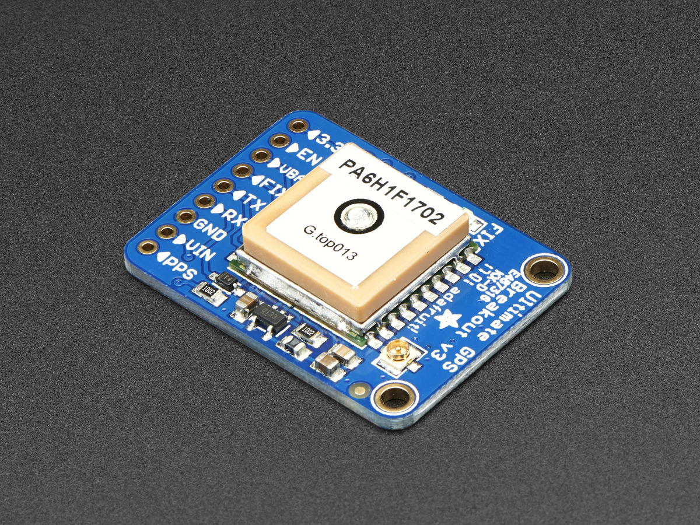

GPS Component
=============

.. seo::
    :description: Instructions for setting up GPS component in ESPHome.
    :image: crosshairs-gps.svg

The ``gps`` component allows you to connect GPS modules to your ESPHome project.
Any GPS module that uses the standardized NMEA communication protocol will work.

    GPS Module. Image by `Adafruit`_

.. _Adafruit: https://www.adafruit.com/product/746

For this component to work you need to have set up a :ref:`UART bus <uart>`
in your configuration - only the RX pin should be necessary.

.. code-block:: yaml

    # Example configuration entry

    # Declare GPS module
    gps:
      latitude:
        name: "Latitude"
      longitude:
        name: "Longitude"
      altitude:
        name: "Altitude"

    # GPS as time source
    time:
      - platform: gps

The component is split up in platforms, by defining the GPS module
(as seen above).

In addition to retrieving GPS position data, the module can also be used as a
time platform to get the current date and time via the very accurate GPS clocks
without a network connection.

See :doc:`time/gps` for config options for the GPS time source.

Configuration variables:
------------------------
- **latitude** (*Optional*): Include the Latitude as a sensor

  - **name** (**Required**, string): The name to give the latitude sensor
  - **id** (*Optional*, :ref:`config-id`): Set the ID of this sensor for use in lambdas.
  - All other options from :ref:`Sensor <config-sensor>`.

- **longitude** (*Optional*): Include the Longitude as a sensor

  - **name** (**Required**, string): The name to give the longitude sensor
  - **id** (*Optional*, :ref:`config-id`): Set the ID of this sensor for use in lambdas.
  - All other options from :ref:`Sensor <config-sensor>`.

- **speed** (*Optional*): Include the measured speed as a sensor

  - **name** (**Required**, string): The name to give the speed sensor
  - **id** (*Optional*, :ref:`config-id`): Set the ID of this sensor for use in lambdas.
  - All other options from :ref:`Sensor <config-sensor>`.

- **course** (*Optional*): Include the measured course as a sensor

  - **name** (**Required**, string): The name to give the course sensor
  - **id** (*Optional*, :ref:`config-id`): Set the ID of this sensor for use in lambdas.
  - All other options from :ref:`Sensor <config-sensor>`.

- **altitude** (*Optional*): Include the measured altitude as a sensor

  - **name** (**Required**, string): The name to give the altitude sensor
  - **id** (*Optional*, :ref:`config-id`): Set the ID of this sensor for use in lambdas.
  - All other options from :ref:`Sensor <config-sensor>`.

- **satellites** (*Optional*): Include the number of tracking satellites being used as a sensor

  - **name** (**Required**, string): The name to give the tracking satellites sensor
  - **id** (*Optional*, :ref:`config-id`): Set the ID of this sensor for use in lambdas.
  - All other options from :ref:`Sensor <config-sensor>`.

See Also
--------

- :ref:`sensor-filters`
- `TinyGPS++ library <http://arduiniana.org/libraries/tinygpsplus/>`__
- :apiref:`gps/gps.h`
- :ghedit:`Edit`
