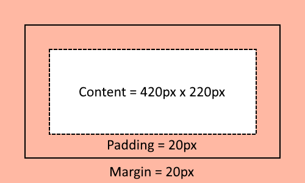

Graphical Layout
================

.. seo::
    :description: A layout system for rendering screens in ESPHome
    :image: folder-open.svg

The ``graphical_layout`` in ESPHome lets you design simple layouts that should work
with different sized text, images, etc.

Overview
--------

The integration is intended to take some of the hassle out of laying out physical user interfaces (eg. on an LCD or eInk display)
in ESPHome

Configuration variables:

- **id** (*Optional*, :ref:`config-id`): Manually specify the ID used for code generation
- **layout** (:ref:`graphical_layout-layout_item`): The root layout item

Rendering
---------

Once you've constructed your layout you need to render it to a display

.. code-block:: yaml

    graphical_layout:
      id: example_layout
      layout:
        # Layout here...
          

    display:
      - platform: ..
        pages:
          - id: page_with_layout
            lambda: |-
              // render_layout takes an (x, y) to start the layout at
              it.render_layout(0, 0, id(example_layout));

Margin vs Padding vs Content Area
*********************************

The way items are rendered relies on two important properties; their margin and their padding. Typically when laying out items 
you don't want the items right next to each other as it would look too crowded. This is where an item's margin comes in; this
defines the space between one layout item and its neighbour.

Next we have the border. This is an optional box drawn around the item. The padding defines the space between the border (even
if it happens to be zero) and the actual content.

It might be easier thinking about this "inside out" though. In the above image the piece of content has requested that it needs
420 x 220 pixels of space. Next 20 pixels of padding are applied around this. Followed by a 2 pixel border. And then 20 pixels
of margin. The total width of this item would be; 20 pixels for the left margin, 2 pixels for the left border, another 20 pixels
for the left padding, then 420 pixels for the content, 20 pixels for the right padding, 2 pixels for the right border, and another
20 pixels for the right margin. For a total of 504 pixels. If a second item was rendered to the right of this item its on screen
area would start after these 504 pixels.

.. code-block:: yaml

    graphical_layout:
      layout:
        type: fixed_dimension_panel
        width: 420
        height: 220
        padding: 20
        margin: 20
        border: 2
        border_color: black

.. note::

    In practice each of padding, margin, and border can have different values for left, top, bottom, and right. See
    :ref:`graphical_layout-dimension` for more information.

.. _graphical_layout-layout_item:

Layout Items
------------

All items that can be added to the layout derive from :apiref:`LayoutItem <graphical_layout/layout_item>` and have the following
common generic-properties

Configuration variables:

- **margin** (*Optional*, int or :ref:`graphical_layout-dimension`): Space between the layout item and any other layout items in
  pixels. Defaults to 0.
- **border** (*Optional*, int or :ref:`graphical_layout-dimension`): Size of the border around the layout item in pixels. Defaults
  to 0
- **border-color** (*Optional*, :ref:`config-color`): Colour of the border (when **border** > 0 pixels). Defaults to ``COLOR_ON``
- **padding** (*Optional*, int or :ref:`graphical_layout-dimension`): Space between the border and the actual content of the 
  layout item in pixels. Defaults to 0

.. _graphical_layout-dimension:

Dimension
*********

- **left** (*Optional*, int): Value for the left. Defaults to 0
- **top** (*Optional*, int): Value for the top. Defaults to 0
- **right** (*Optional*, int): Value for the right. Defaults to 0
- **bottom** (*Optional*, int): Value for the bottom. Defaults to 0

When a single integer is specified instead of one or more of the following all dimension sides are set to the same value.
The following two configurations are equal

.. code-block:: yaml

    padding: 5

.. code-block:: yaml

    padding:
        left: 5
        top: 5
        right: 5
        bottom: 5

Text Panel
**********

The Text Panel renders a single line of text to the display

Configuration variables:

- **font** (:ref:`font <display-fonts>`): Font to use for rendering
- **foreground_color** (*Optional*, :ref:`config-color`): Foreground colour to render the text in. Defalts to COLOR_ON
- **background_color** (*Optional*, :ref:`config-color`): Background colour to render for the label. Defaults to COLOR_OFF
- **text_align** (*Optional*, :ref:`graphical_layout-text_align`): Alignment to render the text to the area. Defaults to TOP_LEFT. One of:
- **text** (string, :ref:`templatable <config-templatable>`): The text to render

.. code-block:: yaml

    font:
      - file: "gfonts://Roboto"
        id: roboto
        size: 20

    graphical_layout:
      layout:
        type: text_panel
        font: roboto
        text: "Hello world!"

Text Run Panel
**************

The Text Run Panel is suitable for rendering a block of text to the display and handles differing fonts and sizes. It
will wrap at break characters as appropriate.

.. note::

    By default text will wrap at spaces, tabs, newlines, carriage returns, as well as ``=``, ``<``, ``>``, ``/``, ``&``, 
    ``*``, ``+``, ``^``, ``|``, and ``\``

Configuration variables:

- **text_align** (*Optional*, :ref:`graphical_layout-text_align`): Alignment to render text within the panel. Defaults to TOP_LEFT
- **max_width** (int): Maximum width to use when laying out the panel. Measured in pixels.
- **min_width** (*Optional*, int): Minimum width to use when laying out the panel. Measured in pixels. Defaults to 0
- **can_wrap_at_character** (*Optional*, :ref:`Action <config-lambda>`): A lambda that determines if the provided character is suitable
  for breaking the line. If not provided defaults to the set of characters in the note above.

    - ``int offset``: Offset into the string of the current character. Useful to inspect previous/future character as part of
      your determination. Eg. If you want to break only on `--` but not a single `-`.
    - ``std::string string``: The entire portion of text currently being considered for breaking. This may be a subset of
      a run if it has already been broken somewhere on the line
    - ``char character``: Character being inspected (this is equivalent to ``args.string.at(offset)``)

- **runs** (list of :ref:`graphical_layout-text_run`): A list of text and styles to render to the screen. Requires at least one run.

.. _graphical_layout-text_run:

Text Run
^^^^^^^^

  - **font** (:ref:`display-fonts`): Font used to render the text run
  - **foreground_color** (*Optional*, :ref:`config-color`): Foreground colour to render the text in. Defaults to COLOR_ON
  - **background_color** (*Optional*, :ref:`config-color`): Background colour to render for the label. Defaults to COLOR_OFF
  - **text** (string, :ref:`templatable <config-templatable>`): The text for this run

.. code-block:: yaml

    font:
      - file: "gfonts://Robot"
        id: roboto_normal
        size: 20
      - file: "gfonts://Robot"
        id: roboto_big
        size: 30

    graphical_layout:
      layout:
        type: text_run_panel
        max_width: 200
        runs:
          - font: roboto_normal
            text: "Hello "
          - font: roboto_big
            text: World!
.. note::

    In the example above that the first run is ``"Hello "`` - a quoted string with a space at the end. Because of
    the way yaml works if you do not quote a string ending in white space it'll be trimmed. Without the quote the above
    example would render the text ``HelloWorld`` without any space between the portions of text.

Fixed Dimension Panel
*********************

The Fixed Dimension Panel is useful when you want to fix the size of a section of the layout. It takes a single child item
that will be constrained a maximum dimension of those provided.

Configuration variables:

- **width** (*Optional*, int or a :ref:`graphical_layout-fixed_dimension_panel_modes`): Width to constrain the item to in
  pixels. If not provided defaults to the child's width
- **height** (*Optional*, int or a :ref:`graphical_layout-fixed_dimension_panel_modes`): Height to constrain the item to in
  pixels. If not provided defaults to the child's height. The lambda receives a single argument - ``args`` with the following
  properties
- **child** (:ref:`graphical_layout-layout_item`): A Layout Item that will be constained by the fixed dimension panel

.. code-block:: yaml

    graphical_layout:
      layout:
        type: fixed_dimension_panel
        width: 20
        height: 20
        child:
          type: text_panel
          font: roboto
          text: This is a very long string that's definitely longer than 20 pixels but will be truncated

.. _graphical_layout-fixed_dimension_panel_modes:

Calculated Dimension Modes
^^^^^^^^^^^^^^^^^^^^^^^^^^

- ``DISPLAY``: Uses the maximum value of the dimension that will fit on the display accounting for the panels margin,
  border, and padding.
- ``CHILD``: Uses the external dimension (inclusive of margin, border, and padding) of the child for the panel's dimension

Display Rendering Panel
***********************

The Display Rendering Panel can be used to perform arbitrary drawing within the confines of the layout system.

Configuration variables:

- **width** (int): Desired width of the panel in pixels
- **height** (int): Desired height of the panel in pixels
- **lambda** (:ref:`Action <config-lambda>`): Lambda that will perform the drawing. Like the
  :ref:`Display Engine<display-engine>` this will receive a variable ``it`` which represents the engine object. In
  addition the lambda will also receive a variable ``bounds`` which is the rectangle actually available for drawing

.. code-block:: yaml

    graphical_layout:
      layout:
        type: display_rendering_panel
        width: 100
        height: 100
        lambda: |-
          // Draws a box around the available space and a cross through it
          it.rectangle(0, 0, bounds.w, bounds.h);
          it.line(0, 0, bounds.w, bounds.h);
          it.line(0, bounds.h, bounds.w, 0);

.. note::

    All of the coordinates you use in your lambda will be relative to the top-left of the space your panel is
    rendering to. So even if your Display Rendering Panel is positioned at (100, 50) a call to 
    ``it.draw_pixel_at(0, 0)`` would fill the pixel (100, 50) on the screen. See :ref:`local_coordinates` for more 
    information

Horizontal Stack Panel
**********************

The Horizontal Stack Panel renders a series of other :ref:`Layout Items<graphical_layout-layout_item>` from left to
right. 

Configuration variables:

- **item_padding** (*Optional*, int): Number of pixels to leave between the Horizontal Stack Panel's internal padding
  and each child item it renders
- **child_align** (*Optional*, :ref:`graphical_layout-vertical_child_align`): Controls how child elements are rendered - 
  vertically -  within the available space. Defaults to TOP.
- **items** (list of :ref:`graphical_layout-layout_item`): A set of items to render

.. code-block:: yaml

    graphical_layout:
      layout:
        type: horizontal_stack_paenl
        items:
          - type: text_panel
            font: roboto
            text: Left Hand Side
          - type: text_panel
            font: roboto
            text: Right Hand Side

Vertical Stack Panel
********************

The Vertical Stack Panel renders a series of other :ref:`Layout Items<graphical_layout-layout_item>` from top to bottom

Configuration variables

- **item_padding** (*Optional*, int): Number of pixels to leave between the Horizontal Stack Panel's internal padding
  and each child item it renders
- **child_align** (*Optional*, :ref:`graphical_layout-horizontal_child_align`): Controls how child elements are rendered - 
  horizontally -  within the available space. Defaults to LEFT.
- **items** (list of :ref:`graphical_layout-layout_item`): A set of items to render

.. code-block:: yaml

    graphical_layout:
      layout:
        type: vertical_stack_paenl
        items:
          - type: text_panel
            font: roboto
            text: First line of text
          - type: text_panel
            font: roboto
            text: Second line of text

Examples
--------

Two Column Layout Free Flowing 
******************************

This will create two columns that will use as much horizontal width as they need

.. code-block:: yaml

    graphical_layout:
      layout:
        type: horizontal_stack_panel
        items:
          # Column 1
          - type: vertical_stack_panel
            items:
              # Column 1 contents
          # Column 2
          - type: vertical_stack_panel
            items:
              # Column 2 contents

Two Column With Single Fixed Column
***********************************

This will create a two column layout where first column has a fixed amount of space and the second column will
grow as necessary.

.. code-block:: yaml

    graphical_layout:
      layout:
        type: horizontal_stack_panel
        items:
          # Column 1 - Fixed (100px)
          - type: fixed_dimension_panel
            width: 100
            child:
              # Column 1 contents, will never grow beyond 100px wide
          # Column 2 - Variable Width
          - type: vertical_stack_panel
            items:
              # Column 2 contents

Header Bar
**********

This will provide a simple header item and leave the remainder of the display for controls, etc

.. code-block:: yaml

    graphical_layout:
      layout:
        type: vertical_stack_panel
        child_align: STRETCH_TO_FIT_WIDTH
        items:
          # Heading
          - type: text_panel
            font: roboto
            border: 1
            border_color: black
            padding: 2
            margin: 2
            text: Very Important Heading
          # Contents
          - type: horizontal_stack_panel
            items:
              # Main body

Hints
-----

- Make use of the nested nature of the display to build the flexibility you require
- You can add arbritary elements (images, QR codes, graphs, etc) through the use of the ``display_rendering_panel``
- If you're having issues determining why your layout is rendering the way it is turning on the border for the items is an
  easy way to visualise what's happening.
- If your issue is around the ``text_run_panel`` you can set ``debug_outline_runs`` to ``true`` which will render outlines
  around each laid out block of text.

Common Enumerations
-------------------

.. _graphical_layout-text_align:

Text Align
**********

  - ``TOP_LEFT``
  - ``TOP_CENTER``
  - ``TOP_RIGHT``
  - ``CENTER_LEFT``
  - ``CENTER``
  - ``CENTER_RIGHT``
  - ``BASELINE_LEFT``
  - ``BASELINE_CENTER``
  - ``BASELINE_RIGHT``
  - ``BOTTOM_LEFT``
  - ``BOTTOM_CENTER``
  - ``BOTTOM_RIGHT``

.. _graphical_layout-vertical_child_align:

Vertical Child Align
********************

  - ``TOP``: Child items will all render at the top of the available space
  - ``CENTER_VERTICAL``: Child items will all be rendered centered around the middle of the available height
  - ``BOTTOM``: Child items will all be rendered at the bottom of the available space
  - ``STRETCH_TO_FIT_HEIGHT``: Child items will be provided the entire available height and their original width

.. _graphical_layout-horizontal_child_align:

Horizontal Child Align
**********************

  - ``LEFT``: Child items will all render to the left of the available space
  - ``CENTER_HORIZONTAL``: Child items will all be rendered centered around the middle of the available width
  - ``RIGHT``: Child items will all render to the right of the available space
  - ``STRETCH_TO_FIT_WIDTH``: Child items will be provided the entire available width and their original height

See Also
--------

- :ref:`Display <display-engine>`
- :ref:`display-fonts`
- :ref:`display-pages`
- :ref:`local_coordinates`
- :apiref:`graphical_layout/graphical_layout.h`
- :ghedit:`Edit`
