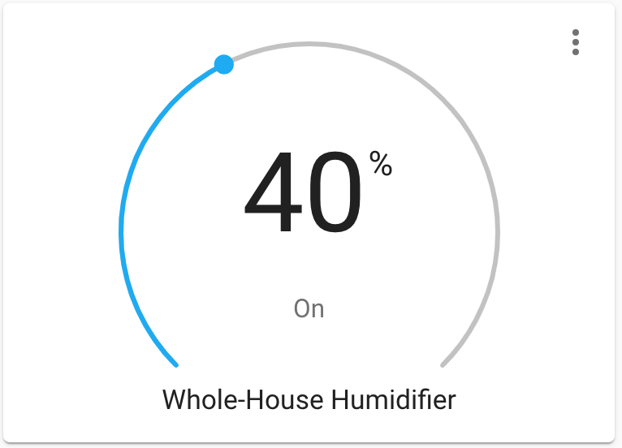

Hygrostat Humidifier Controller
===============================

.. seo::
    :description: Instructions for setting up Hygrostat humidifier controllers with ESPHome.
    :image: humidifier.svg

The ``hygrostat`` humidifier platform allows you to control a humidifier control system in much the same manner as a
physical hygrostat. A sensor measures a value (the air humidity) and the controller will try to keep this value within
a range defined by the set point(s). To do this, the controller can activate devices like a humidification unit and/or
a dehumidification unit to change the value observed by the sensor.
When configured for both humidifying and dehumidifying, it is essentially two controllers in one.

This component can operate in one of two ways:

- **Single-point**: A single threshold (set point) is defined; dehumidifying may be activated when the observed humidity
  exceeds the set point **or** humidifying may be activated when the observed humidity drops below the set point; that is,
  the controller can only raise the humidity or lower the humidity. It cannot do both in this mode.

- **Dual-point**: Two thresholds (set points) are defined; dehumidifying is activated when the observed humidity exceeds the
  upper set point while humidifying is activated when the observed humidity drops below the lower set point; in other words,
  the controller is able to both raise and lower the humidity as required.

This component/controller automatically determines which mode it should operate in based on what :ref:`actions <config-action>`
are configured -- more on this in a moment. Two parameters define the set points; they are ``target_humidity_low`` and
``target_humidity_high``. In single-point mode, however, only one is used. The set point(s) may be adjusted through the
front-end user interface. The screenshot below illustrates a thermostat controller in single-point mode.

    Single-setpoint humidifier UI

This component works by triggering a number of :ref:`actions <config-action>` as required to keep the observed
humidity above/below/within the target range as defined by the set point(s). In general, when the observed humidity
drops below ``target_humidity_low`` the controller will trigger the ``humidify_action`` to activate humidifying. When the observed
humidity exceeds ``target_humidity_high``  the controller will trigger the ``dehumidify_action`` to activate dehumidifying.
When the humidity has reached a point within the desired range, the controller will trigger the ``idle_action`` to stop
humidifying/dehumidifying. Please see the next section for more detail.

.. code-block:: yaml

    # Example dual-point configuration entry
    humidifier:
      - platform: hygrostat
        name: "Hygrostat Humidifier Controller"
        sensor: my_humidity_sensor
        default_target_humidity_low: 40%
        default_target_humidity_high: 70%
        min_dehumidifying_off_time: 300s
        min_dehumidifying_run_time: 300s
        min_humidifying_off_time: 300s
        min_humidifying_run_time: 300s
        min_idle_time: 30s
        dehumidify_action:
          - switch.turn_on: central_fan
        humidify_action:
          - switch.turn_on: central_humidifier
        idle_action:
          - switch.turn_off: central_fan
          - switch.turn_off: central_humidifier

.. code-block:: yaml

    # Example single-point configuration entry (for humidifying only)
    humidifier:
      - platform: hygrostat
        name: "Hygrostat Humidifier Controller"
        sensor: my_humidity_sensor
        default_target_thumidity_low: 40%
        min_humidifying_off_time: 300s
        min_humidifying_run_time: 300s
        min_idle_time: 30s
        humidify_action:
          - switch.turn_on: central_humidifier
        idle_action:
          - switch.turn_off: central_humidifier

.. code-block:: yaml

    # Example single-point configuration entry (for dehumidifying only)
    humidifier:
      - platform: hygrostat
        name: "Hygrostat Humidifier Controller"
        sensor: my_humidity_sensor
        default_target_thumidity_high: 70%
        min_dehumidifying_off_time: 300s
        min_dehumidifying_run_time: 300s
        min_idle_time: 30s
        dehumidify_action:
          - switch.turn_on: central_fan
        idle_action:
          - switch.turn_off: central_fan

Controller Behavior and Hysteresis
----------------------------------

In addition to the set points, hysteresis values determine how far the humidity may vary from the set point value(s)
before an :ref:`action <config-action>` (humidifying or dehumidifying) is triggered. They each default to 0.5%. They are:

- ``dehumidify_deadband``: The minimum humidity differential (humidity above the set point) before **engaging** dehumidify
- ``dehumidify_overrun``: The minimum humidity differential (dehumidifying beyond the set point) before **disengaging** dehumidify
- ``humidify_deadband``: The minimum humidity differential (humidity below the set point) before **engaging** humidify
- ``humidify_overrun``: The minimum humidity differential (humidifying beyond the set point) before **disengaging** humidify

A question that often surfaces about this component is, "What is the expected behavior?" Let's quickly discuss
*exactly when* the configured actions are called by the controller.

Consider the low set point (the one that typically activates humidifying) for a moment, and assume it is set to a common room
humidity of 40%. Let's assume ``humidify_deadband`` is set to 0.4% while ``humidify_overrun`` is set to 0.6%. In this case,
the controller will allow the humidity to drop as low as the set point's value (40%) *minus* the ``humidify_deadband``
value (0.4%), or 39.6%, before calling ``humidify_action`` to activate humidifying.

After humidifying has been activated, it will remain active until the observed humidity reaches the set point (40%) *plus*
the ``humidify_overrun`` value (0.6%), or 40.6%. Once this humidity is reached, ``idle_action`` will be called to deactivate
humidifying.

The same behavior applies to the high set point, although the behavior is reversed in a sense; given an upper set point of
60%, ``dehumidify_deadband`` set to 0.3% and ``dehumidify_overrun`` set to 0.7%, ``dehumidify_action`` would be called at 60.3% and
``idle_action`` would not be called until the humidity is reduced to 59.3%.

Important Terminology
---------------------

Before we get into more configuration detail, let's take a step back and talk about the word "action"; we
need to carefully consider the context of the word in the upcoming section, as it has a double meaning and
will otherwise lead to some ambiguity.

- **ESPHome Action**: A task the ESPHome application performs as requested, such as
  turning on a switch. See :ref:`Action <config-action>`.
- **Humidifier Action**: What the humidifier device is actively doing
- **Humidifier Mode**: What the humidifier device should (or should not) do

We'll call out which definition "action" we are referring to as we describe them below -- read carefully!

With respect to humidifier control, it is important to understand the subtle difference between the terms
"action" and "mode" as they *are not the same thing*:

Examples:

- **Humidifiy Mode**: The humidifier device may humidify but may **not** dehumidify.
- **Humidify Action**: The humidifier device is *actively adding moisture to the air* into the dwelling.

Got all that? Great. Let's take a closer look at some configuration.

Configuration Variables:
------------------------

The hygrostat controller uses the sensor to determine whether it should humidify or dehumidify.

- **sensor** (**Required**, :ref:`config-id`): The sensor that is used to measure the current humidity.

Default Target Humidity and Mode
********************************

These configuration items determine default values the hygrostat controller should use when it starts.

- **default_mode** (*Optional*, humidifier mode): The default humidifier mode the controller should use if it 
  is unable to restore it from memory. One of:

  - ``off`` (default)
  - ``humidify_dehumidify``
  - ``humidify``
  - ``dehumidify``
  - ``auto``
  
This value is used the first time your device starts after ESPHome is initially installed onto it. Add
this option into your configuration if you want your hygrostat component to start in a humidifier mode other
than ``off``.  If this option is not configured, you'll need to manually change the humidifier mode later via
the front end (Home Assistant), an ESPHome action, automation, or from within a lambda elsewhere in your
device's configuration.

- **default_target_humidity_low** (*Optional*, float): The default low target
  humidity for the control algorithm. This can be dynamically set in the frontend later.
- **default_target_humidity_high** (*Optional*, float): The default high target
  humidity for the control algorithm. This can be dynamically set in the frontend later.

**At least one of** ``default_target_humidity_low`` **and** ``default_target_humidity_high``
**must be specified.**

Note that ``min_humidity`` and ``max_humidity`` from the base humidifier component are used to define
the range of allowed humidity values in the hygrostat component. See :doc:`/components/humidifier/index`.

Humidifying and Dehumidifying Actions
*************************************

These are triggered when the humidifier control **action** is changed by the hydrostat controller. Here,
"action" takes on both meanings described above, as these are both humidifier actions *and* ESPHome
:ref:`actions <config-action>`. These should be used to activate humidifying andr/or dehumidifying devices.

- **idle_action** (**Required**, :ref:`Action <config-action>`): The action to call when
  the humidifier device should enter its idle state (not humidifying, not dehumidifying).
- **humidify_action** (*Optional*, :ref:`Action <config-action>`): The action to call when
  the humidifier device should enter humidifying mode to increase the current air humidity.
- **dehumidify_action** (*Optional*, :ref:`Action <config-action>`): The action to call when
  the humidifier device should enter dehumidifying mode to decrease the current air humidity.
- All other options from :ref:`Humidifier <config-humidifier>`.

**At least one of** ``dehumidify_action`` **and** ``humidify_action`` **must be specified.**

If only one of ``humidify_action`` and ``dehumidify_action`` is specified, the controller
will configure itself to operate in single-point mode.

Humidifying and Dehumidifying Modes
***********************************

These are triggered when the humidifier control **mode** is changed. Note the absence of "action" in the
parameter name here -- these are still ESPHome :ref:`actions <config-action>`, however they are *not*
humidifier actions. Instead, they are humidifier *modes*. These :ref:`actions <config-action>` are useful
in that they could be used, for example, to toggle a group of LEDs on and/or off to provide a visual
indication of the current humidifier mode.

- **auto_mode** (*Optional*, :ref:`Action <config-action>`): The action to call when
  the humidifier device is placed into "auto" mode (it may both humidify and dehumidify as required).
- **off_mode** (*Optional*, :ref:`Action <config-action>`): The action to call when
  the humidifier device is placed into "off" mode (it is completely disabled).
- **humidify_mode** (*Optional*, :ref:`Action <config-action>`): The action to call when
  the humidifier device is placed into humidify mode (it may humidify as required, but not dehumidify).
- **dehumidify_mode** (*Optional*, :ref:`Action <config-action>`): The action to call when
  the humidifier device is placed into dehumidify mode (it may dehumidify as required, but not humidify).

**The above actions are not to be used to activate humidifying or dehumidifying devices!**
See the previous section for those.

Advanced Configuration/Behavior:
--------------------------------

Set Point Options/Behavior
**************************

- **away_config** (*Optional*): Additionally specify target humidity range settings for away mode.
  Away mode can be used to have a second set of target humidities (for example, while the user is
  away or sleeping/at night).

  - **default_target_humidity_low** (*Optional*, float): The default low target humidity for the control
    algorithm when Away mode is selected. This can be dynamically set in the frontend later.
  - **default_target_humidity_high** (*Optional*, float): The default high target humidity for the control
    algorithm when Away mode is selected. This can be dynamically set in the frontend later.

**If configured, at least one of** ``default_target_humidity_low`` **and** ``default_target_humidity_high``
**must be specified in the away mode configuration.**

Additional Actions/Behavior
***************************

- **target_humidity_change_action** (*Optional*, :ref:`Action <config-action>`): The action to call when the
  hygrostat's target humidity(s) is/are changed.
- **startup_delay** (*Optional*, boolean): If set to ``true``, when ESPHome starts, ``min_dehumidifying_off_time``
  and ``min_humidifying_off_time`` must elapse before each respective action may be invoked.
  This option provides a way to prevent damage to equipment (for example) disrupted by a power interruption.
  Defaults to ``false``.
- **min_dehumidifying_off_time** (*Required with* ``dehumidify_action``, :ref:`config-time`): Minimum duration the dehumidifying action
  must be disengaged before it may be engaged.
- **min_dehumidifying_run_time** (*Required with* ``dehumidify_action``, :ref:`config-time`): Minimum duration the dehumidifying action
  must be engaged before it may be disengaged.
- **min_humidifying_off_time** (*Required with* ``humidify_action``, :ref:`config-time`): Minimum duration the humidifying action
  must be disengaged before it may be engaged.
- **min_humidifying_run_time** (*Required with* ``humidify_action``, :ref:`config-time`): Minimum duration the humidifying action
  must be engaged before it may be disengaged.
- **min_idle_time** (**Required**, :ref:`config-time`): Minimum duration the idle action must be active before calling
  another humidifier action.

Hysteresis Values
*****************

- **dehumidify_deadband** (*Optional*, float): The minimum humidity differential (humidity above the set point)
  before calling the dehumidifying :ref:`action <config-action>`. Defaults to 0.5%.
- **dehumidify_overrun** (*Optional*, float): The minimum humidity differential (dehumidifying beyond the set point)
  before calling the idle :ref:`action <config-action>`. Defaults to 0.5%.
- **humidify_deadband** (*Optional*, float): The minimum humidity differential (humidity below the set point)
  before calling the humidifying :ref:`action <config-action>`. Defaults to 0.5%.
- **humidify_overrun** (*Optional*, float): The minimum humidity differential (humidifying beyond the set point)
  before calling the idle :ref:`action <config-action>`. Defaults to 0.5%.

See Also
--------

- :doc:`/components/humidifier/index`
- :doc:`/components/sensor/index`
- :ref:`config-action`
- :ghedit:`Edit`
