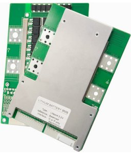

JBD BMS (battery management system)
===================================

.. seo::
    :description: Instructions for setting up JBD BMS (battery management system) in ESPHome.
    :image: jbd_bms.jpg

The ``jbd_bms`` component allows you to integrate JBD BMS boards in ESPHome.
It uses :ref:`UART <uart>` for communication.

Once configured you can use sensors as described below for your projects.

    JBD Battery Management System boards

Overview
--------

JBD BMS boards have multiple UART connection possibilites, which can be used simultaneously. The
manufacturer offers at least three choices: UART for RS232, UART for RS485 and UART for Bluetooth.

This component can connect to any of them, the difference is that UART for RS232 and Bluetooth are
non-isolated, for these special care must be taken when establishing the physical connection. In 
case of using these ports, batteries need to be connected first, and data ports need to be connected
after, because GND for them is equivalent to the negative pole of the battery pack. The manual warns
that improper connection may lead to board damage.

UART for RS485 is an isolated port, and no such measures are necessary, thus this is the recommended
way to connect. Please see the JBD papers for the pinout of the RS485 connector on your JBD BMS board.

The device communicates at ``9600`` baud ``8N1``. To connect to ESPHome, an RS485 transceiver is needed. 
Choose a type which does not need a trigger to send and receive data, for example:

.. figure:: ../images/rs485.jpg

The controller connects to the UART of the MCU. For ESP32 GPIO `16` to `TXD` and `17` to RXD are the 
default ones but any other pins can be used as well. 3.3V to VCC and GND to GND.

.. warning::

    If you are using the :doc:`logger` make sure you are not using the same pins for it or otherwise disable the UART 
    logging with the ``baud_rate: 0`` option.

Component
---------

.. code-block:: yaml

    # Example configuration entry
    uart:
      - id: uart_bus
        tx_pin: GPIO16
        rx_pin: GPIO17
        baud_rate: 9600

    jbd_bms:
      - id: bms
        uart_id: uart_bus
        update_interval: 60s  # optional, default value
        voltage:
          name: Voltage
        current:
          name: Current
        capacity:
          name: Capacity
        battery_voltage:
          - string: 1   # 1-based
            name: String 1 voltage
        temperature:
          - number: 0   # 0-based
            name: NTC 0 temp
        balance_capacity:
          name: Balance Capacity
        rate_capacity:
          name: Rate Capacity
        charge_fet:
          name: Charge FET
        discharge_fet:
          name: Discharge FET
        covp_prot:
          name: COVP
        cuvp_prot:
          name: CUVP
        povp_prot:
          name: POVP
        puvp_prot:
          name: PUVP
        chgot_prot:
          name: CHGOT
        chgut_prot:
          name: CHGUT
        dsgot_prot:
          name: DSGOT
        dsgut_prot:
          name: DSGUT
        chgoc_prot:
          name: CHGOC
        dsgoc_prot:
          name: DSGOC
        short_prot:
          name: Short
        afe_prot:
          name: AFE
        swlock:
          name: SW Lock
        balance_state:
          - string: 1   # 1-based
            name: String 1 balancing

Configuration variables:

- **uart_id**: A configured UART to read data from. If not specified, takes the first one
- **update_interval**: Update interval of the sensors, defaults to ``60s``
- **voltage**: Voltage
- **current**: Current
- **capacity**: Capacity
- **battery_voltage**: String voltage of the specified string

  - **string**:  The number of the string for which to read the voltage. Starts from ``1``
  
- **temperature**: Tempearture measured by the specified NTC sensor

  - **number**:  The number of the temperature sensor which to read. Starts from ``0``
  
- **balance_capacity**: Balance Capacity
- **rate_capacity**: Rate Capacity
- **charge_fet**: Charge FET
- **discharge_fet**: Discharge FET
- **covp_prot**: Cell Block Over-Voltage
- **cuvp_prot**: Cell Block Under-Voltage
- **povp_prot**: Battery Over-Voltage
- **puvp_prot**: Battery Under-Voltage
- **chgot_prot**: Charging Over-temperature
- **chgut_prot**: Charging Low-temperature
- **dsgot_prot**: Discharging Over-temperature
- **dsgut_prot**: Discharging Low-temperature
- **chgoc_prot**: Charging Over-current
- **dsgoc_prot**: Discharging Over-current
- **short_prot**: Short Circuit
- **afe_prot**: AFE
- **swlock**: MOS Software Lock-in
- **balance_state**: Balancing Status of the specified string

  - **string**:  The number of the string for which to read the balance status. Starts from ``1``

All sensors are *Optional* and support all other options from :ref:`Sensor <config-sensor>`.

See Also
--------

- :ref:`uart`
- :doc:`logger`
- `JBD BMS manuals <https://jiabaidabms.com/pages/download-files>`__
- `Communication protocol <https://raw.githubusercontent.com/syssi/esphome-jbd-bms/main/docs/Jiabaida.communication.protocol.pdf>`__
- :ghedit:`Edit`
