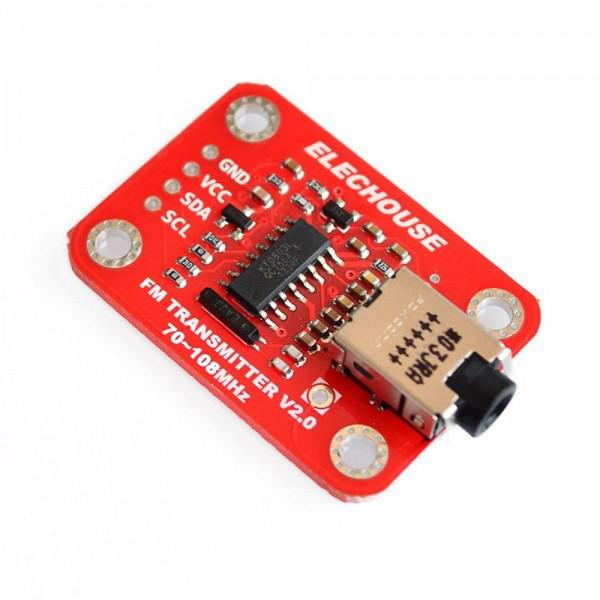

KT0803 FM Transmitter
=====================

.. seo::
    :description: Instructions for setting up KT0803 FM Transmitter
    :image: kt0803.jpg
    :keywords: kt0803

TODO 

Datasheet
---------

`KT0803K <https://github.com/gabest11/datasheet/blob/main/KT0803K.pdf>`__ 
`KT0803L <https://github.com/gabest11/datasheet/blob/main/KT0803L.pdf>`__

This component implements the I²C interface for the KT0803 family of FM transmitters. KT0803, KT0803K, KT0803M, KT0803L are supported, altough you may only be able to find KT0803L on the depicted ELECHOUSE board. It comes with no amplifier. Frequency range is 70-108 MHz [#]_, no RDS. Every register can be controlled through different components (sensor, switch, select, number, text).

.. [#] Tested with RTL-SDR. It can really tune down to 70MHz.

    Example board from ELECHOUSE

.. figure:: images/kt0803-wiring-diagram.png
    :align: center
    :width: 75.0%

    Wiring diagram

Example configuration
---------------------

.. code-block:: yaml

    kt0803:
      id: kt0803_transmitter
      chip_id: KT0803L
      frequency: 87.5
      pga: -15
      rfgain: 108
      mute: False
      mono: False
      pre_emphasis: 75us
      pilot_tone_amplitude: Low
      bass_boost_control: Disabled
      alc_enable: False
      auto_pa_down: True
      pa_down: False
      standby_enable: False
      alc_attack_time: 25us
      alc_decay_time: 25us
      pa_bias: False
      audio_limiter_level: '0.875'
      switch_mode: Mute
      silence_detection: True
      silence_high: '32mV'
      silence_low: '8mV'
      silence_duration: '100ms'
      silence_high_counter: '15'
      silence_low_counter: '1'
      alc_gain: -3
      xtal_sel: '32.768kHz'
      au_enhance: False
      frequency_deviation: 75kHz
      ref_clk: '32.768kHz'
      xtal_enable: True
      ref_clk_enable: False
      alc_high: '0.6'
      alc_hold_time: 5s
      alc_low: '0.25'
      pw_ok:
        name: Power OK
      slncid:
        name: Silence Detected
      update_interval: 3s
    
    number:
      - platform: kt0803
        frequency:
          id: kt0803_frequency
          name: Frequency
        pga:
          name: PGA Gain Control
        rfgain:
          name: RF Gain
        alc_gain:
          name: ALC Gain
    
    switch:
      - platform: kt0803
        mute:
          name: Mute
        mono:
          name: Mono
        alc_enable:
          name: ALC Enable
        auto_pa_down:
          name: Automatic PA Power Down
        pa_down:
          name: PA Power Down
        standby_enable:
          name: Standby Enable
        pa_bias:
          name: PA Bias
        silence_detection:
          name: Silence Detection
        au_enhance:
          name: Audio Frequency Response Enhancement
        xtal_enable:
          name: Crystal Oscillator Enable 
        ref_clk_enable:
          name: Refence Clock Enable
    
    select:
      - platform: kt0803
        pre_emphasis:
          name: Pre-emphasis
        pilot_tone_amplitude:
          name: Pilot Tone Amplitude
        bass_boost_control:
          name: Bass Boost Control
        alc_attack_time:
          name: ALC Attack Time
        alc_decay_time:
          name: ALC Decay Time
        audio_limiter_level:
          name: Audio Limiter Level
        switch_mode:
          name: Switching Channel Mode Selection
        silence_high:
          name: Silence High
        silence_low:
          name: Silence Low
        silence_duration:
          name: Silence Duration
        silence_high_counter:
          name: Silence High Counter
        silence_low_counter:
          name: Silence Low Counter
        xtal_sel:
          name: Xtal Selection
        frequency_deviation:
          name: Frequency Deviation
        ref_clk:
          name: Refence Clock
        alc_high:
          name: ALC High Threshold
        alc_hold_time:
          name: ALC Hold Time
        alc_low:
          name: ALC Low Threshold
    
Configuration variables:
------------------------

- **chip_id** (**Required**, string): KT0803, KT0803K, KT0803M, KT0803L. No detection possible, the user has to select the chip type and with that the feature set.
- **frequency** (*Optional*, float): Between 70 and 108MHz. Step size is 0.05MHz (0.1MHz for KT0803)

TODO

Diagnostic sensors:
-------------------

- **pw_ok** (*Optional*, boolean): Power OK sensor. Basically says "the chip is functioning".
- **slncid** (*Optional*, boolean): Silence Detected sensor. Becomes On when it detects silence on the input. How it detects silence can be configured with the silence_* parameters. If auto_pa_down is On, it also turns off the power amplifier to save energy.

Advanced:
---------

TODO

Feature set
-----------

==================== ======= ========= ======= ============= ==========================================================================================================
parameter / chip id  KT0803  KT0803K/M KT0803L default       values
==================== ======= ========= ======= ============= ==========================================================================================================
frequency            x       x         x       87.50         70 - 108 (MHz)
pga                  x [#]_  x         x       -15           -15 - 12 (dB)
rfgain               x       x         x       108           95.5, 96.5, 97.5, 98.2, 98.9, 100, 101.5, 102.8, 105.1, 105.6, 106.2, 106.5, 107, 107.4, 107.7, 108 (dbUV)
mute                 x       x         x       False
mono                         x         x       False
pre_emphasis         x       x         x       75us          50us, 75us (50ns => Europe, Australia, 75us => USA, Japan)
pilot_tone_amplitude x       x         x       Low           Low, High
bass_boost_control           x         x       Disabled      Disabled, 5dB, 11dB, 17dB
alc_enable                             x       False         
auto_pa_down                           x       True          
pa_down                      x         x       False
standby_enable                         x       False
alc_attack_time                        x       25us          25us, 50us, 75us, 100us, 125us, 175us, 200us, 50ms, 100ms, 150ms, 200ms, 250ms, 300ms, 350ms, 400ms
alc_decay_time                         x       25us          25us, 50us, 75us, 100us, 125us, 175us, 200us, 50ms, 100ms, 150ms, 200ms, 250ms, 300ms, 350ms, 400ms
pa_bias                      x         x       True          [#]_
audio_limiter_level          x                 0.875         0.6875, 0.75, 0.875, 0.9625
switch_mode                  x         x       Mute          Mute, PA Off
silence_detection            x         x       False
silence_high                 x         x       32mV          0.5mV, 1mV, 2mV, 4mV, 8mV, 16mV, 32mV, 64mV
silence_low                  x         x       8mV           0.25mV, 0.5mV, 1mV, 2mV, 4mV, 8mV, 16mV, 32mV
silence_duration             x         x       100ms         50ms, 100ms, 200ms, 400ms, 1s, 2s, 4s, 8s, 16s, 24s, 32s, 40s, 48s, 56s, 60s, 64s [#]_
silence_high_counter         x         x       15            15, 31, 63, 127, 255, 511, 1023, 2047
silence_low_counter          x         x       1             1, 2, 4, 8, 16, 32, 64, 128
alc_gain                               x       -3            -15, -12, -9, -6, -3, 0, 3, 6 (dB)
xtal_sel                               x       32.768kHz     32.768kHz, 7.6MHz
au_enhance                             x       False         
frequency_deviation          x         x       75kHz         75kHz, 112.5kHz, 150kHz, 187.5kHz [#]_
ref_clk                                x       32.768kHz     32.768kHz, 6.5MHz, 7.6MHz, 12MHz, 13MHz, 15.2MHz, 19.2MHz, 24MHz, 26MHz
xtal_enable                            x       True          
ref_clk_enable                         x       False
alc_high                               x       0.6           0.6, 0.5, 0.4, 0.3, 0.2, 0.1, 0.05, 0.01
alc_hold_time                          x       5s            50ms, 100ms, 150ms, 200ms, 1s, 5s, 10s, 15s
alc_low                                x       0.25          0.25, 0.20, 0.15, 0.10, 0.05, 0.03, 0.02, 0.01, 0.005, 0.001, 0.0005, 0.0001
==================== ======= ========= ======= ============= ==========================================================================================================

.. [#] KT0803 -12, -8, -4, 0, 4, 8, 12dB (lower two bits are ignored)
.. [#] KT0803K/M 50ms - 8s
.. [#] KT0803L 75kHz, 112.5kHz
.. [#] pa_bias modifies the values of rfgain (105.1 => 107.2, 105.6 => 108, 106.2 => 108.7, 106.5 => 109.5, 107 => 110.3, 107.4 => 111, 107.7 => 111.7, 108 => 112.5), but only internally, parameters stay the same.
