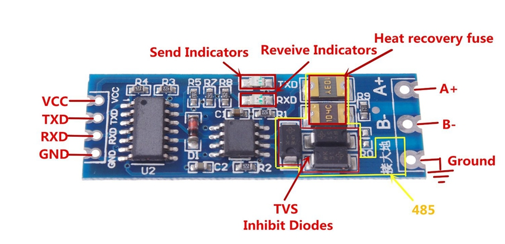

Kuntze pool monitor
===================

.. seo::
    :description: Instructions for setting up Kuntze pool monitor in ESPHome.
    :image: kuntze.jpg

The ``kuntze`` component allows you to integrate the Kuntze water measurement 
instrument in ESPHome. It uses :ref:`UART <uart>` (ModBUS) for communication.

Once configured you can use sensors as described below for your projects.

    Kuntze Neon® Multi instrument

Overview
--------

Kuntze devices have an RS485 (ModBUS RTU) communication port. Please see the 
Kuntze papers for the pinout of the RS485 connector on your unit. ModBUS line
has to be terminated properly with a 120 resistance, and since this is likely
your only unit connected to ESPHome, you should activate bus termination in the
Network menu (this component doesn't support multiple Kuntze devices on the same 
bus). ModBUS address should remain at factory default value.

The device communicates at ``19200`` baud ``8E1``. To connect to ESPHome, an RS485 
transceiver is needed. Choose a type which does not need a trigger to send and 
receive data,  for example:

The controller connects to the UART of the MCU. For ESP32 GPIO `16` to `TXD` and `17` 
to RXD are the default ones but any other pins can be used as well. 3.3V to VCC and GND to GND.

Component
---------

A configured modbus component is optional. It will be automatically created.

.. code-block:: yaml

    # Example configuration entry
    uart:
      - id: uart_bus
        tx_pin: GPIO16
        rx_pin: GPIO17
        baud_rate: 19600
        parity: EVEN

    sensor:
      - platform: kuntze
        id: my_kuntze
        ph:
          id: ph
        temperature:
          id: temperature

Configuration variables:

- **ph**: Measured pH value
- **temperature**: Measured temperature value
- **dis1**: Measured DIS 1 value
- **dis2**: Measured DIS 2 value
- **redox**: Measured Redox value
- **ec**: Measured EC value
- **oci**: Measured OCI value

All sensors are *Optional* and support all other options from :ref:`Sensor <config-sensor>`.

.. note::

    If you are using an ESP8266, serial logging may cause problems reading from UART. For best 
    results, hardware serial is recommended. Software serial may not be able to read all 
    received data if other components spend a lot of time in the ``loop()``.

    For hardware serial only a limited set of pins can be used. Either ``tx_pin: GPIO1`` and 
    ``rx_pin: GPIO3``  or ``tx_pin: GPIO15`` and ``rx_pin: GPIO13``.

    The disadvantage of using the hardware uart is that you can't use serial logging because 
    the serial logs would be sent to the modbus device and cause errors.

    Serial logging can be disabled by setting ``baud_rate: 0``.

    See :doc:`logger` for more details

    .. code-block:: yaml

        logger:
            level: <level>
            baud_rate: 0

See Also
--------

- :ref:`uart`
- :doc:`logger`
- :ref:`Sensor <config-sensor>`
- `Kuntze manuals <https://www.kuntze.com/en/downloads-2/>`__
- `Communication protocol <https://www.kuntze.com/wp-content/uploads/2021/05/2019_Manual_Modbus-RTU_ENG.pdf>`__
- :ghedit:`Edit`
