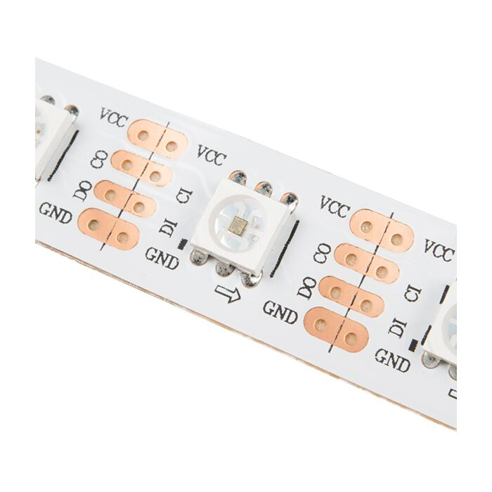
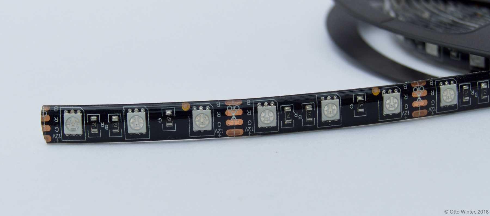

APA102 RGB Light
================

.. seo::
    :description: Instructions for setting up APA102 LED RGB lights in ESPHome.
    :image: ../components/light/images/apa102.jpg

The ``apa102`` light platform drives one or more APA102 type RGB LEDs. These LEDs are often used in strips, where
each LED is individually addressable. The interface is SPI-like so this component requires an SPI interface to
be configured.

.. code-block:: yaml

    # Example configuration entry
    spi:
      mosi_pin: GPIO3
      clk_pin: GPIO9

    light:
      - platform: apa102
        num_leds: 30
        color_correct: [80%, 60%, 100%]
        id: rgb_led
        name: "RGB LED Strip"
        data_rate: 1MHz

Color Correction
----------------

It is often favourable to calibrate/correct the color produced by an LED strip light as the
perceived intensity of different colors will generally vary. This can be done by using
``color_correct`` to adjust the relative brightness of the RGB components.

Configuration variables:
------------------------

- **name** (**Required**, string): The name of the light.
- **num_leds** (*Optional*, int): The number of LEDs attached. The default is 1.
- **effects** (*Optional*, list): A list of :ref:`light effects <light-effects>` to use for this light.
- **id** (*Optional*, :ref:`config-id`): Manually specify the ID used for code generation.
- **data_rate** (*Optional*): Set the data rate of the SPI interface to the display. One of ``80MHz``, ``40MHz``, ``20MHz``, ``10MHz``, ``5MHz``, ``2MHz``, ``1MHz`` (default), ``200kHz``, ``75kHz`` or ``1kHz``.
- All other options from :ref:`Light <config-light>`.

You may also need to configure an ``output`` GPIO pin to control power to the LEDs, depending on your hardware. The
APA102 does not have a ``CS`` input, and is write-only so the SPI ``miso`` pin should not be specified.

See Also
--------

- :doc:`/components/light/index`
- :doc:`/components/output/ledc`
- :doc:`/components/output/esp8266_pwm`
- :doc:`/components/output/pca9685`
- :doc:`/components/output/tlc59208f`
- :doc:`/components/output/my9231`
- :doc:`/components/output/sm16716`
- :apiref:`rgb/rgb_light_output.h`
- :ghedit:`Edit`
