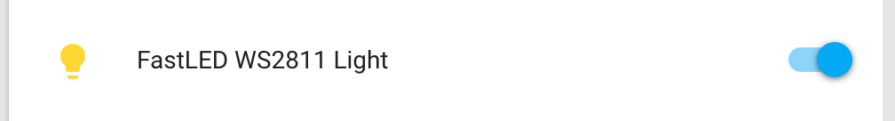
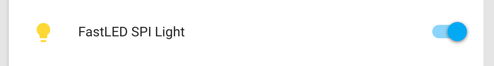

FastLED Light
=============

.. seo::
    :description: Instructions for setting up FastLED addressable lights like NEOPIXEL.
    :image: color_lens.png

.. _fastled-clockless:

Clockless
---------

The ``fastled_clockless`` light platform allows you to create RGB lights
in ESPHome for a :ref:`number of supported chipsets <fastled_clockless-chipsets>`.

Clockless FastLED lights differ from the
:ref:`fastled-spi` in that they only have a single data wire to connect, and not separate data and clock wires.

.. code-block:: yaml

    # Example configuration entry
    light:
      - platform: fastled_clockless
        chipset: WS2811
        pin: GPIO23
        num_leds: 60
        rgb_order: BRG
        name: "FastLED WS2811 Light"

Configuration variables:
************************

- **name** (**Required**, string): The name of the light.
- **chipset** (**Required**, string): Set a chipset to use.
  See :ref:`fastled_clockless-chipsets` for options.
- **pin** (**Required**, :ref:`config-pin`): The pin for the data line of the FastLED light.
- **num_leds** (**Required**, int): The number of LEDs attached.
- **rgb_order** (*Optional*, string): The order of the RGB channels. Use this if your
  light doesn't seem to map the RGB light channels correctly. For example if your light
  shows up green when you set a red color through the frontend. Valid values are ``RGB``,
  ``RBG``, ``GRB``, ``GBR``, ``BRG`` and ``BGR``. Defaults to ``RGB``.
- **max_refresh_rate** (*Optional*, :ref:`config-time`):
  A time interval used to limit the number of commands a light can handle per second. For example
  16ms will limit the light to a refresh rate of about 60Hz. Defaults to the default value for the used chipset.
- **gamma_correct** (*Optional*, float): The `gamma correction
  factor <https://en.wikipedia.org/wiki/Gamma_correction>`__ for the
  light. Defaults to ``2.8``.
- **color_correct** (*Optional*, list of percentages): The color correction for each channel. This denotes
  the maximum brightness of the red, green and blue channel. Defaults to ``color_correct: [100%, 100%, 100%]``.
- **default_transition_length** (*Optional*, :ref:`config-time`): The length of
  the transition if no transition parameter is provided by Home
  Assistant. Defaults to ``1s``.
- **power_supply** (*Optional*, :ref:`config-id`): The :doc:`/components/power_supply` to connect to
  this light. When the light is turned on, the power supply will automatically be switched on too.
- **effects** (*Optional*, list): A list of :ref:`light effects <light-effects>` to use for this light.
- **id** (*Optional*, :ref:`config-id`): Manually specify the ID used for code generation.

- **internal** (*Optional*, boolean): Mark this component as internal. Internal components will
  not be exposed to the frontend (like Home Assistant). Only specifying an ``id`` without
  a ``name`` will implicitly set this to true.
- If MQTT enabled, all other options from :ref:`MQTT Component <config-mqtt-component>`.

.. _fastled_clockless-chipsets:

Supported Chipsets
******************

- ``NEOPIXEL``
- ``WS2811``
- ``WS2811_400`` (``WS2811`` with a clock rate of 400kHz)
- ``WS2812B``
- ``WS2812``
- ``WS2813``
- ``WS2852``
- ``APA104``
- ``APA106``
- ``GW6205``
- ``GW6205_400`` (``GW6205`` with a clock rate of 400kHz)
- ``LPD1886``
- ``LPD1886_8BIT`` (``LPD1886`` with 8-bit color channel values)
- ``PL9823``
- ``SK6812``
- ``SK6822``
- ``TM1803``
- ``TM1804``
- ``TM1809``
- ``TM1829``
- ``UCS1903B``
- ``UCS1903``
- ``UCS1904``
- ``UCS2903``

.. _fastled-spi:

SPI
---

The ``fastled_spi`` light platform allows you to create RGB lights
in ESPHome for a :ref:`number of supported chipsets <fastled_spi-chipsets>`.

SPI FastLED lights differ from the
:ref:`fastled-clockless` in that they require two pins to be connected, one for a data and one for a clock signal
whereas the clockless lights only need a single pin.

.. code-block:: yaml

    # Example configuration entry
    light:
      - platform: fastled_spi
        chipset: WS2801
        data_pin: GPIO23
        clock_pin: GPIO22
        num_leds: 60
        rgb_order: BRG
        name: "FastLED SPI Light"

Configuration variables:
************************

- **name** (**Required**, string): The name of the light.
- **chipset** (**Required**, string): Set a chipset to use. See :ref:`fastled_spi-chipsets` for options.
- **data_pin** (**Required**, :ref:`config-pin`): The pin for the data line of the FastLED light.
- **clock_pin** (**Required**, :ref:`config-pin`): The pin for the clock line of the FastLED light.
- **num_leds** (**Required**, int): The number of LEDs attached.
- **rgb_order** (*Optional*, string): The order of the RGB channels. Use this if your
  light doesn't seem to map the RGB light channels correctly. For example if your light
  shows up green when you set a red color through the frontend. Valid values are ``RGB``,
  ``RBG``, ``GRB``, ``GBR``, ``BRG`` and ``BGR``. Defaults to ``RGB``.
- **max_refresh_rate** (*Optional*, :ref:`config-time`):
  A time interval used to limit the number of commands a light can handle per second. For example
  16ms will limit the light to a refresh rate of about 60Hz. Defaults to the default value for the used chipset.
- **gamma_correct** (*Optional*, float): The `gamma correction
  factor <https://en.wikipedia.org/wiki/Gamma_correction>`__ for the light. Defaults to ``2.8``.
- **color_correct** (*Optional*, list of percentages): The color correction for each channel. This denotes
  the maximum brightness of the red, green and blue channel. Defaults to ``color_correct: [100%, 100%, 100%]``.
- **default_transition_length** (*Optional*, :ref:`config-time`): The length of
  the transition if no transition parameter is provided by Home Assistant. Defaults to ``1s``.
- **power_supply** (*Optional*, :ref:`config-id`): The :doc:`/components/power_supply` to connect to
  this light. When the light is turned on, the power supply will automatically be switched on too.
- **effects** (*Optional*, list): A list of :ref:`light effects <light-effects>` to use for this light.
- **id** (*Optional*, :ref:`config-id`): Manually specify the ID used for code generation.

- **internal** (*Optional*, boolean): Mark this component as internal. Internal components will
  not be exposed to the frontend (like Home Assistant). Only specifying an ``id`` without
  a ``name`` will implicitly set this to true.
- If MQTT enabled, all other options from :ref:`MQTT Component <config-mqtt-component>`.

.. _fastled_spi-chipsets:

Supported Chipsets
******************

- ``APA102``
- ``DOTSTAR``
- ``LPD8806``
- ``P9813``
- ``SK9822``
- ``SM16716``
- ``WS2801``
- ``WS2803``

See Also
--------

- :doc:`/components/light/index`
- :doc:`/components/power_supply`
- :apiref:`light/fastled_light_output.h`
- `Arduino FastLED library <https://github.com/FastLED/FastLED>`__
- :ghedit:`Edit`

.. disqus::
