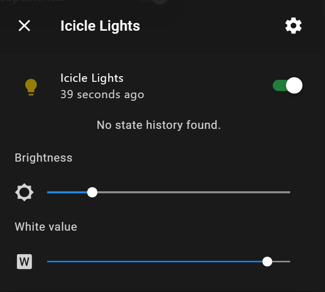

H-bridge Light
==============

.. seo::
    :description: Instructions for setting up a hbridge light.
    :image: brightness-medium.svg

The ``hbridge`` light platform creates a dual color brightness controlled light from two
:ref:`float output component <output>`.

H-bridge lights are very common for Christmas lighting and they use 2 wires for a bunch of LEDs.
The pins are switched alternatively to allow two sets of lights to operate.

.. code-block:: yaml

    # Example configuration entry
    light:
      - platform: hbridge
        id: mainlight
        name: "Hbridge Lights"
        pin_a: pina
        pin_b: pinb

Internally, H-bridge lights are implemented as cold/warm white lights. This means that the brightness of the two colors
is mapped to the cold white and warm white values, even if the colors aren't actually white in reality. To individually
control the colors in the :ref:`light control actions <light-turn_on_action>`, you need to use the ``cold_white`` and
``warm_white`` options.

Configuration variables:
------------------------

- **id** (*Optional*, :ref:`config-id`): Manually specify the ID used for code generation.
- **name** (**Required**, string): The name of the light.
- **pin_a** (**Required**, :ref:`config-id`): The id of the first float :ref:`output` to use for this light.
- **pin_b** (**Required**, :ref:`config-id`): The id of the second float :ref:`output` to use for this light.
- All other options from :ref:`Light <config-light>`.

.. note::

    As we are switching the H-bridge in software, the light may glitch every so often when other tasks run on the MCU.

See Also
--------

- :doc:`/components/light/index`
- :doc:`/components/output/esp8266_pwm`
- :apiref:`hbridge/light/hbridge_light.h`
- :ghedit:`Edit`
