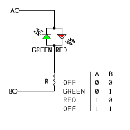

H-bridge Light
==============

.. seo::
    :description: Instructions for setting up a hbridge light.
    :image: brightness-medium.svg

The ``hbridge`` light platform controls two light sources using a single pair of wires.

.. figure:: images/hbridge-ui.png
    :align: center
    :width: 40.0%

These type of lights are very common for "Christmas lighting" and "adjustable color-temperature lights" or "dual color LEDs" 
They use a single pair of wires to control two light sources. 

Due to the diode property of LEDs they will only light up if current is flowing in one direction. 
By putting the other light source in the reverse direction you can control which light source will light up by changing the current flow direction.

By quickly alternating the current flow direction you can (make it seem like) both light sources are lit at the same time.

Configuration
-------------

.. code-block:: yaml

    # Example configuration entry

    # Output config list
    # Note: For PWM output use "esp8266_pwm" for ESP8266 or "ledc" for ESP32 as platform
    output:
      - platform: ... # PWM Capable output platform
        id: output_light_a
        pin: ... # Output pin assignment
        frequency: 100 Hz
      - platform: ... # PWM Capable output platform
        id: output_light_b
        pin: ... # Output pin assignment
        frequency: 100 Hz

    # Create a light using the hbridge
    light:
      - platform: hbridge
        id: hbridge_light
        name: "H-Bridge Light"
        pin_a: output_light_a
        pin_b: output_light_b

Internally, H-bridge lights are implemented as cold/warm white lights. This means that the brightness of the two colors
is mapped to the cold white and warm white values, even if the colors aren't actually white in reality. To individually
control the colors in the :ref:`light control actions <light-turn_on_action>`, you need to use the ``cold_white`` and
``warm_white`` options.

Output assignment
*****************

- **id** (*Optional*, :ref:`config-id`): Manually specify the ID used for code generation.
- **name** (**Required**, string): The name of the light.
- **pin_a** (**Required**, :ref:`config-id`): The id of the first float :ref:`output` to use for this light.
- **pin_b** (**Required**, :ref:`config-id`): The id of the second float :ref:`output` to use for this light.
- All other options from :ref:`Light <config-light>`.

.. note::

    As we are switching the H-bridge in software, the light may glitch every so often when other tasks run on the MCU.

See Also
--------

- :doc:`/components/light/index`
- :doc:`/components/output/ledc`
- :doc:`/components/output/esp8266_pwm`
- `Adafruit's basic H-bridge tutorial <https://learn.adafruit.com/adafruit-arduino-lesson-15-dc-motor-reversing/overview>`__
- :ghedit:`Edit`
