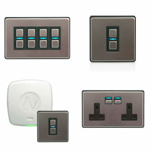

LightWaveRF Switch
==================

.. seo::
    :description: LightWaveRF Switch Lights
    :image: brightness-medium.svg

The ``LightWaveRF`` light platform creates a module to dump and send commands to light switches
:ref:`float output component <output>`.

LightwaveRF switches are very common in UK automation which allows to control light/socket/relay and more via RF remote
or via the HUB.
Using cheap RF receiver and transmitter you can implemented a simple implementation to control your devices.

.. code-block:: yaml

    # Example configuration entry

    # Specify the two pins to connect the receiver and transmitter
    lightwaverf:
      read_pin: 13
      write_pin: 14

    # Create a switch to trigger a light
    switch:
      - platform: template
        name: "Turn off sofa"
        id: light_off_ceiling_sofa
        turn_on_action:
          lightwaverf.send_raw:
            code:  [0x04, 0x00, 0x00, 0x00, 0x0f, 0x03, 0x0d, 0x09, 0x08, 0x08]
            name: "Sofa"
            repeat: 1

Configuration variables module:
-------------------------------

- **read_pin** (**Required**, :ref:`Pin Schema <config-pin_schema>`): The pin that the receiver is connected to
- **write_pin** (**Required**, :ref:`Pin Schema <config-pin_schema>`): the pin that the transmitter is connected to

Configuration variables:
------------------------

- **name** (*Optional*, string): The name to give for the action
- **id** (**Required**, :ref:`config-id`): The id of the switch to call via HA

.. lightwaverf.send_raw:

``lightwaverf.send_raw`` Action
--------------------------------

Send the raw data that has been captured via the dump system

.. code-block:: yaml

    on_...:
      then:
        - lightwaverf.send_raw:
            code:  [0x04, 0x00, 0x00, 0x00, 0x0f, 0x03, 0x0d, 0x09, 0x08, 0x08]
            name: "Sofa"
            repeat: 1

Configuration variables:
------------------------

- **name** (*Optional*, string): The name to give for the action
- **id** (**Required**, :ref:`config-id`): The id of the switch to call via HA
- **code** (**Required**, list hex): The raw dump in an array of hex
- **repeat** (*Optional*, int): The amount of repeats to send the signal
- **invert** (*Optional*, int): Send the signal inverted

See Also
--------

- :doc:`/components/light/index`
- :doc:`/components/output/esp8266_pwm`
- :ghedit:`Edit`
