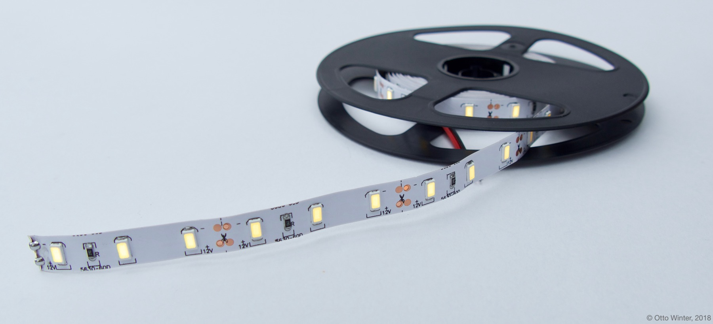
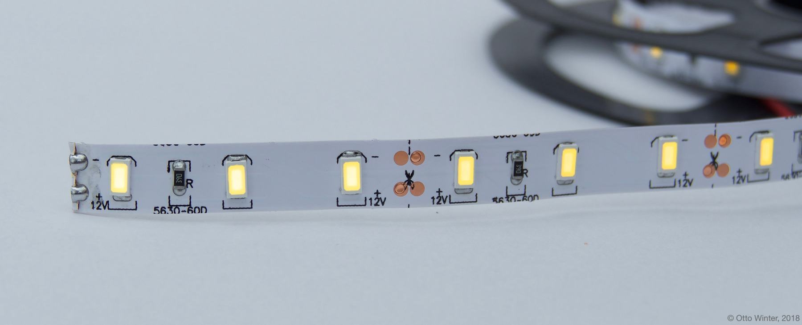

Monochromatic Light
===================

.. seo::
    :description: Instructions for setting up monochromatic (brightness-only) lights.
    :image: brightness-medium.png

The ``monochromatic`` light platform creates a simple brightness-only light from an
:ref:`float output component <output>`.

    Example of a brightness-only LED strip that can be used with this component.

.. figure:: images/kitchen-lights.png
    :align: center
    :width: 40.0%

.. code-block:: yaml

    # Example configuration entry
    light:
      - platform: monochromatic
        name: "Kitchen Lights"
        output: output_component1

    # Example output entry
    output:
      - platform: esp8266_pwm
        id: output_component1
        pin: D1

Configuration variables:
------------------------

- **name** (**Required**, string): The name of the light.
- **output** (**Required**, :ref:`config-id`): The id of the float :ref:`output` to use for this light.
- **gamma_correct** (*Optional*, float): The `gamma correction
  factor <https://en.wikipedia.org/wiki/Gamma_correction>`__ for the light. Defaults to ``2.8``.
- **default_transition_length** (*Optional*, :ref:`config-time`): The length of
  the transition if no transition parameter is provided by Home
  Assistant. Defaults to ``1s``.
- **effects** (*Optional*, list): A list of :ref:`light effects <light-effects>` to use for this light.
- **id** (*Optional*, :ref:`config-id`): Manually specify the ID used for code generation.

- **internal** (*Optional*, boolean): Mark this component as internal. Internal components will
  not be exposed to the frontend (like Home Assistant). Only specifying an ``id`` without
  a ``name`` will implicitly set this to true.
- If MQTT enabled, all other options from :ref:`MQTT Component <config-mqtt-component>`.

See Also
--------

- :doc:`/components/output/index`
- :doc:`/components/light/index`
- :doc:`/components/light/binary`
- :doc:`/components/power_supply`
- :doc:`/components/output/ledc`
- :doc:`/components/output/esp8266_pwm`
- :doc:`/components/output/pca9685`
- :doc:`/components/output/my9231`
- :apiref:`light/light_state.h`
- :ghedit:`Edit`

.. disqus::
