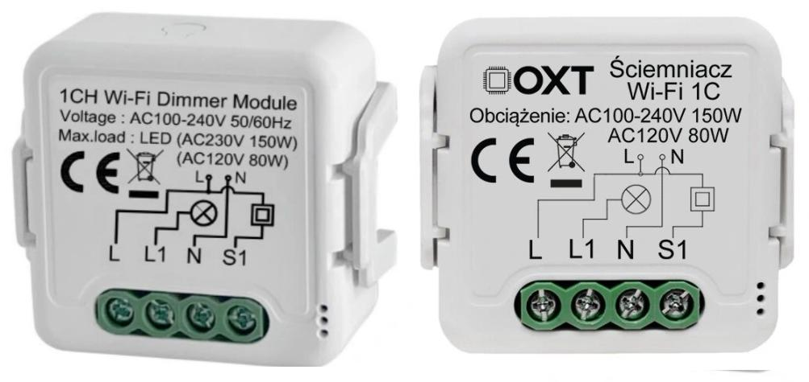

OXT-type Dimmer
===============

.. seo::
    :description: Instructions for setting up a 1- or 2-channel OXT Dimmer
    :image: /components/light/images/oxt_dimmer.jpg

OXT dimmers are another type of in-wall, brightness-only light dimming devices sold with Tuya-Smart application support,
yet using different method to control light than the already-supported :doc:`/components/light/tuya` (see :ref:`technical-details`).

There are two types of OXT dimmers available supporting either 1- or 2- light channels.

.. note::

    Advantage of the OXT implementations is that, unlike :doc:`/components/light/tuya`-based devices, here the firmware has 
    full control over dimming functionality and physical switch input, so can control timings, transitions, effects, etc.

The devices seem to be manufactured in china and is sold under different marketing names such as OXT and Smart Best, possibly also
Himojo, HaveDeer, GIRIER, RSH are compatible as well but have not been tested... All of them look identical and have same dimensions 39.2*39.2*18mm,
so very likely they are all using same hardware design and protocol.

.. _technical-details:

Technical details
-----------------

The device is using Tuya-compatible application structure with two main components:

- a `Tuya CB3S <https://developer.tuya.com/en/docs/iot/cb3s?id=Kai94mec0s076>`__ module, used as an application-level processor,
  wifi, Tuya comms, etc, (this will be replaced with our custorm firmware),
- secondary, application-specific MCU responsible for controlling triac at strictly defined moments.

.. note::

    CB3S module is using Beken BK7321N controller. The support for that family of products is added to ESPHome with
    the use of :doc:`/components/libretiny`.

Unlike other Tuya-based dimming devices:

- external switch input is connected to CB3S module instead of the second MCU,
- communication to dimming MCU is unidirectional (uses ony TX pin of the UART interface),
- the protocol is different than in other :doc:`/components/tuya` devices.

There is no confirmation from MCU whether the light has actually switched-on, nor it is any information about overheating or
unexpected events - just fire the command over UART and hope that it works.

OXT Control protocol
--------------------

The protocol to control brightness is very simple and each frame consists of:

+------+------+------+------+--------+----------+----------+------+------+------+------+------+
| Zeroes      | Syn Header  | Update | Channel1 | Channel2 |  Footer?           | Zeroes      |
+------+------+------+------+--------+----------+----------+------+------+------+------+------+
| 0x00 | 0x00 | 0xff | 0x55 | `<UU>` | `<XX>`   | `<YY>`   | 0x05 | 0xdc | 0x0a | 0x00 | 0x00 |
+------+------+------+------+--------+----------+----------+------+------+------+------+------+

where:

- `<UU>` is the channel ID being updated by the given command (either 0x01 or 0x02)
- `<XX>` is brightness value for Channel 1
- `<YY>` is brightness value for Channel 2

where a brightness value id ranging 0x00-0xff.

The protocol also works with different numer of leading/trailing zeroes - perhaps they are used to create
a timing delay between two consecutive commands? Not sure...

That's it. No confirmation, no acks, no feedback.

Example Configuration
---------------------

For 1-channel dimmer use config like this one:

.. code-block:: yaml

    esphome:
      name: dimmer
      comment: OXT 1-ch dimmer

    bk72xx:
      board: cb3s # Using original CB3S module by Tuya, can also be replaced with other pin-compatible

    # Disable UART logging - we need UART to talk to dimming MCU
    logger:
      baud_rate: 0

    uart:
      tx_pin: GPIO11 # rx_pin is not required (not used)
      baud_rate: 9600

    light:
      - platform: oxt_dimmer
        channels:
        - name: lamp1
          id: lamp1
          min_value: 0
          max_value: 255
          sensing_pin:
            number: GPIO08 # CB3S module
            inverted: true
            mode: input_pullup
          default_transition_length: 1s

For 2-channel dimmer just add second channel defintion, like here:

.. code-block:: yaml

    esphome:
      name: dimmer
      comment: OXT 2-ch dimmer

    bk72xx:
      board: cb3s

    logger:
      baud_rate: 0

    uart:
      tx_pin: GPIO11
      baud_rate: 9600

    light:
      - platform: oxt_dimmer
        channels:
        - name: lamp1
          id: lamp1
          sensing_pin:
            number: GPIO08  # CB3S module
            inverted: true
            mode: input_pullup
        - name: lamp2
          id: lamp2
          sensing_pin:
            number: GPIO09  # CB3S module
            inverted: true
            mode: input_pullup

Configuration variables:
------------------------

- **name** (**Required**, string): The name of the light.
- **id** (*Optional*, :ref:`config-id`): Manually specify the component ID.
- **channels**(**Required**, list): List of channels
- **uart_id** (*Optional*, :ref:`config-id`): Manually specify the ID of the UART component. Defaults to UART 1
- **sensing_pin** (*Optional*, :ref:`config-pin_schema`): Specify GPIO input that will be used to control dimmer locally. Supports short-press to toggle the light and long-press to dim up/down.
- **min_value** (*Optional*, integer): Min brightness, lamp will be turned off below this value
- **max_value** (*Optional*, integer): Similar to the above, brightness will be limited to this value when maxed

See Also
--------

- :doc:`/components/light/index`
- :apiref:`oxt_dimmer/light/oxt_dimmer.h`
- :ghedit:`Edit`
