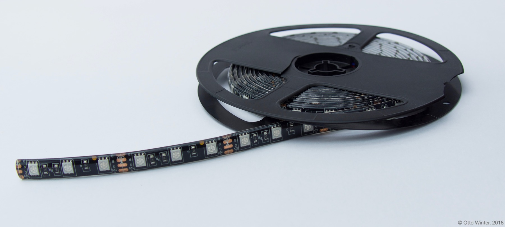

RGB Light
=========

.. seo::
    :description: Instructions for setting up RGB lights in ESPHome.
    :image: rgb.png

The ``rgb`` light platform creates an RGB light from 3 :ref:`float output components <output>`
(one for each color channel).

    Example of an RGB LED strip that can be used with this component.

.. figure:: images/rgb-ui.png
    :align: center
    :width: 40.0%

.. code-block:: yaml

    # Example configuration entry
    light:
      - platform: rgb
        name: "Living Room Lights"
        red: output_component1
        green: output_component2
        blue: output_component3

Color Correction
----------------

It is often favourable to calibrate/correct the color produced by an LED strip light as the
perceived intensity of different colors will generally vary. This can be done by using
:ref:`max_power <config-output>` on individual output channels:

.. code-block:: yaml

    # Example configuration entry
    light:
      - platform: rgb
        name: "Living Room Lights"
        red: output_component1
        green: output_component2
        blue: output_component3

    # Example output entry
    output:
      - platform: ...
        id: output_component1
        max_power: 80%
      # Repeat for green and blue output

.. note::

    Remember that ``gamma_correct`` is enabled by default (``γ=2.8``), and you may want take it into account for the calibration. For instance if you command a light to *50%* brightness and want it to be the new maximum: ``max_PWM_power = max_light_power^2.8 = 0.5^2.8 = 0.144``, then you would set ``max_power`` to *14.4%*.

Configuration variables:
------------------------

- **name** (**Required**, string): The name of the light.
- **red** (**Required**, :ref:`config-id`): The id of the float :ref:`output` to use for the red channel.
- **green** (**Required**, :ref:`config-id`): The id of the float :ref:`output` to use for the green channel.
- **blue** (**Required**, :ref:`config-id`): The id of the float :ref:`output` to use for the blue channel.
- **effects** (*Optional*, list): A list of :ref:`light effects <light-effects>` to use for this light.
- **id** (*Optional*, :ref:`config-id`): Manually specify the ID used for code generation.
- All other options from :ref:`Light <config-light>`.

See Also
--------

.. figure:: images/rgb-detail.jpg
    :align: center
    :width: 75.0%

- :doc:`/components/output/index`
- :doc:`/components/light/index`
- :doc:`/components/light/rgbw`
- :doc:`/components/light/rgbww`
- :doc:`/components/light/rgbct`
- :doc:`/components/power_supply`
- :doc:`/components/output/ledc`
- :doc:`/components/output/esp8266_pwm`
- :doc:`/components/output/pca9685`
- :doc:`/components/output/tlc59208f`
- :doc:`/components/output/my9231`
- :doc:`/components/output/sm16716`
- :apiref:`rgb/rgb_light_output.h`
- :ghedit:`Edit`
