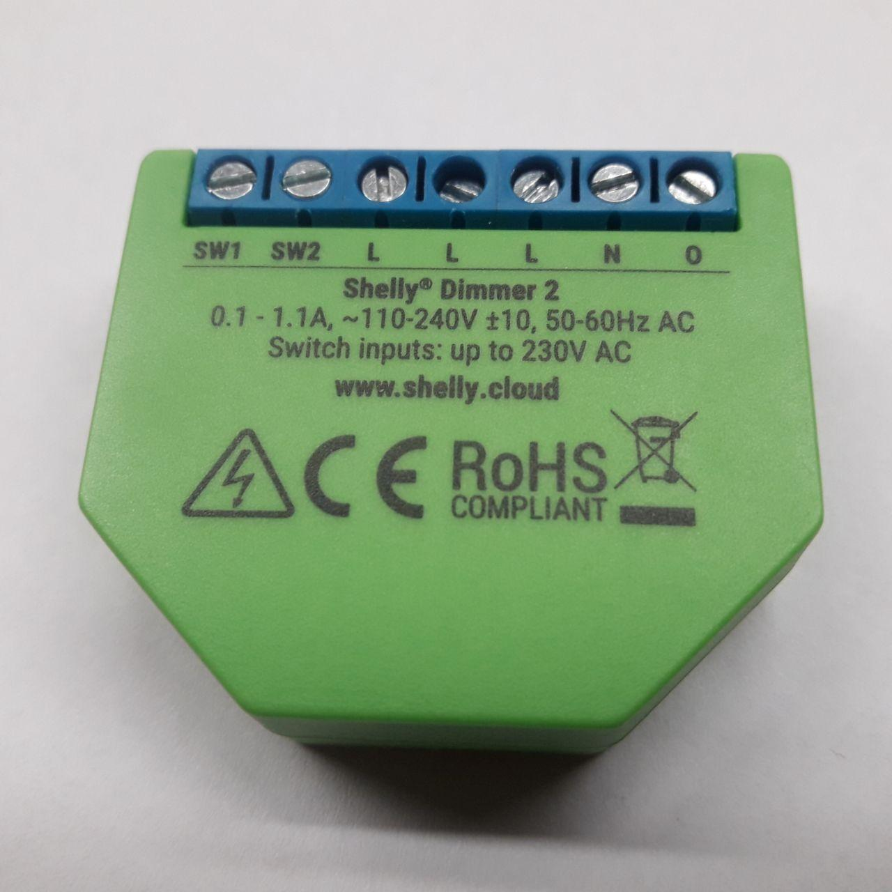

Shelly Dimmer
=============

.. seo::
    :description: Instructions for setting up a Shelly Dimmer 2.
    :image: shellydimmer2.jpg

The ``shelly_dimmer`` component adds support for the dimming and power-metering functionality that can be found the `Shelly Dimmer 2 <https://shelly.cloud/knowledge-base/devices/shelly-dimmer-2/>`_. The interaction with mains is done via an STM32 microcontroller that is automatically (when configured) flashed with an `open source firmware <https://github.com/jamesturton/shelly-dimmer-stm32>`_.
A detailed analysis of the Shelly Dimmer 2 hardware is given `here <https://github.com/arendst/Tasmota/issues/6914>`_.

Warning!!! At the time of writing there seems to be no way to revert back to the "stock firmware", because there seems to be no way to revert to firmware of the STM32 co-processor.

The 

An example of a configuration of this component:

.. code-block:: yaml

    logger:
        baud_rate: 0

    uart:
        tx_pin: 1
        rx_pin: 3
        baud_rate: 115200
    sensor:

    light:
        - platform: shelly_dimmer
          name: Shelly Dimmer 2 Light
          id: thislight
          power:
            name: Shelly Dimmer 2 Light Power
          voltage:
            name: Shelly Dimmer 2 Light Voltage
          current:
            name: Shelly Dimmer 2 Light Current
          max_brightness: 500
          firmware:
            version: "51.6"
            update: true

Configuration variables:
------------------------

- **id** (*Optional*, :ref:`config-id`): Manually specify the ID used for code generation.
- **uart_id** (*Optional*, :ref:`config-id`): Manually specify the ID of the UART hub.

.. note::

    Currently, only the first hardware UART of the ESP is supported, which has to be configured like this:

    .. code-block:: yaml

        uart:
            tx_pin: 1
            rx_pin: 3
            baud_rate: 115200

- **name** (**Required**, string): The name of the light.
- **leading_edge** (*Optional*, boolean): `Dimming mode <https://en.wikipedia.org/wiki/Dimmer#Solid-state_dimmer>`_: ``true`` means leading edge, ``false`` is trailing edge. Defaults to ``false``.
- **min_brightness** (*Optional*, int): Minimum brightness value on a scale from 0..1000, the default is 0.
- **max_brightness** (*Optional*, int): Maximum brightness value on a scale from 0..1000, the default is 1000.
- **warmup_brightness** (*Optional*, int): Brightness threshold below which the dimmer switches on later in mains current cycle. `This might help with dimming LEDs <https://github.com/jamesturton/shelly-dimmer-stm32/pull/23>`_. The value is from 0..1000 with an default of 0.
- **nrst_pin** (*Optional*, :ref:`config-pin`): Pin connected with "NRST" of STM32. The  default is "GPIO5".
- **boot0_pin** (*Optional*, :ref:`config-pin`): Pin connected with "BOOT0" of STM32. The  default is "GPIO4".
- **current** (*Optional*): Sensor of the current in Amperes. All options from
  :ref:`Sensor <config-sensor>`.
- **voltage** (*Optional*): Sensor of the voltage in Volts. Only accurate if neutral is connected. All options from :ref:`Sensor <config-sensor>`.
- **power** (*Optional*): Sensor of the active power in Watts. Only accurate if neutral is connected. All options from :ref:`Sensor <config-sensor>`.
- **firmware** (*Optional*):

  - **version** (*Optional*): Version string of the `firmware <https://github.com/jamesturton/shelly-dimmer-stm32>`_ that will be expected on the microcontroller. The default is "51.6", another known-good firmware is "51.5".
  - **url** (*Optional*, string): An URL to download the firmware from. Defaults to github for known firmware versions.
  - **sha256** (*Optional*): A hash to compare the downloaded firmware against. Defaults a proper hash of known firmware versions.
  - **update** (*Optional*): Should the firmware of the STM be updated if necessary? The default is false.

.. note::

    When flashing Shelly Dimmer with esphome for the first time, automatic flashing the STM firmware is necessary too for the dimmer to work and enabled by the following configuration.:

    .. code-block:: yaml

        firmware:
          version: "51.6" #<-- set version here
          update: true
    
    There is no action required by the user to flash the STM32. There is no way to revert to stock firmware on the STM32 at the time of writing.

- All other options from :ref:`Light <config-light>`.

See Also
--------

- :doc:`/components/light/index`
- :apiref:`shelly_dimmer/light/shelly_dimmer.h`
- :ghedit:`Edit`
