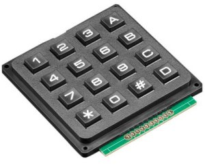

Matrix keypad
=============

.. seo::
    :description: Matrix key input panel

The ``matrix_keypad`` component allows you to integrate pads which
have the keys connected at the intersection points of the rows and columns 
of a matrix. 

.. note::

    This component also needs the ``key_provider`` component in order to work.

Component
---------

.. code-block:: yaml

    # Example configuration entry
    key_provider:
    matrix_keypad:
      id: mykeypad
      rows:
        - pin: 21
        - pin: 19
        - pin: 18
        - pin: 5
      columns:
        - pin: 17
        - pin: 16
        - pin: 4
        - pin: 15
      keys: "123A456B789C*0#D"
      has_diodes: false

Configuration variables:

- **id** (*Optional*, :ref:`config-id`): Set the ID of this device for use in lambdas.
- **rows** (*Optional*, list): A list of :ref:`pins <config-pin_schema>` where the horrizontal
  matrix lines are connected, in order from top to bottom. Required for ``binary_sensor``.
- **columns** (*Optional*, list): A list of :ref:`pins <config-pin_schema>` where the vertical
  matrix lines are connected, in order from left to right. Required for ``binary_sensor``.
- **keys** (*Optional*, string): The keys present on the matrix, from top left to bottom right, 
  row by row. Required for ``binary_sensor`` and ``key_collect``.
- **has_diodes** (*Optional*, boolean): For pads where row pins are outputs, and the keys are 
  connected with diodes. Defaults to ``false``.

Binary Sensors
--------------

Individual keys can be added to ESPHome as separate ``binary_sensor``s.

.. code-block:: yaml

    # Example configuration entry
    binary_sensor:
      - platform: matrix_keypad
        keypad_id: mykeypad
        id: key4
        row: 1
        col: 0
      - platform: keypad
        id: keyA
        key: A

Configuration variables:

- **platform** (**Required**, string): The integration platform, which is ``keypad``.
- **keypad_id** (**Required**, :ref:`config-id`): The ID of the keypad to process keypresses from.
- **id** (*Optional*, :ref:`config-id`): Set the ID of this key for use in lambdas.
- **row** (*Optional*, integer): The row where the key can be found.
- **col** (*Optional*, integer): The column where the key can be found.
- **key** (*Optional*, string): The key from ``keys`` configuration entry above which has to be detected.
- All other options from :ref:`Binary Sensor <config-binary_sensor>`.

Either the ``row`` and ``col`` parameters, or the ``key`` parameter has to be provided.

.. note::

    Automatic handling of multiple keys (e.g. PIN code entry) is possible with the 
    the ``key_collect`` component.

See Also
--------

- :doc:`/components/key_collect`
- :doc:`/components/key_provider`
- :ref:`Binary Sensor <config-binary_sensor>`
- :ghedit:`Edit`
