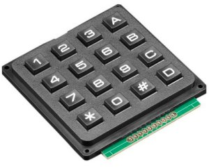

.. _matrix_keypad:

Matrix keypad
=============

.. seo::
    :description: Matrix key input panel

The ``matrix_keypad`` component allows you to integrate pads which
have the keys connected at the intersection points of the rows and columns
of a matrix.

Component
---------

.. code-block:: yaml

    # Example configuration entry
    matrix_keypad:
      id: mykeypad
      rows:
        - pin: GPIOXX
        - pin: GPIOXX
        - pin: GPIOXX
        - pin: GPIOXX
      columns:
        - pin: GPIOXX
        - pin: GPIOXX
        - pin: GPIOXX
        - pin: GPIOXX
      keys: "123A456B789C*0#D"
      has_diodes: false

Configuration variables:

- **id** (*Optional*, :ref:`config-id`): Set the ID of this device for use in lambdas.
- **rows** (**Required**, list): A list of :ref:`pins <config-pin_schema>` where the horrizontal
  matrix lines are connected, in order from top to bottom.  These pins need to be output capable.
- **columns** (**Required**, list): A list of :ref:`pins <config-pin_schema>` where the vertical
  matrix lines are connected, in order from left to right.  These pins need to be input capable
  with pullups enabled.  If there is no internal pullup, then an external one is required.
- **keys** (*Optional*, string): The keys present on the matrix, from top left to bottom right,
  row by row. Required for ``key_collector`` and ``binary_sensor`` (if using key selection).
- **has_diodes** (*Optional*, boolean): For pads where row pins are outputs, and the keys are
  connected with diodes. Defaults to ``false``.
- **has_pulldowns** (*Optional*, boolean): For pads where the column lines have external pulldowns. Defaults to ``false``.

Binary Sensor
-------------

Individual keys can be added independently to ESPHome as ``binary_sensor``:

.. code-block:: yaml

    # Example configuration entry
    binary_sensor:
      - platform: matrix_keypad
        keypad_id: mykeypad
        id: key4
        row: 1
        col: 0
      - platform: matrix_keypad
        id: keyA
        key: A

Configuration variables:

- **keypad_id** (*Optional*, :ref:`config-id`): The ID of the keypad to process keypresses from.
- **id** (*Optional*, :ref:`config-id`): Set the ID of this key for use in lambdas.
- **row** (*Optional*, integer): The row of the key.
- **col** (*Optional*, integer): The column of the key.
- **key** (*Optional*, string): The key from ``keys`` configuration entry above.
- All other options from :ref:`Binary Sensor <config-binary_sensor>`.

Either the ``row`` and ``col`` parameters, or the ``key`` parameter has to be provided.

.. note::

    Automatic handling of multiple keys (e.g. PIN code entry) is possible with the
    the :ref:`Key Collector <key_collector>` component.

See Also
--------

- :doc:`/components/key_collector`
- :ref:`Binary Sensor <config-binary_sensor>`
- :ghedit:`Edit`
